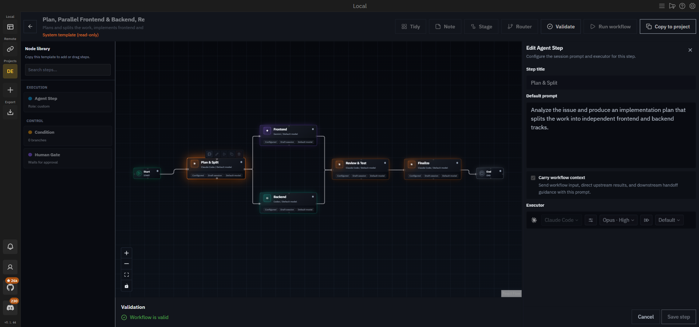

<p align="center">
  <picture>
    <source srcset="packages/public/vibe-kanban-logo-dark.svg" media="(prefers-color-scheme: dark)">
    <source srcset="packages/public/vibe-kanban-logo.svg" media="(prefers-color-scheme: light)">
    
  </picture>
</p>

<p align="center"><strong>用看板规划任务，用 AI 智能体工作流执行任务。</strong></p>
<p align="center">编排 Claude Code、Codex、Gemini CLI 等 10+ 编程智能体 —— 既可单任务执行，也可在可视化画布上组成多智能体工作流。</p>

<p align="center">
  <a href="https://www.npmjs.com/package/easy-vibe-kanban"></a>
  <a href="LICENSE"></a>
</p>

<p align="center"><a href="README.md">English</a> | 中文</p>

> **easy-vibe-kanban** 是 [Vibe Kanban](https://github.com/BloopAI/vibe-kanban)（已被 BloopAI 停止维护）的独立维护分叉版本，并在其基础上持续开发了核心新能力：**Agentic Workflow（智能体工作流）** —— 将一个任务交给一组协作的 agent session 按流程图自动执行。

```bash
npx easy-vibe-kanban
```


## 为什么做这个

与编程智能体协作的工程师，大部分时间花在两件事上：**规划**任务和**审查**智能体产出。easy-vibe-kanban 就是为加速这两件事而生 —— 并且更进一步：你不必一次只盯一个 agent，而是把多个 agent session 编排成工作流，让它们端到端地完成一个任务。

## ✨ Agentic Workflow（智能体工作流）

本分叉版本的核心特性。**Workflow Attempt** 是任务的一种执行方式：不再是单个 agent 会话，而是在可视化画布上设计一张 agent 步骤组成的流程图，各步骤按图自动执行。



*内置模板 "Plan, Parallel Frontend & Backend, Review, Finalize" 在工作流画布上的效果 —— Claude Code 规划拆分，Gemini 与 Codex 并行实现前后端，再评审与收尾。*

- **可视化画布** —— 节点面板、拖拽连线，每个节点和边上都有实时执行状态
- **每个步骤就是一个真实的 agent 会话** —— 每个 Agent Step 对应一个稳定的 agent session，可以随时进入对话，与普通 task attempt 的会话能力完全一致
- **混搭不同智能体** —— 不同阶段用不同 agent：比如 Claude Code 负责实现、Codex 负责审查、Gemini CLI 负责写测试
- **共享 worktree** —— 工作流内所有步骤共享同一个 git worktree，上下文通过真实代码传递，而不是脆弱的节点间 prompt 拼接
- **自动执行** —— 一个步骤完成后自动按出边触发后续步骤，支持分叉（fan-out）与汇聚（join）
- **Agentic 条件路由** —— 加入路由节点，由 agent 自主判断接下来走哪条分支
- **Issue 原生** —— 工作流挂在 issue 下，作为 task attempt 的一种形态，与普通单 agent attempt 并列；后续的审查、diff、PR 流程完全一致

典型流程：

```
Start → 规划 (Claude Code) → 实现 (Codex) → 条件路由
                                              ├─ 通过 → 写测试 (Gemini) → End
                                              └─ 不通过 → 修复问题 (Claude Code) ↺
```

## 核心功能

- **看板规划** —— 在看板上创建、排序、分配 issue
- **工作区执行** —— 每个工作区为 agent 提供独立分支、终端和 dev server
- **Diff 审查 + 行内评论** —— 不离开 UI 直接把反馈发给 agent
- **应用预览** —— 内置浏览器，带 devtools、元素检查和设备模拟
- **编程智能体随时切换** —— Claude Code、Codex、Gemini CLI、Oh My Pi
- **创建 PR 并合并** —— AI 生成 PR 描述，GitHub 上审查、合并


## 安装

先完成你常用编程智能体的认证登录，然后运行：

```bash
npx easy-vibe-kanban
```

## 本地开发

### 环境要求

- [Rust](https://rustup.rs/)（最新稳定版）
- [Node.js](https://nodejs.org/)（>=20）
- [pnpm](https://pnpm.io/)（>=8）

```bash
cargo install cargo-watch sqlx-cli
pnpm i
pnpm run dev   # 启动后端 + 前端；空白数据库从 dev_assets_seed 拷贝
```

常用命令：

| 命令 | 说明 |
|------|------|
| `pnpm run check` | 类型检查（前端 + 所有 Rust workspace） |
| `pnpm run lint` | ESLint + clippy |
| `pnpm run format` | Prettier + rustfmt |
| `cargo test --workspace` | Rust 测试 |
| `pnpm run generate-types` | 从 Rust 重新生成 TS 类型（ts-rs） |

### 关键环境变量

| 变量 | 默认值 | 说明 |
|------|--------|------|
| `PORT` | 自动分配 | 生产环境服务端口（开发模式为前端端口，后端用 PORT+1） |
| `HOST` | `127.0.0.1` | 后端服务地址 |
| `VK_ALLOWED_ORIGINS` | 未设置 | 允许调用后端 API 的来源（反向代理 / 自定义域名场景必须设置，逗号分隔） |
| `DISABLE_WORKTREE_CLEANUP` | 未设置 | 禁用 git worktree 清理（调试用） |

## 架构

- **后端**：Rust workspace —— Axum API 服务、SQLx、独立的 `workflow` crate（图模型、planner、runner、校验）、各编程智能体的 executor 适配层、git/worktree 管理
- **前端**：React + TypeScript + Vite + Tailwind monorepo（`packages/local-web`、`packages/web-core`）
- **共享类型**：通过 ts-rs 从 Rust 生成（`shared/types.ts`），禁止手动编辑

## 致谢与许可

本项目是 Bloop AI 的 [Vibe Kanban](https://github.com/BloopAI/vibe-kanban) 的 hard fork，感谢原团队的开发与开源。

基于 [Apache License 2.0](LICENSE) 开源，署名信息见 [NOTICE](NOTICE)。
