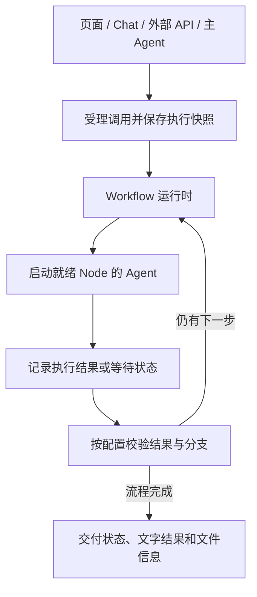
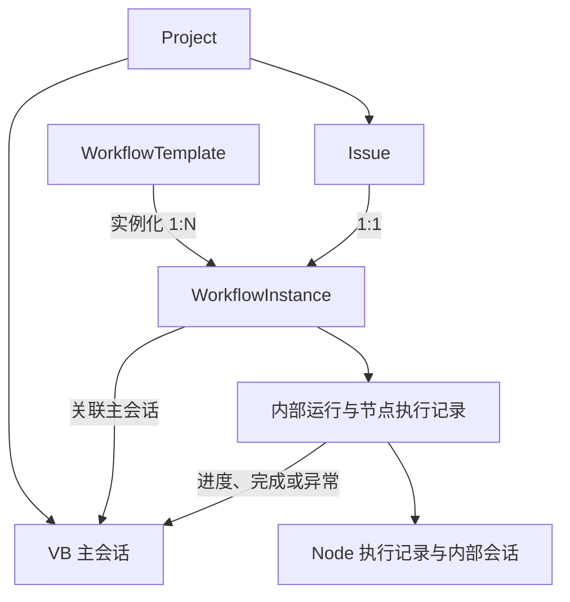

## 已确认的方向

2026-09-30 确认调度、调用入口与配置方向；2026-10-01 确认会话、聊天触发规则，以及 Issue 与工作流实例的一对一关系；2026-10-02 区分模板修改、实例配置修改与交付修改，并最终收敛为工作流实例首次受理执行后固定流程配置；2026-10-03 确认后台结果持久交回原主会话、离线时不自动启动 Agent，以及主 Agent 管理实例、判断重做范围和执行中追加要求的处理方式，运行时校验和执行的分工。

2026-10-04 核心代码已实现并完成分层自动回归。真实四种 CLI 的 MCP 加载与调用、完整 HTTP 流程、真实服务重启恢复、异机及发布安装尚未验收；“已实现”不等于这些验收全部通过。精确结果见下方“验证记录与未完成验收”。

你在 VB 中画出并配置工作流，由多个完整的 Agent CLI 执行重要的业务任务。工作流可以由不同入口调用，但所有入口共用同一个运行时。

**运行时是唯一的流程调度方。** 主 Agent 不逐步调度节点，相邻子 Agent 也不直接启动彼此。

## 核心对象：模板、实例和执行记录

2026-10-01 已确认工作流应有明确的 `WorkflowInstance` 对象。工作流模式的一个 Issue 对应一个工作流实例，该实例只属于这个 Issue；同一个模板可以用于不同 Issue，产生各自的实例。

| 对象                          | 表示什么                                    | 关系                                                        |
| ----------------------------- | ------------------------------------------- | ----------------------------------------------------------- |
| 工作流模板 `WorkflowTemplate` | 用户画好的流程，以及 Node、Agent 和发布配置 | 一个模板可创建多个 Issue 的实例                             |
| 工作流实例 `WorkflowInstance` | 某个 Issue 使用该流程开展工作的稳定对象     | 与工作流模式 Issue 一对一，关联主会话、项目空间和 Node 任务 |
| 执行记录                      | 实例内实际执行、等待、重试及恢复的事实      | 属于该实例，保留既有记录                                    |

同一 Issue 的补充、重试和返工请求都定位原实例，保留实例 ID、主会话和已有执行历史。实例内部可以有多个 Node/Task 和执行记录，聊天轮次不决定实例数量。实例的状态由运行时执行事实产生，不另建一套调度或状态维护引擎。

`WorkflowRun`、`NodeExecution` 是运行时执行记录，不能把每条新消息或每次执行记录都当成一个新的业务实例。每次正式受理执行、重试或重做新增 Run，请求重放与服务恢复沿用原 Run，不把每句修改意见都当成一次执行。

实例保存所采用的模板来源与配置，首次受理执行后固定流程配置，后续重试继续使用原流程。模板编辑不改写已启动实例及其执行快照，更新后的模板用于后续新建实例。

代码复用 [WorkflowAttempt](../../../crates/db/src/models/workflow.rs) 承担实例职责，不叠加第二套对象。[管理迁移](../../../crates/db/migrations/20261003000000_workflow_management.sql) 和 [共用管理服务](../../../crates/server/src/workflow_runtime/management.rs) 落实 Issue 唯一绑定、主会话关系、配置锁定与执行历史。

一对一关系由共用服务和数据库约束保护，覆盖页面、MCP 和外部 HTTP 入口。同一 Issue 再次请求建立实例时，定位已有实例或返回明确的绑定冲突，不创建第二个实例；不同请求标识也不能绕过这个关系。

## 职责划分

| 组件                 | 负责什么                                                                                   | 不负责什么                           |
| -------------------- | ------------------------------------------------------------------------------------------ | ------------------------------------ |
| Node 与连线          | 定义任务、执行者、步骤关系和合法分支                                                       | 仅作展示而让 Agent 任意绕过流程      |
| Workflow 运行时      | 校验管理请求，根据执行快照和节点结果推进流程，传递输入输出，记录执行，处理等待、取消和恢复 | 把业务判断全部写成固定代码           |
| 节点 Agent           | 完成任务，返回成果；在明确的判断节点中给出分支判断                                         | 直接创建下游执行或修改在途流程       |
| 主 Agent             | 理解需求、管理工作流实例、判断重做范围、解释成果与异常，通过工具请求执行、停止或恢复       | 成为第二个节点调度器或改写已冻结流程 |
| 页面、Chat、外部 API | 提交任务、展示进度、处理允许的交互、获取交付                                               | 各自维护另一套执行状态或调度流程     |

运行时通过已有 Agent 执行底座启动和停止实际执行，不另建进程生命周期管理体系。

## 流程如何真正流转

图中的回路表示运行时持续推进，不表示当前画布已支持循环连线。

例如审查 Agent 返回“需要修改”，这只是判断结果。只有运行时按已配置的规则确认返工目标并建立下一次执行，开发 Agent 才会再次运行。审查 Agent 不直接调用开发 Agent。

运行时控制不等于禁止智能判断。已有 Condition 路径可以让 Agent 判断分支，再由运行时校验选择是否合法；不确定结果可以进入已有人工处理流程。

## 主 Agent 的调用入口

VB 内置 MCP 服务已提供主 Agent 的工作流工具。外部系统继续使用 HTTP API，两种入口共用工作流服务和运行时。配置保存、显式会话绑定和持久通知已接入；真实 CLI 加载仍需验收。当前不新增工作流 CLI 命令。

| 比较项             | 内置 MCP                                                                | 本地命令                                               |
| ------------------ | ----------------------------------------------------------------------- | ------------------------------------------------------ |
| Agent 如何发现能力 | 原生 MCP 客户端读取工具名称、说明和参数结构                             | 通过提示词、帮助信息或技能了解命令用法                 |
| 参数与结果         | 按工具 schema 传递结构化参数，返回工具结果                              | 需设计参数、JSON 输出、退出码，并处理 shell 路径和转义 |
| 仓库基础           | 已有 MCP 程序、工具路由、四种 Agent 的配置适配及 Windows/Linux 发布打包 | 已有启动 CLI；需新增工作流子命令与输出约定             |
| 人工排查           | 通过 MCP 客户端检查工具调用                                             | 可直接在终端调用，人工排查更直观                       |
| 实际执行与通知     | 复用工作流服务，已接入显式会话绑定和持久通知                            | 本轮不新增命令入口                                     |

主 Agent 是主要调用者，结构化工具说明和参数更适合稳定调用。已有 MCP 基础可复用，改造集中在工作流工具与主 Agent 会话接入。命令适合人工操作或脚本，可按后续需要增加；本次只采用 MCP 作为主 Agent 的工作流调用入口。

使用随当前 VB 版本分发的本地 MCP 程序，通过 stdio 接入主 Agent，无需独立部署 MCP 网络服务。启动时提供明确的项目、Issue/实例（如已有）及主 Agent 会话上下文，仅暴露工作流调用所需的工具。工具与页面、外部 HTTP 接口共用工作流服务，保留现有项目排队、不可变快照和请求去重。

提交工具在持久化受理后返回稳定的实例标识及内部执行标识。VB 展示实际进度，并将完成、异常和待办作为系统事实持久交回原主会话；用户主动继续对话时，主 Agent 再读取成果或调查异常。工具调用、系统通知与 Agent 回复是不同事实，不因通知自动启动 Agent。

代码证据：[MCP 程序](../../../crates/mcp/src/bin/vibe_kanban_mcp.rs) 的工作流模式使用 [显式上下文](../../../crates/mcp/src/task_server/workflow_context.rs)，不靠 cwd 猜测会话；[执行级接入](../../../crates/executors/src/workflow_mcp.rs) 覆盖四种 provider 的原生配置，真实 `tools/list` 必须证明作用域和六类工具就绪后才发送首条真实提示词。就绪等待仅限制启动阶段为 30 秒，不限制 Agent 工作时长。真实四 CLI 加载未验收；[预设 MCP 配置](../../../crates/executors/default_mcp.json) 中的 `npx ...@latest` 不用作内部同版本接入方式。

## 管理工具与执行记录：已实现契约

本节方案于 2026-10-03 获整体批准，核心实现与定向回归于 2026-10-04 完成。局部重做推进受影响下游、复用无关上游；工具参数见 [工具定义](../../../crates/mcp/src/task_server/tools/workflows.rs)，服务校验见 [管理服务](../../../crates/server/src/workflow_runtime/management.rs)。开发机的精确契约另见 [管理工具契约](../../../.trellis/spec/workflow/backend/workflow-management-contracts.md)。

### 主 Agent 只使用六类工具

| 工具               | 用人话说                                              | 是否产生实际执行           |
| ------------------ | ----------------------------------------------------- | -------------------------- |
| `workflow_context` | 我现在属于哪个项目、哪个 Issue 和实例，有哪些操作可用 | 否                         |
| `workflow_list`    | 查看允许调用的已配置工作流                            | 否                         |
| `workflow_get`     | 看流程、节点记录、错误、成果和待处理事项              | 否                         |
| `workflow_submit`  | 提交首次执行、失败重试或成果重做                      | 持久化受理后，由运行时安排 |
| `workflow_stop`    | 请求安全停止指定执行，查询停止是否确认                | 不创建后续执行             |
| `workflow_respond` | 按现有权限处理准确的批准、分支或 Arena 待办           | 由运行时推进已有执行       |

开始、重试、重做共用提交工具，通过明确的操作类型区分，不拆一堆含义相近的工具。不提供“任意启动某个节点会话”的工具，避免绕开流程运行时。

项目和主会话由 VB 显式绑定，首次调用建立的 Issue/实例关联后续从数据库读取，不能一直使用启动时的空上下文。后端每次核对权限和归属，不能仅凭 Agent 填写的 ID 放行，也不靠当前目录猜测；共享目录不代表会话相同。现有 MCP 的 `project_id` 是远程项目引用，不能直接拿来作本机项目绑定。

### 每次正式执行留一条新记录

每次正式受理的首次执行、重试和重做都新增 `WorkflowRun`，而不是把旧 Run 改回运行中、清空错误后再使用。重复网络请求、事件重放及服务重启恢复沿用原记录，不产生新一轮执行。Node 在同一次 Run 内的合法多轮执行继续用 `iteration`，不是把它改成跨交付的次数计数器。

业务身份保持不变：同一 Issue、WorkflowInstance、主会话和项目空间。真正再次工作的 Node 新增执行记录，按现有绑定复用 Agent Node 的 Task/Session；Arena 的 Task/候选组按新节点执行建立，不把 Agent 的复用规则强加给所有类型。

以“分析材料 → 撰写报告 → 校对”为例：

| 执行记录         | 分析材料             | 撰写报告           | 校对                   |
| ---------------- | -------------------- | ------------------ | ---------------------- |
| 第一次执行       | 实际执行，保存结果   | 实际执行，保存结果 | 实际执行，保存结果     |
| 后续要求改写报告 | 引用第一次的分析结果 | 新执行记录         | 重新校对，新增执行记录 |

“引用旧结果”和“又执行一次”分别记录。引用明确的旧 NodeExecution，不伪造新的成功记录，不把上次 Agent 改动的文件再计入本次清单。历史保留每次实际输入、输出、错误和执行关联；项目文件仍是当前内容，不新增历史文件副本。

### 局部重做：选择起点，再重新走受影响下游，已确认

2026-10-03 已确认：主 Agent 判断要全部重做，还是从某些 Node 开始重做。运行时将所选起点及受影响的下游纳入本轮，复用不受影响的上游成果。例如只改报告，就复用分析结果，重写报告后重新校对，不把整条流程从头跑一遍。

纳入范围不代表把所有分支都执行：仍由原流程的合法分支和汇合规则决定哪些 Node 真正运行。重做 Condition 时重新判断分支，旧分支的下游结果不能冒充本轮成果；不重做的上游 Condition 则保留其已确认选择。多轮输入须引用准确执行身份，不能一律取 iteration 0 或会话最后一条消息。

该规则已由 [重做 planner](../../../crates/workflow/src/rework.rs) 实现并完成定向回归。它不允许主 Agent 改变固定连线或绕过分支；失败导致的 Skipped 也不能冒充已确认的未选分支或有效上游成果。

### 执行中追加要求如何落到记录

提交时保存新要求、材料路径、源执行、本次处理决定及可用的原用户消息引用。等待当前执行时持久记录依赖，停止后处理时持久记录停止意图与后续请求；这些都不修改旧执行已经受理的输入。不能把要求只放进一个会被替换的内存消息槽位。

受理返回项目、Issue、实例、执行和请求标识，以及排队、等待旧执行、停止旧执行或启动中的真实阶段。请求编号不变的重复调用返回原受理结果；同一编号换参数返回冲突。不同请求同时基于旧执行提交时，原子核对实例最新受理记录，不能静默套用过期计划。

依赖旧执行的可复用成果，在旧执行真实结束、停止边界确认后再固定具体来源，且必须先于新 Node 启动。必需输入最终不可用时，在已受理的新 Run 上记录可查询的计划失败，不丢失 ID，也不猜测成果后开始执行。受理、依赖规划与原 FIFO 的衔接已由管理服务实现。

停止请求成功返回不代表进程已经退出。旧执行若自然完成，保留它的真实完成结果和结束时间；残留进程清理另行记录，停止未确认或进程失联仍保留项目占用。已修复将自然终态改回 Cancelling 并清空结果的旧路径，队列仍要求确认子进程退出及人工等待解除。

停止与后续执行在一个事务里保存新 Run、源执行依赖、原排队顺序和明确的停止意图，提交后才请求真实停止。恢复继续处理这条记录，不重新受理。源执行确实结束后先固定复用计划，再进入原项目队列；取消等待中的新 Run 后不能被就绪检查重新启动。不新增第二套调度器；真实服务崩溃恢复仍待验收。

工具错误须保留后端的业务错误码和可读原因，不能只剩“HTTP 409”。人工处理按准确的 `node_execution_id` 校验，不能靠节点名字或“最新待办”猜测；Agent 拿到工具也不自动获得所有人工批准权限。

### 主会话如何真正关联

用户先选择项目与已配置工作流，VB 准备普通主会话，固定主 Agent 的配置。需求讨论阶段不为凑业务归属提前创建空 Issue；第一次正式提交才在事务里建立或取得 Issue、唯一实例及 Workflow Task，并绑定这条原会话。Node 仍使用自己的 Task/Session，不额外把主会话伪装成一个 Node。

实例只保存一条主会话关联。MCP 后续从持久关系读取最新 Issue/实例，不依赖启动时尚未存在的 ID；同目录的其他会话不能借此调用。原会话删除后保留执行结果，不另建替代会话。外部 HTTP 执行也不会隐式启动主 Agent。

发布配置、会话绑定、同版本 MCP 启动参数与执行级作用域凭据已进入代码。捕获的完整 ExecutorConfig 不允许被会话模型、原生命令或 profile 覆盖改写；普通会话保留原有配置恢复方式。

### 结果回到会话，不等于 Agent 自动开口

结果通知与工作流终态/待办一起持久化，页面把它作为普通系统消息放回原主会话。按稳定通知 ID 去重，不伪造 Agent 回复，也不占用或覆盖用户的排队消息。历史通知保留当时事实，显示及读取时另外核对当前状态，已经处理的待办不会再次提示批准。

静态核对发现，现有 [Agent 命令接口](../../../crates/executors/src/runtime/orchestration.rs:206) 没有向闲置原连接发送新一轮通知的能力，[运行状态](../../../crates/executors/src/runtime/contracts.rs:571) 也没有 Idle。已有 [会话后续消息](../../../crates/server/src/routes/sessions/agent_run.rs:373) 会创建新的 AgentRun，不能因为上一轮成功或网页还开着，就认定主 Agent 仍在线等候。

2026-10-03 用户已确认本次采用“结果自动显示，用户继续对话时主 Agent 读取并解释”的闭环。打开会话只读事实，不启动进程；不因通知自动启动、恢复或唤醒主 Agent。此前有条件的在线自动反馈不列入本轮范围；真实闲置通道和自动解释留待后续独立设计，不借用户消息队列实现。

### 本轮不宣称通过的验收

核心代码与分层回归已完成，但真实 CLI、认证 HTTP/MCP、真实服务恢复、异机及发布安装未执行。当前机器未安装 OMP，不为本轮验收安装或启动真实 Agent。mock、fake port、协议样本与源码检查不能代替真实 provider 加载。

## 主 Agent 的配置位置

已确认在每个工作流的发布设置中配置主 Agent，配置内容包括智能体、模型和提示词。由发布者提前定义该工作流如何理解需求和解释交付，使用者通过对话提交需求。

| 配置对象      | 配置位置                 | 职责                                     |
| ------------- | ------------------------ | ---------------------------------------- |
| 主 Agent      | 工作流发布设置           | 理解需求、管理工作流实例、解释成果和异常 |
| Node 的 Agent | 对应 Node 的设置         | 完成该节点任务                           |
| Router Agent  | 已有工作流级 Router 设置 | 判断 Condition 分支，由运行时校验并推进  |

例如“报告生成”工作流选择 Claude 作为主 Agent，分析和撰写 Node 分别选择 Gemini、Codex。主 Agent 的配置不会覆盖 Node 或 Router 的配置，实际节点调度仍由运行时负责。

主 Agent 会话沿用已有会话固定智能体及运行配置的约定。修改发布设置不会给已有会话替换智能体；新会话使用新配置。配置保存、普通会话准备和执行关联已实现，页面与生产模型的定向回归已通过。

## 主会话与节点会话

2026-10-01 已确认主 Agent 复用 VB 现有会话，归属于本次选择的项目。用户在这条主会话中提交需求、查看进度并接收结果，形成完整的沟通和交付记录。

各个 Node 保留自己的内部会话，用户从工作流执行详情中按需查看其过程、成果和错误。主会话展示工作流进度和交付，节点内部会话保留原有执行身份，不把全部节点对话拼接成主 Agent 的原生会话历史。

2026-10-02 已确认主会话不新增工作流进度卡片。沿用普通聊天消息与现有工具调用展示：主 Agent 根据真实受理状态说明已接收或排队；用户询问进度时查询运行时并回答；完成或异常的系统事实仍回到原主会话。Node 的详细过程继续从执行详情查看。持久通知已实现，用户主动继续时的真实 Agent 回复仍待联调。

图示表达工作流模式的业务归属；数据库复用 Attempt 并新增管理关系，不单独建立另一套 WorkflowInstance 表。主会话关联 Issue 的唯一实例，进度展示以该实例的运行时记录为准，主 Agent 的解释不改变执行状态。Node 内的任务继续复用已有 Task 模型。

会话创建时机、实例关联与通知的持久化接口已按前文契约实现。同一 Issue 的后续操作保持原实例身份，新增执行记录而不清空历史。

## 后台消息交回主会话：2026-10-03 已确认

工作流异步受理后在后台推进，主 Agent 不需要一直等待，也不需要持续查询。完成、失败、异常或进入人工等待时，运行时保存结果和持久的待交回通知，明确关联项目、Issue、WorkflowInstance、实际 WorkflowRun 和原主 Session。通知存储及原会话系统消息已实现，不伪造 AgentEvent 或 Agent 回复。

通知是内部执行事实，不冒充用户新提出的要求，也不是重新启动工作流的指令。按 2026-10-03 最新确认，页面自动以普通系统消息展示通知，用户主动继续对话时主 Agent 再沿用原会话读取真实状态与成果并解释，不新增工作流进度卡片。人工等待通知处理时应核对当前状态，不能把已处理的事项继续描述成待处理。

主 Agent 正在回复时，通知先持久保存，不插入或打断它的回复，也不在当前轮结束后自动启动新轮。结果显示与 Agent 解释是不同事实；失联不等于空闲，不能因此启动重复进程，不把每个 Node 的状态变化都变成新的主 Agent 对话。

主 Agent 不在线时，VB 不自动启动、唤醒或重启它，只保存结果和待处理通知。用户下次打开原会话时，由页面读取并以普通聊天消息展示已保存的事实；打开页面本身不启动 Agent，也不把系统结果冒充为 Agent 已生成的回复。用户之后主动继续对话时，主 Agent 可以读取这些结果进行解释。

通知持久化并去重，不能覆盖用户消息或并发启动同一会话。同一事件重放复用同一通知身份；不同执行或不同人工等待事项不能误合并。页面按原 Session 分页读取并合并系统事实，展示成功与 Agent 是否已解释是不同事实。真实服务重启与 Agent 继续对话的端到端验收仍独立保留。

反馈失败不改变工作流真实结果，只保留可查询结果和待处理通知，不能重跑已完成工作来补一条回复。用户主动取消后不能因通知自动重启 Agent 或工作流；原会话已删除时只保留执行结果供查询，不擅自新建替代会话。

通知使用 [管理迁移](../../../crates/db/migrations/20261003000000_workflow_management.sql) 的持久事件与 [管理模型](../../../crates/db/src/models/workflow_management.rs)，不复用 [QueuedMessageService](../../../crates/services/src/services/queued_message.rs) 的可替换内存槽位，也不借自动后续消息启动 Agent。

## 聊天如何触发工作流

2026-10-01 已确认由主 Agent 理解用户消息。用户提出明确的执行需求，且主 Agent 判断需求和材料足够时，通过内置 MCP 调用工作流；缺少必要信息或材料时先追问。

| 用户消息                       | 主 Agent 的处理                          | 工作流行为                                                 |
| ------------------------------ | ---------------------------------------- | ---------------------------------------------------------- |
| “帮我生成报告”，需求与材料足够 | 整理执行需求和材料路径，调用工作流       | VB 准备业务记录并异步提交执行                              |
| “帮我生成报告”，缺少必要材料   | 向用户追问或请求补充材料                 | 等待补充，不创建实际执行                                   |
| “现在做到哪了”                 | 查询关联执行的真实状态并回答             | 查看进度                                                   |
| “解释一下结果”                 | 读取已交付成果并回答                     | 查看成果                                                   |
| 执行中补充或调整要求           | 判断等待当前执行结束，还是安全停止后处理 | 保持原实例，按已受理请求和停止确认推进，不直接改写在途执行 |

首次正式调用时，VB 自动创建缺失的 Issue、其唯一工作流实例及相关 Task/执行记录，业务归属为 Project → Issue ↔ WorkflowInstance，节点任务和执行记录归属于该实例。已有明确 Issue 上下文时取得该 Issue 的已有实例，后续请求由运行时按实例当前状态处理；用户在主会话中沟通，无需手工逐项创建这些记录。

MCP 工具通过共用服务校验项目、Issue、实例、会话和允许调用的工作流，准备上述关联并持久化受理。主 Agent 提交请求，业务服务负责记录与实例/执行身份，不让 Agent 直接写生命周期表。沿用异步项目队列和请求去重，同一次提交重试不得重复创建业务记录或执行，同一 Issue 始终保持唯一实例。

聊天理解与追问针对主 Agent 的 Chat 入口，Issue 与实例的一对一关系适用于所有入口。外部 HTTP 创建、查询与提交已接入统一实例和受理契约，不能让同一 Issue 建多个 Attempt；实例内修改需求采用前述管理工具、来源复用及执行历史契约。真实 HTTP 全链路尚未验收。

## 三类修改的边界

2026-10-02 已确认：修改工作流、修改某次尝试的配置，以及要求修改交付成果是不同的操作，不能用笼统的“修改”替代各自的规则。

| 操作             | 修改对象                                            | 例子                            |
| ---------------- | --------------------------------------------------- | ------------------------------- |
| 改工作流         | 可复用模板中的 Node、连线和 Agent 等配置            | 给报告模板增加一个校对 Node     |
| 改某次尝试的配置 | 启动前调整该 Issue 实例的输入或流程配置，不写回模板 | 启动前只给这次报告增加校对 Node |
| 改交付成果       | 追加本次任务要求，流程定义保持原样                  | 要求把已交付报告改成表格        |

“某次尝试”在此表达单次工作的配置修改，不引入一个新的业务对象，也不改变 Issue 与实例的一对一关系。按照 2026-10-02 的最新决定，实例流程配置仅在首次受理执行前可编辑；启动后不再调整这份流程。交付修改按前述原实例内重做与成果复用处理，不能借此修改已固定的流程。

## 工作流实例启动后固定：已确认

2026-10-02 用户进一步收敛设计：已经开始的工作流不再修改。本节替代此前“运行中保存后续配置、结束后修改再执行”的规则，也撤回“修改已启动实例的流程后按影响范围重做”的提案。实例级永久配置锁定已实现并完成受理竞争与只读页面的定向回归。

| 阶段           | 已确认的行为                                                                                    |
| -------------- | ----------------------------------------------------------------------------------------------- |
| 尚未受理执行   | 可以调整这个实例的流程配置，保存本身不启动执行                                                  |
| 首次受理执行后 | 固定 Node、连线、执行者、模型、提示词和分支等流程配置，包括排队、运行、失败、取消及完成后的实例 |
| 修改工作流模板 | 更新模板用于后续新建实例，不改变已经启动的实例                                                  |

锁定边界采用首次持久化受理，而不是等待实际 Agent 进程启动，避免排队期间修改流程导致受理内容不一致。校验失败、尚未受理的草稿仍可编辑；已经受理的实例不会因停止、失败或完成重新变成可编辑草稿。

冻结的是流程业务定义。运行时仍可补齐 Session/Task 关联、处理已配置的人工事项、更新真实状态和保存执行记录。失败重试或合法恢复使用原流程与快照，不通过重试替换 Agent、增删 Node 或修改连线。暂时失联仍不等于已停止，项目占用与停止确认规则保持有效。

页面对已启动实例展示只读流程，共用服务也应拒绝其流程配置修改，覆盖页面、MCP 与外部 HTTP 入口。首次受理与草稿保存需要原子校验：保存先成功则受理采用保存后的配置；受理先成功则后续配置保存被拒绝。不能只根据当前是否处于 Running 判断能否编辑。

本轮不再设计已启动实例的流程修订、不同流程配置间的成果复用或变更影响计算。原流程下的失败重试、交付后追加要求与执行历史保留是不同问题，后续分别细化，不以新建业务实例代替已有实例的恢复操作。

## 原流程下的重试与交付修改：规则与记录方案

已经确认同一 Issue 的补充、重试和返工保持原实例身份、主会话与执行历史；启动后的流程配置保持固定。用户主动停止不触发自动重启，正常人工事项处理和失败重试继续经过运行时。

交付后要求修改成果，属于追加任务要求，不是修改流程定义。2026-10-03 已确认重做范围应看实际情况：不固定为每次全流程重跑，也不固定为每次只重做局部 Node。应结合本次修改要求、已有成果和受影响的步骤决定范围，始终保持原 Issue、实例、主会话及固定流程。

2026-10-03 已确认：主 Agent 可以管理这个工作流实例，不只是转述消息。它结合用户的新要求、已有成果和节点执行记录判断需要重做哪些 Node，通过内置 MCP 提交管理请求；运行时负责校验请求并落实实际调度、停止和执行记录。主 Agent 可以请求全流程重做或局部重做，但不能直接启动节点进程、改写生命周期表，或绕过项目占用、停止确认和已冻结的流程定义。

工具参数、准确上游成果引用和新增执行记录已实现；局部重做按原图推进受影响下游。通知或状态查询不能自动重开已完成执行，重做必须来自正式受理的请求。执行中追加要求的处理规则见下节。

执行历史应保留每次实际输入、输出、错误及 Agent 执行关联。项目目录中的文件仍是当前文件，不提供修改前的文件快照；历史记录保留不能被解释为历史文件内容也已保存。

历史重试清空旧行的路径已改为共用管理受理，新增 Run 与实际 NodeExecution，复用结果保留准确源执行与 iteration。完成的旧 Run 不重新打开；后续交付修改产生新 Run。生产画布区分实际执行、复用和跳过，旧成果只读，进度与成本只计算本轮实际工作。

## 执行中收到新要求：2026-10-03 已确认

工作流执行中，用户仍可在原主会话补充或调整要求。主 Agent 根据新要求、当前进度和已有成果判断处理方式，不固定为每次立即停止，也不固定为必须等整个流程结束。

- **等待当前执行结束**：保留追加要求，保持本次已受理执行的输入和流程配置不变；后续处理仍通过主 Agent 提交管理请求和运行时持久化受理，不直接把新要求塞入正在执行的 Node。
- **先安全停止再处理**：主 Agent 通过工具请求运行时停止当前执行。运行时保持真实的停止中或未确认状态，在确认旧执行已停止后才允许重做实际开始；暂时失联不能视为停止，也不能因此释放项目占用或启动重复进程。

停止后的处理沿用原 Issue、WorkflowInstance、主会话及固定流程，保留已有执行记录和成果，不通过停止解锁流程配置。若旧执行在处理请求期间已自然完成，先核对真实终态和成果，不把已完成事实覆盖成一次失败或取消。

为落实用户的新要求而停止再重做，与用户只要求停止任务是不同意图。单纯取消不自动重启；状态查询、结果通知或打开会话也不产生重做请求。主 Agent 离线时仍沿用已确认的不自动唤醒规则，已持久化受理的执行由运行时继续负责。

2026-10-03 已确认停止范围：用户单纯要求停止某次执行时，一并取消同实例依赖它且尚未开始的后续请求，避免停完又自动开始之前排队的修改。明确要求“停掉旧执行，按新要求重做”时，内部停止旧执行保留已受理的新请求。其他 Issue 的独立队列不受影响。取消后续不撤销已经发出的旧执行停止；回复列明受影响执行和真实停止状态，不能把另有源执行活跃的整个实例说成已经停止。

`after_current` 和 `stop_then_run` 已实现持久关联、停止意图与后续受理的事务衔接，继续使用原项目 FIFO。临时数据库和 fake port 的依赖、取消与竞争回归已通过；真实服务恢复未验收，不能用内存消息槽位代替这些记录。

## 意外终止时主 Agent 如何介入

正常流程由运行时推进，异常处理允许主 Agent 根据现场灵活判断，不要求把每种故障都提前写成固定恢复分支。

1. **运行时记录事实**：保存当前节点、真实执行状态、错误及已有结果。进程已退出与暂时失联分开表达，不能在情况不明时启动重复执行。
2. **主 Agent 查看情况**：结合节点记录、运行日志、已完成的文字结果和项目文件，判断哪些工作已经完成、哪里中断、可能原因及可行的后续处理。
3. **向用户说明**：例如“材料分析已完成，报告生成中断；草稿仍在项目目录，可排查原因后重试生成节点”。说明以可验证结果为依据，不能凭解释把失败改成成功。
4. **按情况处理**：主 Agent 可以提出重试、排查环境、继续或结束的方案；需要执行时，向运行时提交其支持且已获授权的操作请求。运行时校验并记录操作，保留原有执行身份和恢复语义。

用户主动停止不触发自动重启。主 Agent 不绕过执行快照、项目占用或停止确认，也不在运行时之外自行重启节点。主 Agent 不可用时，页面/API 仍能查看运行时记录的真实状态。

异常通知、状态查询和重试/重做工具已接入；用户主动继续时主 Agent 可据真实记录解释并请求支持的操作。不自动唤醒 Agent，也不将灵活判断另建为第二套工作流引擎；真实 provider 异常联调仍待验收。

## 沿用的业务边界

- 工作流仍由用户在 VB 中准备；外部选择允许调用的工作流，不提交任意图定义。
- 业务归属采用 Project → Issue ↔ WorkflowInstance，工作流模式的 Issue 与实例一对一。Task、Node 和执行记录保留在实例内部，Chat 作为交付入口不取消这些归属。
- 同一项目最多一个活跃工作流；后续请求异步排队。节点内部执行仍遵守已有规则，不把项目串行误解为所有节点必须串行。
- 实例首次受理执行后固定流程配置，停止、失败和完成后也不再编辑这份流程。执行与重试使用原快照；模板更新用于后续新建实例。
- 材料和成果位于项目工作目录，不由 VB 强制拆成 Issue/run 文件夹。文件清单不代替目录浏览，也不提供未实现的历史文件快照。
- Chat 复用 VB 主会话来提交需求、查看进度和接收交付；Node 的内部会话从执行详情中查看。明确执行需求在信息足够时由主 Agent 调用工作流，进度查询和成果解释按普通对话处理，不把对话轮次直接当作执行次数。
- 发布入口放在现有“工作流”栏目中，不增加新的左侧一级导航。

## 当前实现与差距

以下为 2026-10-04 的核心实现状态，定向自动回归不能代替真实 provider、服务及部署验收。

| 能力                 | 当前情况                                                                        | 证据                                                                                                                                                    |
| -------------------- | ------------------------------------------------------------------------------- | ------------------------------------------------------------------------------------------------------------------------------------------------------- |
| 运行时控制下一步     | 已有图与执行状态驱动的就绪节点规划和执行循环                                    | [planner.rs](../../../crates/workflow/src/planner.rs)、[运行时 runner](../../../crates/server/src/workflow_runtime/runner.rs)                           |
| 底层多上游汇合       | 通用编排服务已实现 All、Any、Each，以及持久化消费去重；画布接线的一致性仍需核对 | [汇合策略](../../../crates/services/src/services/orchestration.rs)、[Workflow 接线](../../../crates/server/src/workflow_runtime/runner.rs)              |
| Agent 判断分支       | 已有 Condition router 路径，只有选中的目标会被推进                              | [planner.rs](../../../crates/workflow/src/planner.rs)、[Condition 契约](../../../.trellis/spec/workflow/backend/workflow-attempt-contracts.md)          |
| 异步外部调用         | 已有项目授权、任务实例化、持久化受理、项目级队列及查询/取消能力                 | [queue.rs](../../../crates/server/src/workflow_runtime/queue.rs)、[外部接入文档](../../integrations/external-workflows.mdx)                             |
| 工作流实例与 Issue   | 复用 Attempt 为实例，数据库与共用服务保护 Issue 一对一绑定                      | [管理迁移](../../../crates/db/migrations/20261003000000_workflow_management.sql)、[管理服务](../../../crates/server/src/workflow_runtime/management.rs) |
| 实例启动后固定流程   | 首次持久受理即永久锁定；页面只读，服务拒绝流程配置修改                          | [Workflow API](../../../crates/server/src/routes/workflows.rs)                                                                                          |
| 主 Agent 调用入口    | 同版本 stdio MCP、显式执行级作用域与六工具就绪门已实现；真实 CLI 未验收         | [MCP 工具](../../../crates/mcp/src/task_server/tools/workflows.rs)、[就绪协议](../../../crates/executors/src/workflow_mcp/readiness.rs)                 |
| 主 Agent 配置        | 工作流栏目内发布设置与普通主会话准备已接入；完整运行配置固定                    | [主 Agent 设置](../../../packages/web-core/src/features/workflow/ui/WorkflowMainAgentDialog.tsx)                                                        |
| 主会话与节点会话     | 主会话一次性关联实例；Node 保留自己的 Task/Session，执行详情按需查看            | [管理服务](../../../crates/server/src/workflow_runtime/management.rs)                                                                                   |
| 后台结果交回         | 持久系统通知自动展示到原 Session；读取、通知与打开页面不启动 Agent              | [通知模型](../../../packages/web-core/src/features/workflow/model/workflowNotifications.ts)                                                             |
| 聊天触发与业务记录   | 正式提交原子准备 Issue、唯一实例与执行；需求讨论不提前建空 Issue                | [管理集成测试](../../../crates/server/tests/workflow_management.rs)                                                                                     |
| 交付修改与重做管理   | 新 Run/实际 NodeExecution 保留历史，复用准确来源，旧成果只读                    | [重做 planner](../../../crates/workflow/src/rework.rs)、[运行视图](../../../packages/web-core/src/features/workflow/model/workflowRuntimeView.ts)       |
| 执行中追加要求       | 等待当前或停止后处理持久受理，保留原 FIFO；停止请求不冒充确认退出               | [项目队列](../../../crates/db/src/models/workflow_queue.rs)                                                                                             |
| 审查后回到开发       | 当前校验器拒绝环形图，不能直接画回连线实现返工循环                              | [validation.rs](../../../crates/workflow/src/validation.rs) 的 `reject_cycles` 与 `rejects_graph_with_cycle`                                            |
| 对外 Chat 交付       | 后续设计方向；已有外部 API 不等于完整 Chat 产品                                 | 本文的交付边界                                                                                                                                          |
| 工作流栏目内统一发布 | 已接入主 Agent 配置与会话入口；外部 Chat/嵌入页面不在本轮交付范围               | [工作流入口](../../../packages/web-core/src/features/workflow/ui/WorkflowLandingPage.tsx)                                                               |
| 主 Agent 异常介入    | 已提供系统通知、真实状态及重试/重做工具；主动继续的真实 provider 联调待验收     | 本文的异常介入设计                                                                                                                                      |

底层 `evaluate_join()` 已实现三种汇合策略；`start_workflow_orchestration()` 当前却固定写入 `join: All`，而画布规划器按成功上游累计触发次数，允许下游新增 iteration。实际启动仍经过 Workflow 规划、Agent 状态协调和执行边界，不能仅凭底层策略字段宣称画布完整支持三种策略，也不能仅看规划器就断言真实 Agent 一完成便立即启动下游。后续复用底座时应验证这些层的调度与消费记录是否一致，不重新发明汇合机制。

## 规划收口与实施审阅

主 Agent 通过内置 MCP 管理工作流，在工作流栏目配置智能体、模型和提示词，并复用项目下的 VB 会话承载需求和交付。Issue 唯一实例、首次受理永久锁定、重试/重做历史、停止与后续受理衔接、持久系统通知和页面入口已实现。运行时仍是唯一调度方，不扩展已启动实例的流程修改；真实 CLI 和部署验收仍待完成。

现有工作流级 `router_executor_config` 用于 Condition 的分支判断，[Router 配置面板](../../../packages/web-core/src/features/workflow/ui/WorkflowRouterConfigPanel.tsx) 也按此职责展示。运行时在同一 WorkflowRun 内创建或复用名为 `Workflow Router` 的会话。该会话不是接收用户需求、调用整个工作流并解释交付的主 Agent 会话，不能把现有 Router 配置视为已经实现主 Agent 配置。

局部重做的下游边界、结果交回范围及用户停止的依赖取消范围均已确认。主会话关联、作用域 MCP、通知、执行历史和停止衔接的契约已齐备；任务 PRD 已无损收敛并保留原验收编号，实施计划和上下文清单已核对。整体方案已于 2026-10-03 获最新明确批准，不再追加零碎产品确认。新的执行记录不等于支持画布环形连线；若后续需要图内循环，仍须另行说明每轮输入输出、执行身份、恢复和取消，不能只删除环检测。

开发机实施依据见 [任务 PRD](../../../.trellis/tasks/09-24-project-workflow-integration/prd.md)、[技术设计](../../../.trellis/tasks/09-24-project-workflow-integration/design.md)、[实施与验收计划](../../../.trellis/tasks/09-24-project-workflow-integration/implement.md) 和 [管理契约](../../../.trellis/spec/workflow/backend/workflow-management-contracts.md)。`.trellis/` 按仓库规则保留本地、不发布；远程读者可通过本文链接的生产代码和测试核对。管理迁移已新增绑定、来源引用、停止意图与通知等持久结构，但没有新增循环协议或脚本引擎。

## 验证记录与未完成验收

2026-10-04 定向后端回归已通过：管理集成 11、原工作流路由 51、重做 planner 5、项目队列 4、executor 工作流接入 24、MCP 库 8、server 工作流单元 27、local-deployment 工作流单元 5。MCP binary 过滤器命中 0 项，不计入通过数。临时 SQLite 和 fake port 用于检查业务边界，不代表真实 Agent 执行。

前端工作流浏览器 suite 38、生产画布视觉 suite 6、生产运行模型 suite 6、通知模型 5 和对话虚拟化模型 3 均通过；浏览器测试 mock HTTP。四个前端包类型检查及 26 个生产文件定向 lint 通过。六个受影响 Rust 包的 `--tests` 编译、生成类型检查和全项目格式化通过；未运行全 workspace 测试或严格 Clippy，既有 Rust warning 保留。

本轮新增 43 个文案 leaf key 已覆盖七语言；英文和简繁中文全量键一致。四种其他语言原有缺项仍使全量语言检查失败；NPX CLI 全量类型检查仍受既有 `cac` 依赖缺失影响。没有为此安装依赖、覆盖旧翻译或宣称全仓检查通过。

真实四种 CLI 的 MCP 加载与工具调用、完整认证 HTTP/MCP 流程、实际服务恢复和停止、异机及 npm 发布安装尚未验收。完整外部 Chat/嵌入产品与画布环形连线不在本轮实现范围，不把代码、源码审查或 fake/mock 结果当成这些验收。

## Claude Code 参考

[Claude Code Dynamic Workflows 官方文档](https://code.claude.com/docs/en/workflows)中的主 Claude 编写 JavaScript 编排脚本，由独立运行时执行，子 Agent 返回结果。借鉴的是调度责任划分，不是要求 VB 改用 JavaScript，或放弃现有 Node/连线定义。
