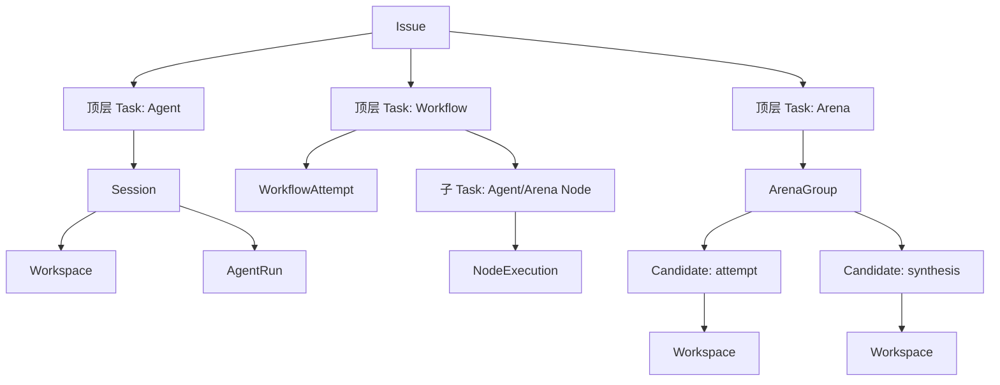
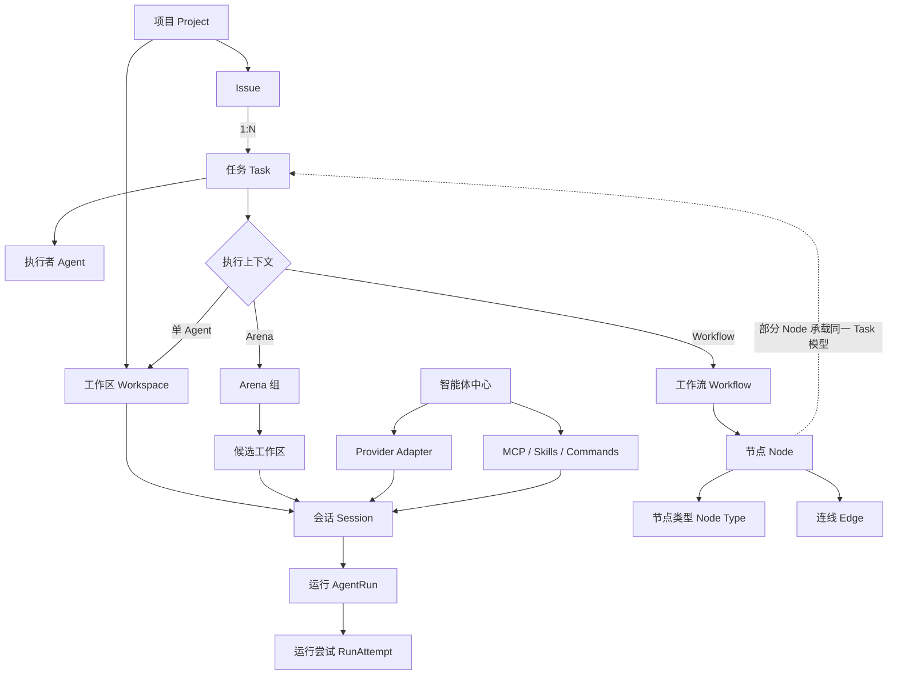
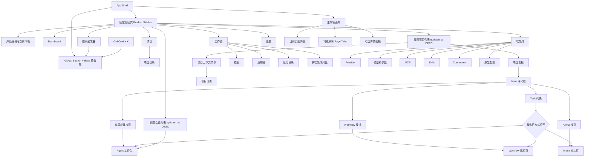
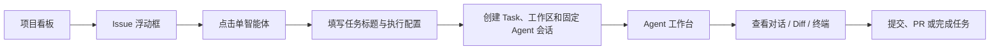
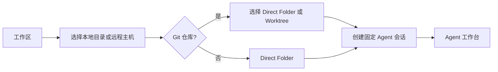
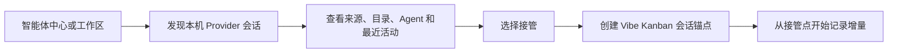
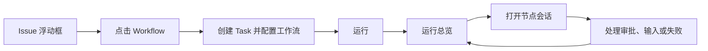
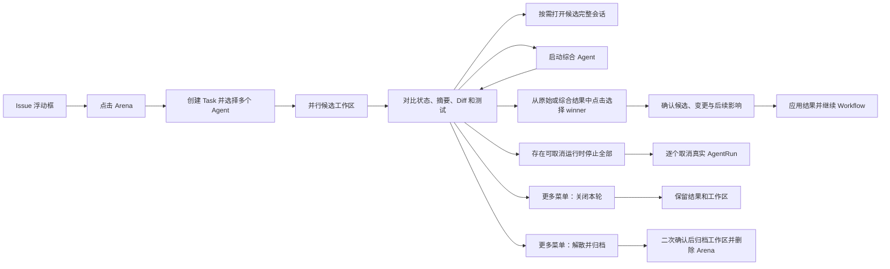

## 核心判断

Vibe Kanban 不应继续以“看板页面”作为整个产品的唯一中心。看板负责规划，Task 是统一执行身份，工作区、会话和 AgentRun 承担实际执行；Workflow 与 Arena 负责把执行单元组织或比较起来。

产品名称继续使用 `Vibe Kanban`，定位确定为“多智能体开发控制台”。这不是界面中的常驻营销副标题，而是信息架构判断：项目与看板负责规划，Agent 工作台负责执行，Workflow 与 Arena 负责多智能体编排和比较，智能体中心负责 Provider、模型、MCP、Skills、Commands 与原生配置。以上能力都是同一产品的一级组成，不从属于看板页面。

统一建立以下产品心智：

```text
项目（Project）       = 长期业务和代码上下文
Issue                 = 需要处理的工作目标或事项，不与 Task 混用
任务（Task）          = 统一的执行任务模型，拥有标题、状态和执行上下文
智能体（Agent）       = Task 的执行者
工作区（Workspace）   = Agent 实际工作的目录与 Git 环境
会话（Session）       = 用户与固定 Agent 的持续交互边界
运行（AgentRun）      = 会话内一次可观察、可控制的执行
工作流（Workflow）    = 由 Node 组成的编排定义或实例
节点（Node）          = Workflow 画布中的所有业务单元
节点类型（Node Type） = 决定 Node 的编排行为与可配置内容
连线（Edge）          = Node 之间的流转或依赖关系
Arena                 = 多个候选工作区的并行对比与综合
智能体中心            = Provider、模型、MCP、Skills、Commands 和原生配置的管理入口
```

Issue 直接发起的 Task 与 Workflow 中由 Node 承载的 Task 使用同一种 Task 模型。它们可以拥有不同来源和上下文关联，但不拆成 `Agent Task`、`Workflow Task` 或 `Node Task` 等平行业务对象。并非所有 Node 都必须承载 Task；开始、结束、条件等类型只负责组织流程。Node 的类型始终作为属性表达，不与 Node 组合成新的业务对象名称。

这个统一模型同时落到数据层，而不是只在页面上统一名称：



- Task 是数据库中的 canonical 实体，拥有稳定 ID、Project/Issue、可选父 Task、唯一标题、不可变执行方式和时间。Issue 列表只显示没有父 Task 的顶层 Task。
- Task 不保存另一份 runtime status。单 Agent、Workflow、Arena 和 Workflow child Task 分别从唯一 Session/AgentRun、WorkflowAttempt、ArenaGroup 或 NodeExecution binding 派生状态与打开目标；缺失或重复 binding 是数据错误，不由前端猜测。
- 单 Agent Task 绑定 Session，不直接绑定 Workspace。Session 已经唯一指向 Workspace，这样同一 Workspace 的多个会话不会被错误合并为一个 Task。
- Workflow Draft 中的 Node 保存 TaskSpec；只有开始运行时，承载 Task 的 Agent/Arena Node 才实例化为父 Workflow Task 的子 Task。Start、End、Condition、Human Gate 和 Transform 只产生编排执行记录，不创建 Task。
- Arena 的多个候选属于一个 Task。每个 candidate 使用独立稳定 ID、Workspace 和显式 `attempt | synthesis` purpose；名称不是类型，winner 引用 candidate 而不是靠 Workspace 名称或位置推断。
- 单 Agent、Workflow 和 Arena 的创建都以事务同时建立 Task 与 binding。用户在确认前取消或任一步失败时不留下空 Task、孤立 Workspace/Session 或半创建 Arena。
- Local SQLite 是执行数据的唯一写入 owner；Remote 页面通过绑定 Host 的 canonical API 使用同一 TaskSummary 与状态映射。Host 离线时明确显示不可用，不在 Remote PostgreSQL 建立另一套可以独立修改执行状态的 Task。

Node Type 保留现有七种值：

| Node Type  | 当前职责                                | 是否承载 Task |
| ---------- | --------------------------------------- | ------------- |
| Start      | 定义 Workflow 入口                      | 否            |
| End        | 定义 Workflow 结束                      | 否            |
| Agent      | 由 Agent 执行工作                       | 是            |
| Condition  | 根据条件选择后续 Edge                   | 否            |
| Human Gate | 等待用户确认、拒绝或输入                | 否            |
| Transform  | 对上下文进行确定性转换                  | 否            |
| Arena      | 一个 Task 配置多个 Agent 候选并比较结果 | 是            |

表中的 `Agent` 和 `Arena` 只是 `Node.type` 的值。界面中的对象标题、选中状态、编辑入口和运行记录仍统一称为 Node。

`Start` 和 `End` 是每个 Workflow 自动创建且各自唯一的系统 Node。它们不进入 Node Type 选择器，不允许新增、删除、复制、改名或修改 Type；点击只负责选中和定位，不显示配置内容，并关闭此前打开的配置框。Start 不允许入边，End 不允许出边。

`Arena` 类型遵守 `1 Node → 1 Task → N Agent candidates`。多个候选可以分别产生运行、会话和结果，但它们仍属于同一个 Task；Issue 卡片、Workflow 进度和 Task 列表都只投影一条 Task，不把候选提升为同级 Task。

`WorkflowNodeCard` 使用最多三层固定信息节奏。第一行以弱化小字显示只读 `Type: …`，配置缺失时在同一行右侧增加文字“待配置”；第二行显示唯一 canonical 标题，承载 Task 的 Node 直接使用 `Task.title`，不额外重复 Task 摘要；第三行仅为承载 Task 的 Node 显示执行者摘要，单 Agent 使用 Agent 名称，Arena 使用候选数量而不展开候选列表。模型、运行时长、工作区路径和其他配置都留在 Dialog 或运行详情；Skills 既不进入卡片，也不进入 Node Form。

普通 `WorkflowNodeCard` 在桌面画布使用约 `220–240px` 固定宽度，不提供 resize handle 或持久化尺寸。两层与三层卡片按实际内容自然收敛高度；主标题最多显示两行，溢出省略，hover 与 keyboard focus 使用同一完整标题提示。Start / End 使用独立的紧凑系统卡片，避免为了统一宽度制造无信息空白。

所有 Node Type 使用同一中性 surface，不能通过七种整卡背景色制造分类噪声。Type identity 只由 Meta row 的弱化文字或小图标承担；hover 只提升边框对比度，selected 使用清晰的品牌色外描边与轻量阴影。配置不完整时使用淡警示边框并继续显示“待配置”文字；selected 与待配置必须能同时辨认，任何状态都不能只依赖颜色。

Workflow 运行页将 canonical Node status 放在 Meta row 右侧，以状态图标或状态点加文字共同表达。Running 仅让小状态点低幅度呼吸，Waiting、Failed、Completed、Cancelled 等状态保持静止；卡片边框可以使用低强度语义色，但 neutral surface 不变。运行状态与 selected 使用不同视觉层，不能相互覆盖。编辑页不投影运行状态，只显示适用的“待配置”；`prefers-reduced-motion` 下 Running 状态点也保持静态。

Node Type 只在 Node Type Picker 中选择；用户在尚未选择 Type 时取消 Picker，不创建 Node。选定 Type 后立即以该类型的稳定默认值创建 Node，并在同一交互中写入 Workflow Draft、插入画布、自动选中并在靠右浮动的共享 Dialog 中显示 Node Form。Type 从创建起作为只读属性展示；不同 Type 的配置、Edge 语义和运行状态不做隐式迁移，用户需要另一种 Type 时创建或显式替换 Node。

Node Type Picker 有两个入口但共用同一 catalog 与默认值：页面“添加 Node”独立创建 Node；从 Node 连接点拖出的预览线落到空白画布时，Picker 锚定在落点并保留临时来源连线。空白落点 Picker 选择 Type 后，用一个 Draft transaction 创建 Node 和来源 Edge，再自动选中新 Node、打开 Node Form；取消时临时线消失，Node、Edge 和 history 均不变化。

两个入口共用同一种轻量 anchored popover，不切换成居中 Modal。Popover 纵向排列 Agent、Condition、Human Gate、Transform、Arena 五个可创建 Type，每项只有小图标、名称与一行用途说明；数量固定且足够少，因此不增加搜索、分类或 Tabs。Start / End 不出现在 catalog 中。方向键移动 active option，Enter 选择，Escape 取消并回到触发按钮或来源 Node 连接上下文。

Workflow 的主要建图路径是直接连接。普通 Node 在 hover、selected 或 keyboard focus 时显示可发现的输出连接点；开始拖动后，合法目标 Node 显示稳定高亮并提供大于可见 handle 的命中区域，松手立即以一个 command 创建 Edge。非法目标必须显示明确原因，预览线回弹且不能先写入再回滚 Draft。键盘用户通过 Node 的“开始连接”动作进入相同目标选择状态，不能被迫使用精细指针拖动。

输出 handle 同时承担路由语义选择，不只是无差别的技术端口。Start、Agent 和 Transform 各有一个 Default 输出，Arena 有一个 Winner 输出；Human Gate 根据 `required_action` 直接显示带文字标签的 Approve / Reject 输出；Condition 将每条 branch 与一个同名输出逐行对应，并在分支列表末尾显示弱化的“新增分支”连接入口；End 没有输出。Handle 只在 hover、selected 或 keyboard focus 时增强显示，但语义标签必须可读。从特定 handle 开始连线会把其语义原子写入 Edge，已连接 handle 保持可见并可通过 Edge 端点重连。

一个 semantic handle 允许指向多个不同目标。路由语义被激活时，其全部下游 Node 并行进入执行：Default、Winner、Approve、Reject 和任一 Condition branch 都遵守同一规则，因此无需增加单独的 Fork Node Type。从已有 handle 再次开始连接会创建一条拥有独立 ID 的新 Edge；只有拖动已有 Edge 的 source / target 端点才重连该 Edge。单条 Edge 的选择、删除和 Undo / Redo 不影响同一 handle 上的其他 Edge。

Edge 的默认路径使用自动平滑曲线和目标端小箭头，形成自然、连续的执行方向，不采用直角折线。来自同一 semantic handle 的多条 Edge 在离开来源后逐渐散开，但每条路径始终保留独立 hit area、selection 和端点，不合并为不可单独操作的公共主干。未交互 Edge 使用低强调视觉；hover 或 selected 只突出当前路径，并将其他 Edge 轻微降级，不能同时把整组连线染成高强调状态。Node 卡片始终位于 Edge 图层之上；首版不提供手动路径编辑或路径重置，用户通过移动 Node 解决少量遮挡。

Edge 不为所有语义常驻相同权重的文字。Default 路径不显示标签；Approve、Reject、Winner 和 Condition branch 在来源 handle 附近显示紧凑、淡色的语义标签，不能把标签放在线条中部形成大块遮挡。Hover 或 selected 时提升当前标签对比度并显示完整语义；其他路径标签继续弱化，使用户既能辨认特殊分支，又不会在普通串行路径中重复阅读 Default。

Edge 运行态只解释执行经过哪条路径，不复制 Node 运行状态。编辑状态下所有 Edge 静止；运行时，当前正在传递执行的路径使用轻微、定向的流动提示，已经经过的路径保持低强调高亮，Condition 未命中的路径明显弱化。Failed、Waiting、Completed 等文字和主要状态图标仍属于 Node；Edge 不增加第二套状态 Badge。启用 `prefers-reduced-motion` 时，当前路径改用稳定静态高亮，语义和可辨认性不能依赖运动。

已有 Edge 的 source / target 端点可以在画布直接拖动重连。把普通 Node 拖到 Edge 的扩大插入命中区时，该 Edge 只在命中成立后高亮；松手原子删除原 Edge 并创建“原来源 → 插入 Node → 原目标”两段，保持 Node 最终位置。原 Edge 路由语义、source handle 和与来源绑定的 Condition branch 条件进入第一段，第二段使用 Default 并保留原 target handle。无效拆分或重连不改变 Draft。

直接连接、空白落点创建、Edge 拆分和端点重连分别是一个 `WorkflowCommandHistory` transaction。Undo Edge 拆分必须恢复原 Edge ID、端点、handles、类型、route 与 Condition branch 目标，Redo 恢复相同新 Edge IDs；不能生成部分完成状态。产品不再提供“插入 Agent Step”或“插入 Node”的 Edge 右键命令。

新建和编辑 Node 都不维护 Dialog 局部草稿。每个字段变化立即写入当前内存中的 Workflow Draft，点击其他 Node 直接切换配置对象，关闭配置框也保留已经进入 Draft 的修改。配置尚未满足最低要求的新 Node 显示“待配置”，关闭配置框不会回滚或删除它，只有显式删除操作才移除 Node。页面顶部“保存 Workflow”统一校验并持久化完整 Workflow；存在待配置或无效 Node 时阻止保存并定位对应 Node 和字段，Node、Edge 和 Workflow 不允许从各自配置框独立保存成不同版本。

Dirty Workflow Draft 的离开边界以编辑器路由为准。Node / Edge selection 切换、空白单击、关闭共享配置框、画布平移缩放以及同一编辑器内部操作都不触发提示；离开编辑器路由、切换到另一个 Workflow，或进入当前 Workflow 的模板列表、运行记录、定时任务等非编辑页面时才拦截目标导航并打开离开确认 Dialog。

离开确认提供“继续编辑”“不保存”和“保存并离开”。继续编辑取消待执行导航并恢复触发导航控件的焦点；不保存将 Draft 重置为最后持久化 Graph 后继续原目标；保存并离开先执行与页面顶部相同的完整校验和持久化，成功后继续原目标，校验或请求失败则取消导航、保持 Dirty 并定位第一个无效 Node / 字段或显示保存错误。浏览器刷新、关闭标签页或窗口只注册原生 `beforeunload` Dirty 提示，不能依赖自定义文案或关闭期间的异步保存。

页面顶部保存不冻结 Workflow Canvas 或配置表单。Save command 在触发瞬间捕获不可变 Graph snapshot 与单调递增的 Draft revision，对该 snapshot 完成页面级校验并只提交该 revision。请求期间保存控件显示进行中并阻止相同请求重复提交，但其他 Node / Edge 编辑可以继续生成更高 revision。

保存响应只能推进其对应 snapshot 的 persisted baseline，不能把服务器响应 Graph 直接覆盖到当前 Draft。若响应到达时 current revision 等于 saved revision，Draft 转为 Clean；若 current revision 更高，则保存成功状态只说明旧 snapshot 已持久化，当前页面仍为 Dirty 并重新提供保存入口。失败时保持当前 Draft 与 Dirty 状态，在顶部保存上下文中显示错误和重试；成功或失败都不重置 viewport、selection、配置框、表单焦点或各对象滚动位置，也不通过重新请求整个 Workflow 制造闪烁。

Workflow Draft 的所有可撤销结构和配置修改进入同一会话级 command history，包括 Node / Edge 新增与删除、Node 移动、Edge 连接与重连、路由变化及 Node / Edge 配置提交。一次 pointer drag 从开始到结束合并为一个 command；文本字段在一次聚焦编辑会话结束时将初始值到最终值合并为一个 Workflow command，聚焦期间的 `Ctrl/Cmd + Z` 仍由输入控件执行原生文字撤销并同步当前 Draft。

当焦点位于画布或非文本控件时，`Ctrl/Cmd + Z` 撤销最近 Workflow command，`Ctrl/Cmd + Shift + Z` 与平台等价快捷键重做；顶部提供两个低强调图标并在无可用操作时真实 disabled。删除 Toast 的“撤销”只能调用当前 command history 的同一 undo，不维护另一份临时快照；若用户在 Toast 后提交新 command，旧 Toast 立即关闭，避免选择性逆序修改历史。Undo 后提交新 command 会清空 Redo 分支。

历史只存在于当前 Workflow 编辑会话，不写入数据库，也不提供复杂历史面板。页面级保存只移动 persisted baseline，不清空 Undo / Redo：撤销到基线之外会再次变为 Dirty，重做到与基线一致时可以恢复 Clean。Undo / Redo 必须继续遵守 revision-aware 保存，不能因为旧保存响应到达而丢失当前历史或 Draft。

Workflow Canvas selection 分为 mutually exclusive 的单对象和 Node 多选状态。单对象状态可以是一个 Node 或一个 Edge，并打开对应配置；多选状态只包含两个及以上 Node IDs，`edgeId` 必须为空，进入时关闭共享配置框且不显示批量表单。点击一个 Edge 会清除 Node 多选并进入 Edge 单选；无修饰键点击一个 Node 会收敛为 Node 单选并打开 Node Form。

桌面端 `Shift + 点击 Node`负责添加或移除多选成员，`Shift + 空白拖动`启动 marquee 并只收集 Node，Edge 不响应框选。普通空白拖动继续使用此前确认的平移手势，普通空白单击清除全部 selection；两类拖动继续复用画布 canonical drag threshold，不能因为增加框选而改变原有平移判定。Escape 清除多选并关闭临时操作条。

Node 多选时在画布顶部显示 `WorkflowMultiSelectionBar`，只包含“已选择 N 个 Node”和删除操作，不提供批量 Agent / 模型 / Type 配置、自动对齐或平均分布。拖动任一已选 Node 会保持相对位置并以一个 history command 移动整组；批量删除用一个 scoped command 原子移除全部选中普通 Node、关联 Edge 和受影响 Condition branches，再清除 selection，并通过一条 Toast 完整撤销。Start / End 仍可单独选择和移动，但不加入 Node 多选，避免批量删除路径出现部分成功。

Node 复制只接受一个已选普通 Node，通过上下文菜单或画布焦点下的 `Ctrl/Cmd + D` 触发；文本输入、选择器和其他表单控件聚焦时不能拦截该快捷键。Start / End、Edge 和 Node 多选不提供复制入口。命令创建新 Node ID，将 canonical 标题追加本地化“副本”后缀，在来源 Node 右下方错开放置并经过现有防重叠逻辑，随后清除旧 selection、选中新 Node 并在同一个共享外框中打开 Node Form。

副本保留只读 Type、Task 配置、Agent、模型与权限 override 和对应 Type 的 authoring config，但清除 `session_id`、execution / run identity、结果与其他运行时绑定。Skills 不属于 Node authoring data，因此不存在复制行为。Condition 只复制 routing mode 和非目标绑定配置，清空 branches，因为目标 Node 和 Edge 均未复制；其他引用 Edge 或运行对象的派生状态也必须重新计算。复制永远不创建入边或出边，避免副本自动加入执行路径。新 Node 的“待配置”与校验状态由复制后的实际数据重新计算，不能照搬来源状态。

Duplicate command 作为一个 history transaction 保存新 Node 的固定 ID、位置与完整 authoring data；Undo 移除该副本，Redo 使用同一 ID 和数据恢复，而不是每次生成不同对象。复制只更新 Workflow Draft 并使其 Dirty，仍由页面级保存持久化。

桌面端 Workflow Canvas 配置 Dialog 覆盖在画布右侧，但与 Page Canvas 顶部、右侧和底部保持 `16–24px` 间距。它是四边完整圆角、带浮层阴影的独立矩形，不贴边、不占据布局列，也不在打开时压缩或平移画布；因此它仍是一次性配置 Dialog，而不是常驻 Node Inspector 或边缘 Drawer。

该 Dialog 是非模态浮层：不渲染 Scrim 或 Backdrop Blur，不锁定键盘焦点，也不使用覆盖层拦截整个 Page Canvas。用户可以在配置框打开期间继续平移、缩放画布和选择其他 Node / Edge；配置框自身覆盖的矩形区域正常接收自己的指针事件，不向下穿透。

Node 与 Edge 共用的是 `WorkflowCanvasConfigDialog` 外框，不共用业务表单。选中 Node 时渲染 `WorkflowNodeConfigForm`，选中 Edge 时渲染 `WorkflowEdgeConfigForm`；二者都直接编辑同一份 Workflow Draft。Node / Edge 之间切换不关闭和重新打开外框，不改变外框位置、宽高、圆角或阴影，只替换固定 Header 与滚动 Body 的内容。

配置对象切换使用可中断的 `120–160ms` Crossfade，不做大幅横向滑动，也不动画 width、height、top 或 right。用户快速连续选择时，selection 直接收敛到最后一个对象，未完成动效立即取消。每个 Node / Edge 在当前编辑会话中保留自己的 Body 滚动位置，新对象默认从顶部开始；点击画布对象不会自动把键盘焦点送入表单。异步内容超过 `300ms` 时只在对应分区出现 Skeleton，外框与 Header 始终稳定。

空白画布交互必须在一次 pointer gesture 结束后，复用画布已有的 canonical drag threshold 判断意图。未超过阈值的空白单击清除当前 selection 并关闭共享配置框；超过阈值的空白拖动属于画布平移，保留当前 Node / Edge selection 和配置框。配置层不得通过 `pointerdown` 提前关闭，也不得维护另一套阈值。

选择不可配置的 Start / End，或显式删除当前选中的 Node / Edge 时，共享配置框关闭，不渲染空表单，也不自动选择相邻对象。

Node 配置表单使用单列分区，不设置内部 Tabs。固定 Header 展示 Node 名称、只读 Type、Draft 状态和关闭入口，中间 Body 独立滚动；不设置“取消 / 应用”操作 Footer。Body 按顺序显示 Node 基础信息、可选 Task、可选 Agent 和 Type 专属配置；不适用的分区完全隐藏，字段错误在原位置显示。

Edge Form 的 Header 使用“来源 Node → 目标 Node”建立方向感。Body 只包含路由语义、只读连接摘要和底部独立危险区，不提供来源或目标下拉框；用户在画布拖动 Edge 端点完成重连，路径由画布根据 Node 位置自动生成。Edge ID、source / target handle 和内部路径数据不进入常规配置界面，也不存在手动路径编辑入口。

Edge 路由类型由来源 Node 的语义 handle 在创建或重连时确定，而不是在 Edge Form 中事后选择：Start、Agent 和 Transform 等普通来源为 Default，Condition branch handle 为 Condition Branch，Arena 为 Winner，Human Gate 的对应 handle 为 Approve 或 Reject。Edge Form 始终只读投影该语义；改变语义需要回到画布，从正确的来源 handle 重新连接。Condition 分支表达式属于来源 Condition Node 的 `branches`，Edge Form 只投影对应摘要和“打开来源 Node”入口，点击后 selection 切换到该 Node 并在同一外框中 Crossfade 到 Node Form，不能复制第二份可编辑条件。

删除 Edge 位于 Body 最后并与普通字段保持视觉和空间分隔。点击该操作或在画布选中 Edge 后按 Delete，不打开二次确认框：系统先保存完整 Edge 快照，再立即从 Workflow Draft 移除 Edge、清除 selection、关闭配置框并将焦点留在画布。随后显示不抢焦点的短时 Toast：“已删除「来源 → 目标」”，附带“撤销”；撤销恢复原 `id`、来源、目标、handles、路由类型和 route 数据，曲线路径再由当前 Node 位置自动派生。只有页面顶部“保存 Workflow”才持久化删除，撤销本身也只是更新同一份 Workflow Draft。

删除普通 Node 使用相同的 Draft command 模型且不弹确认框。命令先捕获受影响图片段，包括 Node ID、完整 Node / Task 配置、画布位置、全部入边与出边，以及因目标消失而同步变化的 Condition branches；随后原子移除 Node 和关联数据、清除 selection、关闭配置框并把焦点留在画布。Toast 使用 canonical Node 标题并明确“一并移除 N 条连线”，撤销通过逆 patch 恢复该图片段，同时保留删除后对其他 Node / Edge 的无关修改，不能用整份旧 Workflow 覆盖当前 Draft。Start / End 不允许进入删除命令，鼠标、键盘和上下文菜单必须遵守同一约束。

承载 Task 的 Node 不维护独立 Node 名称，`Task.title` 是画布卡片第二行、Dialog Header、运行记录和会话标题的唯一来源。没有 Task 的 Node 才使用自身名称。任何表单都不能同时要求用户填写 Node 名称和 Task 标题，也不能在卡片标题下重复渲染同一个 Task 摘要。

`Type: Agent` 的 Task 必须选择一个 Agent。模型、配置档案、推理、权限和 Provider 原生参数默认跟随智能体中心中的当前 Agent 配置；只有用户显式修改的值才保存为 Node 级覆盖，并提供“恢复为 Agent 默认”。Skills、MCP 与 Commands 都不进入 Node Form 或 Workflow Draft：它们由 Agent 的统一工具配置提供，Skills 还可以在具体会话中按底层能力使用或变化。会话中的 Skill 变化不回写 Node，也不使 Workflow Dirty。全局默认或 Node 覆盖的变化只影响下一次运行，不能改写运行中或历史 Task 的配置快照。

`Type: Condition` 不承载 Task。它的 Node Form 只编辑 Node 名称、`single | multi` 路由方式和自然语言 branch 条件；每条 branch 的目标只读投影画布 Edge，不在表单中重复提供目标选择器。表单新增 branch 后允许暂时处于“待连接”状态，对应 semantic handle 立即出现在 Node 上，页面级保存会定位并阻止空条件或未连接 branch；从画布弱化“新增分支”handle 发起连接时，branch 与 Edge 仍在一次 command 中原子创建，取消手势不产生 branch。当前底层没有独立 fallback / `Else` 数据，因此首版不在 UI 中虚构该能力。

`Type: Human Gate` 不承载 Task。它只配置 Node 名称、`prompt_to_human` 和 `approve | approve_or_reject`；界面文案分别为“仅批准继续”和“批准或拒绝”。操作方式决定 Node 投影 Approve 或 Approve + Reject semantic handles，后续目标只能在画布中连线或重连，Node Form 不复制目标选择器。当前运行模型没有用户自由文本回答字段，因此首版提示文本只用于解释决策，不把回答输入伪装成可持久化输出。从 `approve_or_reject` 降级为 `approve` 时，Action 变化与全部 Reject Edge 删除合并为一个 history command；Toast 明确移除数量并提供一次原子撤销，不能留下隐藏或孤立 Reject Edge。

`Type: Transform` 不承载 Task，只对上游文本执行确定性转换。Node Form 编辑名称和 `template | regex_extract | truncate`，每次只展示当前 mode 对应的 `template`、`regex` 或 `max_chars` 字段；Template 以 `{{input}}` 表达上游输入，Regex 读取第一个 capture group、没有 capture group 时读取完整匹配。配置区底部提供弱化的“测试转换”，展开后接受一次临时样例并就地显示输出或明确错误；样例、测试结果和测试展开状态都属于本地 UI state，不写入 Workflow Draft、command history 或运行快照。

`Type: Arena` 承载一个 Task，并以至少两个 candidate 配置多个 Agent 执行者。Node Form 使用 `Task.title` 作为唯一标题，候选列表默认只投影 Agent 名称和“跟随默认 / 已自定义”摘要；每个候选可独立展开 Agent 配置 override 与可选 `prompt_template`，不显示或保存 Skills。候选专属指令为空时使用同一 Task 与上游上下文，只有显式填写才形成候选差异。Draft 可以暂时少于两个候选，但页面级保存必须定位并阻止；`promote_strategy: manual` 与 `apply_strategy: diff_apply` 是当前固定 runtime 契约，不在 Node Form 伪装成选择器，获胜者只在运行结果中选择。

Workflow 运行页是 canvas-first 单页面，不建立“总览 / 画布 / 节点会话 / 事件”四个并列信息架构分支。Header 投影 Workflow 标题、canonical run status、完成进度和当前允许的取消动作；Body 始终是只读运行画布。只有 canonical 状态产生等待输入、等待审批或失败等关注事项时，画布右侧才叠加 `RunAttentionCard`，没有关注事项时完整空间归还画布。Node 会话和节点运行详情以 Node 为入口，全局事件只存在于二级运行详情，不成为 Page Tab 或另一个 Dashboard 页面。

运行页选择任一 Node 会打开 `WorkflowRunNodeDetailsDialog`：它与编辑器配置框使用相同的靠右留白浮动位置，但属于独立 runtime 内容，不复用 authoring Form。Dialog 非模态、无 Scrim/Blur/Focus Trap，不参与画布布局计算；关闭只改变可见性，viewport 和 selection 保持。Body 按 Node Type 与 canonical status 渐进显示状态、输出、等待或错误，技术事件默认折叠且不使用内部 Tabs。Human Gate 处于等待决策时，详情直接展示 `prompt_to_human` 及当前 Action 允许的“批准继续 / 拒绝”，无需跳转；提交期间两个动作共同进入 pending 并阻止重复提交，成功后以 canonical runtime projection 更新详情，失败就地保留选择和重试入口。Agent 的 waiting input / approval 不在运行页复制底层交互，只提供进入 canonical 会话的明确动作；Arena 提供候选结果入口。`RunAttentionCard` 与详情框不能同时存在；从关注事项进入时直接选中目标 Node 并将同一右侧浮层替换为详情。

Arena 对比页比较同一个 Task 下的候选结果，不把多个完整对话并排。大屏根据候选数展示 2 或 3 个等权结果列，每列只投影 Agent identity、canonical status、结果摘要、Diff、测试、打开完整会话和选择获胜方案；对话正文继续属于对应 canonical Session。候选超过 3 个，或可用宽度不足以维持可读列宽时，页面切换为可键盘操作的候选选择区和固定对比摘要，一次只展开当前候选详情，不能通过无限横向滚动隐藏候选或页面操作。

“综合结果”不是前端拼接文本，而是创建 `purpose: synthesis` 的新 Agent 工作区；创建后立即以明确的“综合”来源和 canonical running 状态加入当前候选集合，完成后显示自己的摘要、Diff、测试和会话入口。它不覆盖原始 attempt，也不自动成为 winner；成功完成的 synthesis 与成功完成的 attempt 使用同一获胜选择交互。Workflow Arena 必须把两种 purpose 都纳入 winner projection、校验和 Diff 应用契约，选中任一结果后都能继续下游 Node。

选择 winner 是一次有实际代码和流程影响的提交，不是单选预览。用户点击“选择为获胜方案”后，页面打开居中模态的紧凑确认 Dialog；它只投影候选名称、变更文件数、将归档的其他候选数量，以及当前场景确实会发生的后续影响。Workflow Arena 明确说明将把 Diff 应用到主工作区并继续下游 Node；不适用的影响不能用静态文案伪造。Dialog 不复制完整 Diff，用户取消后返回原候选按钮，确认提交期间全部 winner 入口共同锁定，失败在原 Dialog 内可恢复，成功才跟随 canonical promoted/winner 状态关闭。

Arena 生命周期与 Agent 运行控制是两条不同的信息架构。Header 只并列“综合结果”、条件式“停止全部”和更多菜单；“停止全部”仅在存在可取消候选时可见，并对每个真实 AgentRun 发出 canonical cancel。“关闭本轮”和“解散并归档”放在更多菜单：前者保留结果与工作区、只关闭 Arena 生命周期，后者经二次确认后归档工作区并删除 Arena。关闭本轮或离开页面不会代替停止操作，用户单纯切换页面时候选继续运行。

## 产品对象关系



关系规则：

- 项目和 Issue 负责“为什么做”。
- Task 负责“这次执行做什么”；一个 Issue 可以拥有多个独立 Task，同一个 Task 模型也用于可执行 Workflow Node。
- Agent 负责“谁来执行 Task”，不能取代 Task 或 Node 成为画布业务单元名称。
- 工作区负责“在哪里做”。
- 会话和运行负责“谁在做、做到哪一步”。
- 工作流和 Arena 负责“如何组织多个执行单元”。
- 智能体中心负责“执行能力从哪里来、启用了什么”。
- 每次点击 Issue 上的任一执行方式按钮并完成配置只创建一条 Task；已有 Task 不被覆盖，也不先创建缺少执行方式的空 Task。

## 固定工作台入口

推荐的桌面端固定产品入口如下：

| 导航      | 用户目标                           | 默认内容                                                      |
| --------- | ---------------------------------- | ------------------------------------------------------------- |
| Dashboard | 掌握当前工作全局并立即处理关注事项 | 项目/Issue/智能体运行统计、需要处理、活跃运行、智能体配置摘要 |
| 搜索      | 打开跨模块搜索弹框                 | 功能、配置、智能体、工具、项目、会话、Issue、工作流和运行记录 |
| 项目      | 规划和组织长期工作                 | 简洁项目目录、项目看板、任务                                  |
| 工作流    | 设计和观察多 Agent 编排            | 模板、编辑器、运行记录、定时任务                              |
| 智能体    | 管理执行能力                       | Provider、模型、MCP、Skills、Commands、原生配置               |
| 设置      | 管理应用和环境                     | 主机、仓库、组织、远程项目、外观、数据                        |

设置放在侧栏底部，不与日常工作入口竞争。通知与 Agent 关注事项通过 Dashboard 徽标和会话状态提示数量与紧急程度；Dashboard 展示优先摘要和直接动作，完整通知列表进入 `/notifications`。

外观设置使用稳定的 `ThemeMode`：`System`、`Light`、`Dark`。首次启动且没有已保存偏好时选择 `System`，并实时跟随操作系统主题变化；用户显式选择 `Light` 或 `Dark` 后保持该选择，不再被系统变化覆盖。Dark-first 只定义设计与视觉验收的优先基线，不改变产品首次启动的 `System` 默认值，也不形成第三套 System 色彩 Token；`System` 始终解析为当前 Light 或 Dark 语义主题。

品牌橙属于产品身份与操作层，不属于业务状态层。它可以标记产品身份、当前选择、键盘焦点和页面唯一主操作，但不能表达 Agent 正在运行、等待、成功、失败、取消、权限或风险。对象同时具有 selected 与 runtime status 时，两层必须并存：品牌层说明“用户正在操作哪个对象”，状态层通过独立颜色、图标和文字说明“对象正在发生什么”。

左侧 Product Sidebar 是稳定、完整的工作台目录：

```text
身份与当前执行环境
Dashboard / 搜索 / 项目 / 工作流 / 智能体
项目完整列表，按 updated_at DESC 排序
会话完整列表，按 updated_at DESC 排序
设置 / 用户 / 版本
```

产品入口的顺序、标签和位置不随页面变化。项目与会话在左侧完整显示，但保持扁平，不展开仓库、分支、任务或消息树。点击具体项目或会话会直接切换右侧 Page Canvas；筛选、归档、批量操作和对象内部功能仍由右侧页面承担。

Dashboard 使用稳定的 `/dashboard` 路由；搜索不拥有页面或路由。点击侧栏“搜索”或按 `Ctrl/Cmd + K` 都打开同一个 Global Search Palette，搜索框后的整个 App Shell 保持原状态，并由 Backdrop Blur 和 Scrim 同时模糊、压暗。搜索触发器不获得持久 active 状态，关闭弹框后焦点返回原触发入口。

## 导航结构图



## App Shell 布局

新外壳只有两个稳定区域：固定分区式 Product Sidebar 和独立 Page Canvas。产品不设置横跨所有页面的全局顶部导航。

```text
┌──────────────────────┬──────────────────────────────────────────────────────┐
│ Product Sidebar      │ Page Canvas                                          │
│                      │                                                      │
│ 身份 / 环境           │ 页面标题、对象上下文、页面操作                       │
│ 产品入口              │ 可选横向 Page Tabs                                  │
│ 完整项目列表           │ 居中限宽内容或全宽生产力界面                         │
│ 完整会话列表           │                                                     │
│ 设置 / 用户 / 版本     │ 可选 Inspector                                      │
└──────────────────────┴──────────────────────────────────────────────────────┘
```

### 左侧工作台侧栏分区

| 分区       | 规则                   | 内容                                                                    |
| ---------- | ---------------------- | ----------------------------------------------------------------------- |
| 身份与环境 | 固定顶部，不展开对象树 | 产品身份、当前本机/远程环境、切换入口                                   |
| 产品入口   | 固定顺序、固定位置     | Dashboard、搜索、项目、工作流、智能体                                   |
| 项目区     | 完整扁平列表           | 当前环境中的所有项目，按真实 `updated_at DESC` 排序                     |
| 会话区     | 完整扁平列表           | 当前环境中的所有会话，按真实 `updated_at DESC` 排序，并显示必要运行状态 |
| 系统区     | 固定底部               | 设置、用户、版本和更新状态                                              |

顶部身份、产品入口和底部系统区固定；完整项目与会话列表共享中间滚动区域。高度不足时只滚动中间区，不能把设置、用户或版本挤出视口。两个列表不设置数量上限，也不提供“查看更多”；数据量较大时可以增量加载和虚拟化，但滚动必须能连续访问全部对象。

Product Sidebar 依赖静态产品路由、聚合状态、项目列表投影和会话列表投影。列表投影只提供 ID、名称、`updated_at`、路由、状态和必要图标，不加载项目树、消息历史、Diff 或运行详情。只有对象真实发生更新时才写入 `updated_at`；点击、浏览、聚焦和恢复滚动位置都不能触发写入或重排。当前对象通过稳定选中态高亮，不通过改序置顶。

产品入口徽标只能表达聚合状态：

| 产品入口  | 允许显示                           | 不允许显示                    |
| --------- | ---------------------------------- | ----------------------------- |
| Dashboard | 全局待处理总数、最高严重级别       | 审批或输入请求标题列表        |
| 搜索      | 不使用常驻徽标                     | 搜索结果数量或历史词条        |
| 项目      | 明确需要用户关注的项目级异常       | 项目数、任务数或最近项目      |
| 工作流    | 活跃 Workflow Run 数、等待 Gate 数 | Workflow 名称或节点列表       |
| 智能体    | 不健康 Provider 或工具配置数量     | Provider、MCP、Skill 名称列表 |

徽标必须有文本或 `aria-label` 解释，不能只靠颜色；数字变化不能改变导航项宽度或导致布局跳动。

### Dashboard 与全局搜索弹框的职责

| 入口                  | 负责                                                                    | 不负责                                                            |
| --------------------- | ----------------------------------------------------------------------- | ----------------------------------------------------------------- |
| Dashboard             | 当前环境的项目/Issue/智能体运行统计、关注队列、活跃运行和智能体配置摘要 | 创建工作区、完整项目/会话管理、配置编辑、长期统计分析、装饰性 KPI |
| Global Search Palette | 跨功能、配置、智能体、工具和业务对象查找 canonical 入口并跳转           | 页面式搜索、复杂编辑、对象管理或直接执行删除、停止运行等风险动作  |
| 模块首页              | 当前模块的完整对象列表、筛选、收藏和管理操作                            | 复制全局关注队列或跨模块搜索体验                                  |

产品只维护一个全局搜索投影和一个 Global Search Palette。查询、选中项和分组展开状态仅在弹框打开期间存在，不写入 URL，也不改变背景页面路由与滚动位置。覆盖层必须同时模糊、压暗完整背景，清楚表达搜索已成为当前操作焦点。搜索遵循顶部选定的当前 Local / Remote 环境；结果只携带可见性过滤后的名称、所在路径、状态和 canonical 路由，打开结果后再由目标页面承载后续操作。

### 右侧页面上下文

这里的“右侧”指 Product Sidebar 之外的整个 Page Canvas。右侧不再增加纵向导航列；页面只使用以下内容组织方式：

| 形态       | 适用内容                                     | 规则                                                                        |
| ---------- | -------------------------------------------- | --------------------------------------------------------------------------- |
| Page Tabs  | Workflow 的编辑/运行、设置分类等同一对象视图 | 位于页面标题下方，选中状态进入 URL；项目看板和 Agent 工作台不使用 Page Tabs |
| Breadcrumb | 三层及以上对象路径                           | 只表达位置，不承载主要操作                                                  |
| Inspector  | 任务属性、Diff、文件、节点配置等详情         | 位于内容右侧，可关闭或改为 Drawer                                           |
| 页内分类   | Provider、MCP、Skills、设置分类等配置内容    | 使用顶部标签、筛选器、分组或内容目录，不形成第二列产品导航                  |

规则：

- 点击 routed 产品入口切换产品模块；点击左侧项目或会话直接进入对应 canonical 路由，并只替换右侧内容。点击搜索只打开覆盖层，不替换右侧内容。
- 稳定路由前缀、Page Tabs 和 URL 共同维护页面状态；深链接、刷新和浏览器返回必须恢复相同对象、页签、筛选与滚动上下文。
- Dashboard 承载优先关注摘要、活跃运行和智能体配置摘要，分区内不提供“查看全部”；`/notifications` 和各模块首页承载完整列表、收藏和管理操作。
- 切换一级模块后返回时，优先通过 URL 和浏览器历史恢复之前的筛选、滚动和对象上下文，不把这些状态藏在左栏组件中。

点击左侧具体项目直接进入项目看板。项目看板顶部只有一行紧凑工具栏：左侧展示不可点击的项目图标与名称，右侧依次放置当前项目 Issue 搜索、canonical Issue 数量与唯一主操作“新建 Issue”。看板是项目 Issue 的唯一集合视图，不提供项目级 Page Tabs、列表模式、筛选或显示设置；搜索词在适用时进入 canonical URL。项目切换、项目设置、Agent 操作和工作流启动不进入工具栏，低频项目设置从左侧项目项的上下文菜单进入。

看板列由项目状态配置驱动，只投影可见状态并遵循 `sort_order`，不能在前端写死列。默认项目显示 Todo、In Progress、In Review 和 Done，默认隐藏的 Cancelled 不生成列。每个列头只包含状态色标、名称、当前查询下的 canonical 数量和列内新增快捷入口；状态管理继续位于项目设置，不在列头重复菜单。

看板的全部列属于同一个二维滚动区域：水平方向移动整组列，垂直方向共享一条滚动位置，`KanbanColumnHeader` 在该共享容器内吸顶。每列不得再创建独立纵向滚动上下文；即使列高不一致，也接受短列下方留白，以保持滚轮、触控板、键盘和跨列拖拽行为一致。

Issue 拖拽入口按输入方式适配。桌面端卡片的非交互区域既支持轻点打开，也在指针超过 canonical drag threshold 后开始拖动；Task 行、`+N 个任务`、标签、更多菜单和其他按钮/链接不注册为 drag handle。触屏端不让整张卡片抢占滚动手势，只从常驻专用拖拽把手开始，视觉图标可弱化但命中区至少 `44 × 44px`。键盘路径复用 drag-and-drop 库的可访问移动、放置和取消语义，不以指针拖动作为唯一入口。

Issue 卡片首先回答“这是什么 Issue、已经发起了哪些 Task”。默认内容只有弱化 Issue ID、最多两行标题、优先级和最多两个标签；存在 Task 时增加紧凑任务区，显示任务总数、最多两个单行任务标题和 `+N 个任务`。任务行按顶层 Task 维度投影，待输入、待审批和失败优先，其次为运行中和未开始；Agent 只是 Task 的执行者，不能取代任务标题成为卡片主轴。描述、负责人和关系进入 Issue 浮动框；Agent、运行时长、PR、工作区等执行信息进入该 Task 对应的 Agent 工作台、Workflow 运行页或 Arena 对比页。

点击卡片主体在看板右侧打开同一个 `IssueFloatingPanel`，不是离开看板进入独立详情页。桌面端浮动框与 Page Canvas 顶部、右侧和底部保留间距，使用完整圆角和浮层阴影；它覆盖看板但不压缩看板，不使用 Scrim 或 Backdrop Blur，未被遮挡的看板仍可点击。点击另一个 Issue 时保留外框并直接替换内容，选中态同步到新卡片；关闭后回到原看板上下文。移动端不并排压缩内容，改为可返回看板的全屏详情。

浮动框固定按“Issue 标题 → 完整 Task 列表 → 单智能体 / Workflow / Arena 三个新执行入口 → Issue 信息”排列。已有 Task 比新建执行更优先；每行只显示 Task 标题、执行方式、canonical 状态和打开箭头，整行直接打开对应 Agent 会话、Workflow 运行页或 Arena 对比页。Agent 名称、模型、耗时、工作区、PR 和其他运行细节不进入此列表。最后只保留一个默认收起的 `IssueInformationSection`；展开后在同一内容区直接查看和编辑描述、状态、标签、关系与评论，不再用 Tabs 拆成多个面板。折叠触发器支持键盘操作并暴露 `aria-expanded`，记录字段不能先用大块表单把 Task 与执行入口推到首屏以下。

Agent 工作台是单 Agent 会话的唯一执行页面。用户从 Product Sidebar 的会话列表或 Issue 中的单 Agent Task 标题进入同一个 canonical 路由。页面中间主区始终是对话时间线和固定输入框，不使用“对话 / 变更 / 文件 / 终端”Page Tabs；变更、文件、Git、终端和预览统一进入右侧可调宽的 Inspector。Inspector 可以向右完全收起且不保留空白栏，对话区使用释放空间，边缘把手负责重新打开并恢复上次标签和宽度。工作台顶部第一行只显示任务名称，第二行只显示可选 Issue、工作空间路径和分支；Agent、模型、运行状态、持续时间和停止操作属于输入区域附近的运行上下文，不进入标题区。

### 主内容两种宽度模式

| 模式       | 页面                                         | 规则                                                                                        |
| ---------- | -------------------------------------------- | ------------------------------------------------------------------------------------------- |
| Contained  | 总览、项目目录、智能体中心、设置、Onboarding | 在 Product Sidebar 右侧的 Page Canvas 内水平居中，最大宽度统一为 `1120px`；大屏保留自然留白 |
| Full-bleed | 看板、Agent 工作台、Workflow、Arena、Diff    | 使用 Page Canvas 全部可用空间，面板可以调整宽度                                             |

Contained 与 Full-bleed 只控制 Page Canvas 内部内容画幅。Product Sidebar 始终固定；居中基准是侧栏右侧的可用区域，而不是包含侧栏的整个浏览器窗口。项目目录等普通内容页不能因为显示器变宽而无限拉伸。

Contained 只做水平居中，不做垂直居中。页面仍从顶部开始，页面标题、说明、工具栏与主体内容进入同一个限宽容器并保持左右边界一致；`1120px` 是最大宽度，不是固定宽度，窗口变窄时容器随 Page Canvas 收缩并保留安全页边距。这个容器只负责尺寸与对齐，不自动增加卡片背景、边框或阴影。

页面标题和对象上下文属于右侧当前页面，不属于全局外壳。深层页面可以展示：

```text
Vibe Kanban / 修复会话取消 / F:\dev\vibe-kanban / main
发布流程 / Run #18 / Review 节点
```

规则：

- 主机是执行位置，不是一个与项目并列的产品模块。
- 项目、任务、工作区和分支使用可读名称，内部 UUID 只进入技术详情。
- Direct Folder 显示实际路径；Git 工作区显示实际路径和分支；Worktree 额外显示 Worktree 标记。
- 同一对象在不同入口打开时，标题、状态和主要操作保持一致。
- 画布或工作台需要极限空间时，可以由用户主动将 Product Sidebar 折叠为图标栏；不能依赖 hover 自动收起或展开。

## 核心用户路径

### 从 Issue 发起单 Agent 开发



Issue 浮动框直接展示“单智能体”“Workflow”和“Arena”三个同级执行按钮，不再通过“执行 Issue”按钮打开二次选择层。一次提交只新增一条 Task；已有 Task 运行时三个按钮仍然可用，因此同一 Issue 可以同时存在多个单 Agent、Workflow 或 Arena Task。最终确认请求进行中时，仅当前配置流程的提交按钮进入 loading/disabled，避免一次操作产生重复记录；请求结束后恢复。

### 从已有目录直接开始



### 接管外部智能体会话



接管不是把 provider 历史刷入 Vibe Kanban 数据库。旧历史可以作为只读来源展示；Vibe Kanban 只拥有接管后的增量数据和控制记录。

### 多智能体工作流



### Arena 对比



## 页面归属规则

页面归属必须由用户心智决定，而不是由后端表名决定：

- 看板、看板内 Issue 浮动框和 Task 执行属于“项目”；不新增独立 Issue 页面或 Task 详情页。
- 工作区列表和完整 Agent 工作台由左侧会话列表或项目上下文进入，不新增独立“工作区”产品入口。
- 单 Agent、Workflow 和 Arena 都从 Issue 上各自直接可见的执行按钮创建顶层 Task；点击已有 Task 标题时，按固定执行方式直接进入 Agent 工作台、Workflow 运行页或 Arena 对比页，不经过通用 Task 详情中转页，也不把已有 Task 作为新执行的前置对象。
- Workflow Task 的编辑和运行体验使用统一“工作流”页面模板。
- Arena Task 的并行比较使用统一 Arena 页面模板。
- MCP、Skills、Commands 和各 Provider 配置属于“智能体中心”，不散落在通用设置的多个隐藏入口中。
- 主机、仓库、组织和应用偏好保留在“设置”。

## 不允许的导航模式

- 不同时保留 Product Sidebar、全局顶部产品栏和页面内另一套产品入口。
- 不截断 Product Sidebar 的项目或会话列表，也不放置可展开对象树、完整消息历史或对象内部菜单。
- 不让 Product Sidebar 因当前项目、工作区、Provider 或设置页面而改变结构。
- 不在 Product Sidebar 与 Page Content 之间插入第二列纵向导航。
- 不把所有功能继续塞进 Settings Dialog。
- 不用内部 ID 作为页面标题、面包屑或主要副标题。
- 不让同一个对象在看板、工作区、工作流中出现三套不同的状态表达。
- 不通过隐藏 hover 作为关键功能的唯一入口。
- 不因远程主机、Direct Folder 或 Worktree 模式不同而复制整套页面。
- 不为搜索建立页面或路由，也不把侧栏搜索触发器表现为持续 active 的产品入口。
