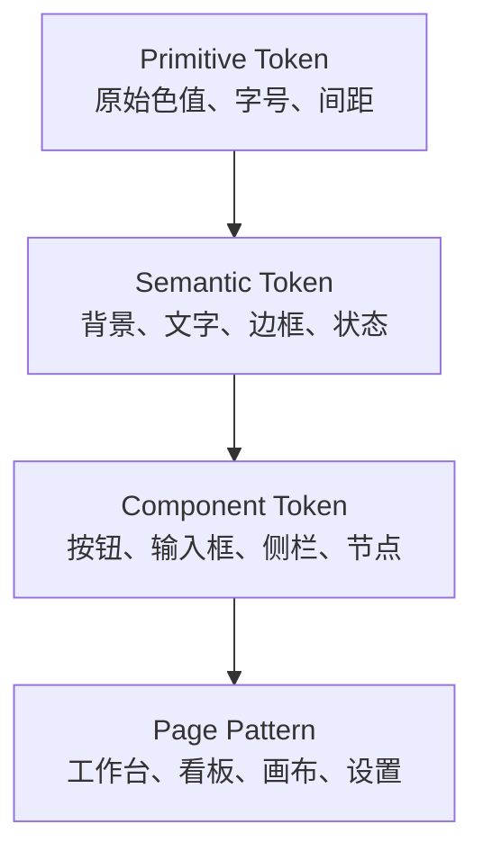

## 设计方向

推荐采用“信息密集、克制、精确的专业开发者工具”风格：

- 保留 `Vibe Kanban` 产品名，以“多智能体开发控制台”作为产品定位；通过核心能力层级表达定位，不在工作页面堆叠宣传性副标题。
- Dark-first 作为视觉设计和高保真评审基线，但产品首次启动默认 `System`；浅色主题必须是完整设计，不是反色补丁。
- 布局强调上下文、状态和下一步操作，不使用营销页式大标题与大留白。
- 静态界面保持安静，只有运行、等待、错误和交互反馈需要吸引注意力。
- 卡片只用于表达独立对象，不把每个区块都包成悬浮卡片。
- 不采用大面积玻璃拟态、霓虹发光、廉价渐变和常驻背景动画。

`ui-ux-pro-max` 针对 Developer Tool / IDE 的建议同样指向：数据密集布局、Dark Mode、Minimalism、实时运行监控、Terminal 语义、微交互和路由级代码拆分。本方案保留这些结论，但不采用与产品不匹配的作品集网格或 Cyberpunk 装饰。

## 设计原则

| 原则                     | 具体要求                                                               |
| ------------------------ | ---------------------------------------------------------------------- |
| Context first            | 用户始终知道当前主机、项目、目录、分支、会话和 Agent                   |
| Stable workspace sidebar | 左侧身份、产品入口、完整项目/会话列表和系统区的顺序与含义稳定          |
| Work stays visible       | 左侧完整展示按真实更新时间排列的项目和会话；点击对象后右侧内容直接变化 |
| Action close to object   | 节点、任务、会话和工具的操作靠近对象本身                               |
| Status is semantic       | 状态由文字、图标和颜色共同表达                                         |
| Conversation first       | Agent 页面以会话时间线为主，日志和技术细节退居 Inspector               |
| Dense but readable       | 减少无效留白，但不再使用 8px 正文                                      |
| One system               | Local、Remote、桌面、移动、看板和工作流共享 Token 与组件               |

## Token 分层



业务组件只能直接使用 Semantic 或 Component Token。页面禁止硬编码颜色和重复拼装 hover/focus 状态。

## 色彩系统

以下色值是首轮视觉原型基线，最终值可以在高保真稿阶段微调，但语义角色不能改变。

### 主题模式

| 模式     | 产品语义                                                                   |
| -------- | -------------------------------------------------------------------------- |
| `System` | 首次启动默认值；解析并实时跟随操作系统的 Light/Dark，不建立第三套 Token    |
| `Light`  | 用户显式固定浅色主题；操作系统主题变化不覆盖该选择                         |
| `Dark`   | 用户显式固定深色主题；也是设计评审优先使用的视觉基线，但不是强制运行默认值 |

根主题必须在首屏绘制前根据已保存的 `ThemeMode` 和系统偏好完成解析，避免主题闪烁。运行期间只在 `System` 模式监听系统主题变化；显式 Light/Dark 不随系统切换。主题变化只能替换 Semantic 与 Component Token，不能重置路由、页面状态、未保存草稿或滚动位置。

### Dark 主题

| Token                 | 建议值    | 用途                   |
| --------------------- | --------- | ---------------------- |
| `--surface-canvas`    | `#111315` | 页面和画布底色         |
| `--surface-sidebar`   | `#15181B` | 一级侧栏               |
| `--surface-primary`   | `#181C20` | 主内容表面             |
| `--surface-secondary` | `#1E2328` | 输入、次级区域、选中行 |
| `--surface-elevated`  | `#242A30` | Popover、Menu、浮层    |
| `--border-subtle`     | `#2A3036` | 默认分隔线             |
| `--border-strong`     | `#3B434B` | 强调边界、拖拽分隔线   |
| `--text-high`         | `#F2F4F5` | 标题与主要内容         |
| `--text-normal`       | `#C7CDD2` | 正文                   |
| `--text-low`          | `#8D969F` | 元信息与占位符         |
| `--brand`             | `#E9702A` | 主要操作与品牌焦点     |
| `--brand-hover`       | `#F07C38` | 品牌操作 hover         |

### Light 主题

| Token                 | 建议值    | 用途                                                               |
| --------------------- | --------- | ------------------------------------------------------------------ |
| `--surface-canvas`    | `#F4F6F7` | 页面和画布底色                                                     |
| `--surface-sidebar`   | `#ECEFF1` | 一级侧栏                                                           |
| `--surface-primary`   | `#FFFFFF` | 主内容表面                                                         |
| `--surface-secondary` | `#F2F4F5` | 输入、次级区域、选中行                                             |
| `--surface-elevated`  | `#FFFFFF` | Popover、Menu、浮层                                                |
| `--border-subtle`     | `#DDE2E6` | 默认分隔线                                                         |
| `--border-strong`     | `#B8C0C7` | 强调边界、拖拽分隔线                                               |
| `--text-high`         | `#172027` | 标题与主要内容                                                     |
| `--text-normal`       | `#34414B` | 正文                                                               |
| `--text-low`          | `#606E78` | 元信息、占位符与侧栏分区标签；在 `--surface-sidebar` 上约为 4.55:1 |
| `--brand`             | `#D85F1E` | 主要操作与品牌焦点                                                 |
| `--brand-hover`       | `#C65016` | 品牌操作 hover                                                     |

分区标签的对比度以实际侧栏背景计算：Light 主题的 `#606E78` 对 `#ECEFF1` 约为 `4.55:1`，Dark 主题的 `#8D969F` 对 `#15181B` 约为 `5.94:1`。视觉上保持低强调，但不通过牺牲小字号文字的可读性制造“淡色”。Light 与 Dark 必须分别验证表面层级、边框、分隔线、hover、selected、focus、disabled 和 loading，不能从其中一套主题推断另一套必然可用。

Diff、终端、Markdown 代码块、语法高亮、状态徽标、Workflow Node/Edge 和 Arena 对比属于复杂主题基线。新增或调整 Token 时必须同时检查两种主题中的正文对比度、增删行辨认、ANSI 色、选区、焦点和状态组合；任何语义都不能只靠红绿或明暗变化表达。

### 状态色

| 状态      | Token                | 建议色    | 注意事项                     |
| --------- | -------------------- | --------- | ---------------------------- |
| Running   | `--status-running`   | `#3B82F6` | 使用蓝色，避免与成功混淆     |
| Waiting   | `--status-waiting`   | `#F59E0B` | 等待输入和审批必须有文字     |
| Success   | `--status-success`   | `#22C55E` | 只表示完成或健康             |
| Error     | `--status-error`     | `#EF4444` | 错误信息必须附带下一步动作   |
| Cancelled | `--status-cancelled` | `#94A3B8` | 不作为错误处理               |
| Workflow  | `--status-workflow`  | `#8B5CF6` | 表达编排对象，不表达生命周期 |

### 品牌橙的使用边界

保留橙色品牌家族，但它只承担产品身份与操作强调，不承担运行语义。上表中的 `--brand` 与 `--brand-hover` 是首轮原型值，不是本次决策冻结的最终 Hex；高保真阶段可以分别调整 Dark/Light 色阶，但不能改变以下职责：

- 用于产品标识中的品牌强调、每个页面唯一主操作、selected ring 和可见 focus feedback。
- 不用于 Running、Waiting、Success、Error、Cancelled、审批、权限、优先级或风险；这些状态始终使用独立 Semantic Token，并配合图标或文字。
- 不把品牌橙铺满普通卡片、用户消息、导航区域或大面积背景；同一区域只保留一个高强调主操作。
- 主操作文字和图标使用独立 `--text-on-brand`，在实际品牌表面上至少达到 `4.5:1`，不能默认使用白色。以当前原型值测算，浅色文字在两套橙色上均不足 `4.5:1`，因此最终组合必须以实测结果为准。
- selected 与 runtime status 使用不同视觉层；例如橙色 selection ring 可以与蓝色 Running、黄色 Waiting 或红色 Error 标识同时存在，不能互相覆盖或把状态改成橙色。

## 字体系统

继续使用已有 IBM Plex 字体家族，避免在全量重构中增加无收益的字体迁移。

| 用途             | 字体          | 字号 / 行高 | 字重    |
| ---------------- | ------------- | ----------- | ------- |
| 页面标题         | IBM Plex Sans | 20 / 28     | 600     |
| 区域标题         | IBM Plex Sans | 16 / 24     | 600     |
| 控件与正文       | IBM Plex Sans | 14 / 20     | 400–500 |
| 紧凑表格、侧栏   | IBM Plex Sans | 13 / 18     | 400–500 |
| 侧栏分区标签     | IBM Plex Sans | 12 / 16     | 500     |
| 元信息           | IBM Plex Sans | 12 / 16     | 400     |
| 路径、分支、代码 | IBM Plex Mono | 12–13 / 18  | 400     |

规则：

- 不再把 8px 或 10px 作为常规正文。
- 不使用全大写字母作为主要导航标签。
- 路径和 ID 可以使用 Mono，任务标题和按钮不能全部使用 Mono。
- 长路径从中间截断，并保留原生 title 或 Tooltip 查看完整值。

## 间距与尺寸

使用 4px 基础网格：

```text
4   控件内部微间距
8   图标与文字、紧凑行间距
12  常规控件内边距
16  区块内边距
24  区块之间
32  页面主要分组
```

| 组件                       | 建议尺寸                                     |
| -------------------------- | -------------------------------------------- |
| 默认按钮 / 输入框          | 32px 高                                      |
| 强调按钮 / Onboarding 输入 | 36–40px 高                                   |
| 紧凑表格行                 | 36px 高                                      |
| 普通列表行                 | 44px 高                                      |
| 产品入口项                 | 36px 高                                      |
| 侧栏分区标题               | 24–28px 高                                   |
| 项目 / 会话列表项          | 28–32px 高，单行省略；current 状态不改变行高 |
| Product Sidebar            | 256px 宽；中屏 224px；Tablet 紧凑模式 56px   |
| 页面标题栏                 | 56–64px 高                                   |
| 最小可点击区域             | 32 × 32px；移动端 44 × 44px                  |

## 外壳布局 Token

| Token                               |                     建议值 | 用途                                                |
| ----------------------------------- | -------------------------: | --------------------------------------------------- |
| `--product-sidebar-width`           |                    `256px` | 默认 Product Sidebar                                |
| `--product-sidebar-compact-width`   |                    `224px` | 中等桌面宽度                                        |
| `--product-sidebar-collapsed-width` |                     `56px` | 用户主动收起和 Tablet 模式                          |
| `--sidebar-section-label-color`     |          `var(--text-low)` | 项目、会话等弱化分区标签与右侧计数                  |
| `--sidebar-section-label-size`      |              `12px / 16px` | 比 13px 侧栏菜单项低一个字号层级                    |
| `--content-contained-max`           |                   `1120px` | 普通信息与管理页面在 Page Canvas 内的统一最大画幅   |
| `--inspector-default-width`         |                    `380px` | Agent、任务、Workflow Inspector                     |
| `--page-gutter`                     |                     `24px` | 桌面页边距；窄屏降为 16px                           |
| `--overlay-backdrop-blur`           |                      `8px` | Global Search Palette 打开时模糊整个 App Shell 背景 |
| `--overlay-scrim-opacity`           |                   `40–60%` | 与背景模糊同时使用，压低搜索框后的视觉干扰          |
| `--kanban-column-width`             |                    `300px` | 看板列的默认等宽基线                                |
| `--kanban-column-gap`               |                     `12px` | 相邻看板列之间的稳定间距                            |
| `--kanban-column-surface`           | `var(--surface-secondary)` | 低对比度列分区表面，不使用悬浮卡片阴影              |

外壳不提供全局顶部产品导航。每个页面模板自己渲染标题、对象上下文和页面操作。Contained 页面在 Product Sidebar 右侧的 Page Canvas 内使用 `width: min(100% - 48px, 1120px)` 和 `margin-inline: auto`，窄屏页边距降为 16px；它只水平居中，仍按页面间距从顶部开始。页面标题、工具栏和主体必须由同一个 Contained 容器约束，`1120px` 只是最大宽度，容器不能默认渲染为带背景、边框或阴影的外层卡片。Full-bleed 页面使用剩余全部空间。

Product Sidebar 和 Page Canvas 各自拥有明确的滚动区域：侧栏顶部身份区、产品入口和底部系统区保持可见，中间的完整项目/会话列表共用独立滚动区；页面画布独立滚动。分区标签可以 sticky，但不能产生第三个常驻纵向滚动列。

Product Sidebar 显示产品入口、active 状态、聚合徽标、完整项目列表和完整会话列表。两类对象统一按真实 `updated_at DESC` 排序；点击、浏览、聚焦和 current 选中态不能修改更新时间。Page Canvas 负责 Page Tabs、筛选、管理操作和 Inspector。动态数据更新不能改变 Product Sidebar 的分区顺序或宽度。

侧栏分区标签使用 12/16、字重 500 和 `--text-low`；列表项使用 13/18 和 `--text-normal`。分区依靠留白而不是卡片背景建立层级。禁止给包含状态图标和焦点环的整个分区设置透明度，弱化只通过语义文字 Token 完成。

## 圆角、边框和阴影

- 小控件：4px。
- 卡片、面板、Popover：6px。
- 大型 Modal 和移动端 Sheet：8px。
- 不使用全局 16–24px 大圆角。
- 常规布局主要依赖 1px 边框和表面层级，不依赖强阴影。
- 只有 Popover、Dialog、拖拽对象和覆盖式 Inspector 使用阴影。

## 组件层级

### `packages/ui`：基础组件

| 类别  | 组件                                                                                                        |
| ----- | ----------------------------------------------------------------------------------------------------------- |
| 输入  | Button、IconButton、Input、SearchInput、Textarea、Select、Switch、Checkbox、AttachmentChip                  |
| 反馈  | Badge、StatusDot、Alert、Toast、Progress、Skeleton、EmptyState                                              |
| 浮层  | Dialog、Sheet、Popover、DropdownMenu、Tooltip、GlobalSearchPalette                                          |
| 导航  | PrimaryNavItem、Tabs、Breadcrumb、PageHeader、PageContext                                                   |
| 数据  | Table、DataGrid、ListRow、SearchResultRow、Card、PropertyList、FilterBar                                    |
| 布局  | SplitPane、ResizablePanel、Inspector、Sidebar、Toolbar                                                      |
| Agent | RunStatus、ProviderIcon、CapabilityBadge、ToolCallGroup、ToolCallRow、ToolCallDetail、AgentInteractionEvent |

这些组件接收可序列化 props，不导入 `web-core` 的 API、Hooks 或业务 Context。

### `packages/web-core`：业务复合组件

| 类别   | 组件                                                                                                                                                                                                                                                                            |
| ------ | ------------------------------------------------------------------------------------------------------------------------------------------------------------------------------------------------------------------------------------------------------------------------------- |
| 外壳   | AppShellContainer、ProductSidebarContainer、SidebarIdentityZone、SidebarPrimaryNav、SidebarObjectSections、SidebarProjectList、SidebarSessionList、SidebarSystemZone、PageCanvas                                                                                                |
| 总览   | DashboardScopeStats、AttentionQueue、ActiveRuns、AgentConfigSummary                                                                                                                                                                                                             |
| 搜索   | GlobalSearchPaletteContainer、SearchResultGroup、SearchInitialSuggestions、SearchNoResults                                                                                                                                                                                      |
| 导航   | PageTabsContainer、BreadcrumbContainer                                                                                                                                                                                                                                          |
| 项目   | ProjectDirectoryContainer、ProjectCard、ProjectKanbanToolbar、KanbanBoardContainer、KanbanColumn、KanbanColumnHeader、KanbanIssueCard、IssueDetailContainer                                                                                                                     |
| 工作区 | AgentWorkbenchContainer、AgentWorkbenchHeader、ConversationPane、SessionComposer、ComposerAccessoryArea、ComposerTextInput、ComposerResourcePicker、ComposerCategoryMenu、ComposerResultPanel、ComposerToolbar、WorkbenchInspector、InspectorTabs、WorkspaceManagementContainer |
| 运行   | CanonicalTimelineContainer、ToolCallGroup、RunActionBarContainer、RunAttentionBanner                                                                                                                                                                                            |
| 工作流 | WorkflowEditor、WorkflowNodeTypePicker、WorkflowNodeCard、WorkflowCanvasConfigDialog、WorkflowNodeConfigForm、WorkflowEdgeConfigForm、WorkflowRunCanvas、WorkflowRunHeader、WorkflowRunAttentionCard、WorkflowRunNodeDetailsDialog                                              |
| Arena  | ArenaComparisonContainer、ArenaCandidateSelector、ArenaCandidateResultColumn、ArenaComparisonSummary、ArenaWinnerControl、ArenaWinnerConfirmDialog、ArenaStopAllControl、ArenaLifecycleMenu、OpenCandidateSessionAction                                                         |
| 智能体 | ProviderInventory、ToolManager、NativeConfigEditor、ConfigDiffPreview                                                                                                                                                                                                           |

业务组件负责数据、权限、运行时能力和导航，View 层只接收已经投影的模型。

### 项目看板工具栏组件契约

`ProjectKanbanToolbar` 是项目看板顶部唯一的工具栏。左侧只展示不可点击的项目图标与项目名称；右侧只包含当前项目 Issue 搜索、canonical Issue 数量与唯一主操作“新建 Issue”。它不渲染项目级 Page Tabs、列表模式、筛选、显示设置或更多菜单，也不负责项目切换、Agent 操作和工作流启动。

搜索触发器展开为单行输入框并具有可访问名称、可见焦点和键盘关闭路径；搜索词在适用时写入 canonical URL。Issue 数量必须来自服务端或共享查询投影，并随当前搜索结果更新，不能通过当前已挂载卡片数量推断。项目设置、编辑和归档等低频动作由 Product Sidebar 项目项的上下文菜单承载。

### 看板列组件契约

`KanbanBoardContainer` 根据项目配置中的可见状态和 `sort_order` 生成 `KanbanColumn`，不能在 View 层写死列。默认项目投影 Todo、In Progress、In Review 和 Done；默认隐藏的 Cancelled 不创建列。每列使用约 `300px` 的统一宽度、`12px` 间距和低对比度分区表面。

`KanbanBoardContainer` 同时是看板唯一的二维滚动容器：`overflow-x` 移动整组列，`overflow-y` 为所有列提供共享纵向位置，`KanbanColumnHeader` 在该容器内 sticky。`KanbanColumn` 和卡片列表不能建立独立纵向滚动、滚动同步逻辑或嵌套 ScrollArea；列高不一致时保留自然留白。滚轮、触控板、键盘和拖拽自动滚动都必须作用于同一容器。

`KanbanColumnHeader` 只接收状态 ID、色标、名称、当前查询下的 canonical Issue 数量，以及当前状态的新建权限。列头同时显示色标与文字，不能依赖颜色单独表达状态；数量使用 tabular figures，数据刷新不能改变列头宽度。

列内新增是弱化的图标按钮，创建时自动带入当前状态；顶部“新建 Issue”仍是页面唯一高强调主操作。图标来自统一 SVG 图标集，必须具有可访问名称、可见焦点与稳定点击区域。状态的新增、编辑、排序、隐藏和删除由项目设置负责，列头不渲染更多菜单。

### Issue 卡片组件契约

`KanbanIssueCard` 的基础投影只包含 Issue ID、标题、优先级和最多两个标签。ID 使用低强调等宽文字，标题最多两行；标签超过两个时直接省略，不渲染 `+N`。存在 Task 时额外接收任务总数和最多两个 `KanbanIssueTaskRow`，剩余数量由卡片计算为 `+N 个任务`；没有 Task 时不保留任务区空白。

`KanbanIssueCard` 使用 input-adaptive drag contract。桌面指针把 drag handle props 附加到卡片非交互表面，并使用 drag-and-drop 基础设施的统一 movement threshold；未越过阈值的释放仍按普通点击打开 Issue。按钮、链接、Task 行、`+N 个任务`、标签和更多菜单必须从 drag initiation 中排除。触屏端只把 drag handle props 附加到常驻 `KanbanCardDragHandle`；图标沿用统一 SVG 体系，视觉可小于命中区，但实际可操作区域至少 `44 × 44px`，且不阻止卡片区域的常规滚动。

键盘拖拽由同一 canonical DnD contract 提供：可拖动入口有可见焦点和可访问名称，进入 lift 状态、移动到目标、drop 和 cancel 都有非纯颜色反馈与屏幕阅读器播报。拖动预览、原位置占位和合法目标反馈不能改变列宽或卡片静态高度；取消、非法落点和 mutation 失败不得额外触发卡片点击。

`KanbanIssueTaskRow` 只投影从 Issue 发起的顶层 Task，至少包含 task ID、单行标题、执行方式、聚合状态和 canonical 执行路由。单 Agent Task 路由到 Agent 工作台，Workflow Task 路由到 Workflow 运行页，Arena Task 路由到 Arena 对比页，不设置独立 Task 详情中转页。排序固定为 `waiting_input / waiting_approval / failed → running → not_started → completed`，同一分组再使用稳定业务顺序；AgentRun、RunAttempt 以及 Workflow/Arena 的内部 Agent 不能直接成为卡片 Task 行。Task 标题是主信息；看板卡片隐藏执行方式、Agent、Provider、运行时长和状态统计，Issue 浮动框列表可以弱化显示执行方式与状态。

任务状态使用形状不同的统一 SVG 图标，并为每种状态提供可访问名称，不能只依赖颜色。点击任务行打开对应任务，点击 `+N 个任务` 打开完整任务列表；两者都必须阻止卡片主体的 Issue 打开动作。

卡片其他区域打开 `IssueFloatingPanel`。更多按钮承载编辑和归档等低频动作，桌面端在 hover 或键盘 focus 时可见，触屏设备始终可见；按钮具有可访问名称和稳定点击区域，并阻止事件冒泡。描述、负责人、Agent、运行时长、PR、关系和工作区数量不属于卡片投影。卡片的 hover、focus、任务状态刷新和更多按钮出现都不能改变外部尺寸。

### Issue 浮动框组件契约

`IssueFloatingPanel` 是看板内唯一的 Issue 详情容器，不建立独立 Issue 页面或并行 Inspector。桌面端覆盖在 Page Canvas 右侧并与顶部、右侧和底部保留间距，使用完整圆角、统一浮层阴影和内部滚动；它不参与看板布局计算，不压缩或平移列，也不是贴边 Drawer。浮动框没有 Scrim、Backdrop Blur、`aria-modal` 或 Focus Trap，未被遮挡的看板继续可操作。

点击其他 Issue 时复用同一个外框，只替换标题、Task 列表与 Issue 信息并同步卡片 selected 状态，不关闭重开或重复播放整框动效。关闭后焦点回到当前 Issue 卡片；浏览器前进、后退和深链接恢复同一项目、Issue 与看板上下文。移动端切换为全屏详情并提供明确返回看板操作。

浮动框内容顺序固定为“Issue 标题 → 完整 `IssueTaskList` → `IssueExecutionActions` → `IssueInformationSection`”。已有 Task 的继续入口优先于新建执行；最后的 Issue 信息使用一个默认收起的折叠区，不能使用大面积属性表单占据首要阅读层级。

### Issue 信息组件契约

`IssueInformationSection` 是单一 disclosure section，不包含 Tabs 或并列子面板。默认状态为 collapsed，只显示“Issue 信息”标题和展开指示；展开后在同一内容流中直接查看和编辑描述、状态、标签、关系与评论。触发器使用原生按钮语义，支持 Enter / Space，提供可见焦点，并用 `aria-expanded` 与 `aria-controls` 关联内容区；展开和收起不能改变浮动框的外部尺寸或看板布局。

### Issue 执行组件契约

`IssueExecutionActions` 是 Issue 浮动框中的常驻执行按钮组，固定包含“单智能体”“Workflow”和“Arena”三个文字按钮。三者是同级执行方式，使用一致的尺寸、视觉权重和完整文字标签，不使用图标按钮代替名称，也不将低频方式折叠到下拉菜单。按钮组不因已有 Task 或运行中 Task 而隐藏或永久禁用，从而允许一个 Issue 重复创建并并行运行多个 Task。

每个 `IssueExecutionAction` 直接打开自身的配置 Dialog 或 Drawer，不再经过通用执行方式选择层。桌面端按钮按“单智能体 → Workflow → Arena”横向排列并保持至少 `8px` 间距；移动端纵向堆叠，每个点击区域不低于 `44px`。配置关闭后焦点返回原按钮；最终确认前不能提前创建数据库 Task，只有确认后才原子创建一条包含标题、执行方式和初始状态的顶层 Task。提交超过 `300ms` 时，当前流程的确认按钮显示明确 loading 并 disabled，不以静默冻结代替反馈。已有 Task 的执行方式不可修改，新的执行意图必须通过对应按钮创建新 Task。

`IssueTaskList` 接收同一 Issue 下的一对多 Task 投影，每行只显示标题、执行方式、canonical 聚合状态和统一打开箭头。标题是主信息，执行方式与状态使用次要层级；整行是唯一打开目标，不在行内增加重复“打开”按钮。列表不显示 Agent 名称、Provider、模型、耗时、工作区、PR 或运行统计，也不得把 AgentRun、RunAttempt、Workflow Node 或 Arena 候选展开成同级 Task，不能因为新增 Task 覆盖或替换已有行。

### Agent 工作台组件契约

`AgentWorkbenchContainer` 是单 Agent 会话的唯一执行容器。Product Sidebar 中的会话和 Issue 中的单 Agent Task 都解析到同一 canonical 工作台路由、会话投影与 AgentRun 状态，不能因为入口不同复制页面或维护两份运行状态。

`AgentWorkbenchHeader` 是纯上下文区域。第一行只展示任务名称；没有关联任务的独立会话使用会话名称。第二行按“可选 Issue → 工作空间路径 → 分支”排列并使用低强调样式。Issue 可点击返回详情；没有关联 Issue 时直接省略。路径过长时使用中间截断，hover 和键盘 focus 都能查看完整值并使用明确的复制操作。

`AgentWorkbenchHeader` 不展示 Agent、模型、canonical 运行状态、持续时间、停止或更多操作，也不提供 Agent 切换。运行反馈和控制进入输入区域附近的运行上下文，由 canonical 能力决定 enabled、loading 和错误反馈。

`ConversationPane` 始终占据中间主区，内部只有 canonical 对话时间线、底层实际提供的 Agent 交互事件，以及固定在底部的输入框。主区不渲染“对话 / 变更 / 文件 / 终端”Page Tabs，辅助内容不能替换整块对话区域。

#### 对话时间线基础标准

本节只定义首版对话体验必须守住的基础标准，不冻结全部事件类型、消息卡片结构或最终视觉。具体的 Markdown、代码块、工具调用、审批、输入请求和错误组件可以在真实使用中逐步优化，只要继续满足信息层级、可读性、原生语义和交互稳定性要求。

| 信息层级   | 典型内容                                 | 默认表达                                                               |
| ---------- | ---------------------------------------- | ---------------------------------------------------------------------- |
| 主内容层   | 用户消息、Agent 正文回复                 | 始终展开并保持最高阅读权重；用户输入可使用淡色容器，Agent 正文直接排版 |
| 执行过程层 | 思考摘要、工具调用、命令、文件与终端输出 | 默认显示可理解的摘要，原始输入、完整输出和日志按需展开                 |
| 交互处理层 | 审批、输入请求、失败、冲突和待确认事项   | 使用独立且明确的提示区域，状态、原因和可执行操作放在同一个上下文中     |

基础标准如下：

- 不把所有内容渲染成高强调聊天气泡。用户消息与 Agent 正文形成稳定区别，但长篇 Agent 回复优先采用文档式排版。
- 正文是视觉主角。Provider、模型、时间、耗时、工具名称和内部 ID 等元信息默认降级，不与结论争夺注意力。
- 工具和系统过程遵循渐进披露：默认摘要必须让用户知道发生了什么，展开后才展示参数、原始输入、完整输出和技术日志。
- 统一不同 Provider 的视觉语法，但保留 Codex、Claude Code、Gemini 和 Pi 的关键原生事件、内容与操作语义，不为视觉统一丢失信息。
- 普通正文使用稳定、易读的内容宽度，建议约 `720–800px`；代码、Diff 和宽表格可以按内容需要突破正文宽度，而不是压缩到不可读。
- Running、Completed、Failed、Waiting 等状态同时使用文字、图标和语义颜色；状态反馈保持可见，但不能使用大面积高饱和背景持续抢占注意力。
- 审批、输入、重试、复制和展开等操作靠近其对应事件，避免让用户去顶部或其他面板寻找当前事件的处理入口。
- 流式内容在原位置稳定增长，避免闪烁、反复重排和布局跳动。用户主动离开底部阅读历史时，不强制抢回滚动位置，只提示存在新内容。
- 长会话预留回到最新、未读边界、时间分段和搜索定位能力；具体导航控件在后续对话专项设计中确定。
- 新增事件类型先归入上述三层，再设计其默认摘要、展开内容和必要操作；不得因为当前组件无法表达，就直接把未经整理的原始日志铺满时间线。

这些标准是可演进基线，而不是封闭的消息协议。后续可以调整容器、间距、事件组合和交互细节，但不得削弱正文阅读、过程可追溯、操作就近和原生语义保真。

#### 用户消息与 Agent 正文首版形态

对话主区内部使用水平居中的阅读列，普通内容宽度以约 `760px` 为首版基线。用户消息靠右放置，最大不超过阅读列约 `88%`，使用淡色次级表面、细边框和约 `8px` 圆角；长需求自然换行，不缩成狭窄的小气泡，也不使用品牌色填满容器。

Agent 回复靠左并直接使用文档式 Markdown 排版，不用边框和背景包住整段回答。Provider 名称或图标只作为弱化的起始标识，不在每段内容间重复模型、耗时与运行状态。标题、列表、引用和代码保留文档层级；代码、Diff 和宽表格可以突破普通阅读列，但必须保持在 `ConversationPane` 的可用范围内。

复制等消息级操作位于对应内容末尾。桌面端可以在 hover 时增强可见度，但键盘 focus 和触屏设备必须提供同等入口。流式回复在正文末尾稳定增长，不使用持续闪烁或明显的逐字打字机动效。

#### 工具调用与相邻分组

单条工具调用默认使用紧凑 `ToolCallRow`，不渲染成高强调大卡片。摘要行按“展开状态 → 工具类型图标 → 可理解的动作 → 操作目标 → 状态或耗时”排列，例如“读取文件 `AgentWorkbench.tsx` · 完成”“运行命令 `pnpm run check` · 01:42”。默认摘要优先说明 Agent 做了什么，不直接使用 Provider 内部函数名代替可读动作。

展开 `ToolCallRow` 后，`ToolCallDetail` 依次提供规范化输入、格式化输出和查看原始输入/输出的入口。长输出按需加载并在自身范围内滚动或分段，不在首次渲染时把完整日志注入页面。正在运行的工具可以在摘要下显示一行最新进度；用户主动展开后，状态变为完成不能自动收起。工具失败先在摘要中显示一行原因，只有真正需要用户介入时才升级为交互处理层。

`ToolCallGroup` 由 canonical 时间线中两个及以上连续相邻的工具调用组成，工具类型可以不同。用户消息、Agent 可见正文、审批、输入请求、系统关注事项或其他非工具事件都会结束当前分组；分组不能跨越这些边界，也不能只因为工具类型相同就合并时间线上不相邻的调用。只有一条工具调用时直接使用 `ToolCallRow`，不增加冗余分组层。

收起状态只显示一行分组摘要，例如“执行了 4 项操作 · 3 项完成 · 1 项运行中”；状态按需关注程度聚合，并保留当前运行项或失败原因的简短提示。展开分组后按原始顺序显示每个 `ToolCallRow`，每行仍可独立展开输入与输出，并允许同时展开多行。分组只是视觉投影，不能改写、丢弃或重新排序底层事件及其审计数据。

活跃分组收到新工具事件时，收起状态只稳定更新数量、聚合状态和当前摘要；展开状态在末尾追加新行。系统不能因为新增事件或工具完成而覆盖用户选择的展开状态。分组和单行触发器都使用按钮语义、`aria-expanded`、可见焦点与明确的屏幕阅读器名称，键盘顺序与原始调用顺序一致。

#### Agent 原生交互事件

`AgentInteractionEvent` 是审批、输入请求、失败恢复、冲突和其他 Provider 原生交互事件的统一视觉容器，不是新的交互协议。组件只消费 Agent Runtime/Adapter 提供的 canonical 事件内容、状态、输入控件、可用动作与能力说明；前端不能自行决定 Agent 何时请求权限、操作是否危险或应该出现哪些按钮。

组件遵守以下边界：

- UI 负责信息层级、间距、语义状态样式、展开状态、未提交的本地输入以及请求期间的加载和错误反馈。
- 用户触发操作后，UI 将底层提供的动作交回 canonical API，并根据真实返回状态更新；不能自行生成允许、拒绝、重试或恢复动作，也不能用乐观完成状态替代底层确认。
- 不同 Agent 返回不同控件或动作时按实际内容渲染。底层没有提供动作时保持只读，能力不可用时显示底层原因，不猜测替代操作。
- 待处理事件使用克制的独立提示区域，避免大面积语义色；已处理事件仍保留在 canonical 时间线中，并压缩成包含真实最终状态的简洁记录。
- 顶部 `RunAttentionBanner` 与时间线组件读取同一个 canonical 事件。Banner 只负责提示和定位，不复制输入状态、动作处理或完成状态。
- 新事件使用可访问的动态播报，但用户阅读历史时不自动抢焦点或强制滚动。控件顺序遵循底层描述，并提供可见焦点、键盘操作、明确标签以及非纯颜色的状态表达。

`AgentInteractionEvent` 可以按底层事件内容呈现文本、选择项、输入框或动作区，但这些都是视觉插槽，不构成 Vibe Kanban 自己的 Agent 审批或提问模型。Provider 原生内容、动作顺序和审计关联必须完整保留。

#### 固定输入区

`SessionComposer` 固定在 `ConversationPane` 底部并与约 `760px` 的正文阅读列对齐。组件使用一个完整的单层矩形外框，约 `10px` 轻圆角、低对比细边框且默认无明显阴影；focus-within 可以增强边框和焦点环，但不能改变外部尺寸。内部由偶现的 `ComposerAccessoryArea`、永久存在的主输入区和永久存在的 `ComposerToolbar` 组成，不嵌套第二层输入卡片。输入框自动增高，到达上限后内部滚动。

`ComposerAccessoryArea` 不是 Agent 运行状态栏。它只在存在会话产物、待提交上下文、权限配置、Command/Skill 参数、Agent Runtime/Adapter 返回的 Composer UI、排队消息或其他临时内容时挂载；没有内容时分隔线和占位高度一并消失。每项内容都有关闭、取消或完成路径，提交或取消后自动移除；需要长期保留的产物写入 canonical 时间线或 Inspector。内容超过高度预算时在自身范围内折叠或滚动，不能无限压缩对话区。

`ComposerTextInput` 基于原生多行文本输入能力，不使用复杂 `contenteditable`。默认显示约 `3–4` 行；扩展区为空时整个 Composer 建议约 `140–170px` 高。输入随内容向上生长，到达 `min(320px, 35vh)` 后只在中央文本区内部滚动。高度上限不能变成内容长度限制，Markdown、代码、路径、空格和换行都按用户原文保留。

`ComposerResourcePicker` 是浮在 Composer 外部的资源选择容器，不改变 Composer 高度。桌面端由左侧窄 `ComposerCategoryMenu` 和右侧宽 `ComposerResultPanel` 组成，两块面板底边对齐并从 Composer 左下方入口向上展开。分类固定为“文件与上下文”“Commands”“Skills”“会话产物”；MCP 属于 Agent 级工具管理，不作为逐条消息分类。分类级动作可以打开 Command 管理或 Tool Manager，但选择器不复制完整管理功能。

`＋` 打开完整分类菜单；`@`、`/`、`$` 分别预选文件与上下文、Commands、Skills；工具栏 Commands 和 Skills 入口直达对应分类，同时保留分类菜单。选择只插入或准备可读内容，不立即执行；只有所选资源确实需要参数时，参数 UI 才进入 `ComposerAccessoryArea`。

分类使用点击和键盘打开，不依赖 hover。上下方向键在结果中移动，左右方向键在分类与结果面板间移动，`Enter` 选择，`Escape` 关闭整个选择器且不清空正文。结果面板独立滚动，切换分类不改变整体尺寸；水平空间不足时翻转展开方向，垂直空间不足时降低高度并滚动。移动端使用单面板和返回分类动作，不并排压缩两块面板。输入框具有独立可访问名称，Placeholder 只承担提示作用。

粘贴文本或大量代码时保持原文，不自动格式化或转成文件；“作为附件发送”只能由用户主动选择。粘贴图片或文件时才创建 `AttachmentChip` 并进入偶现扩展区。只有 Agent Adapter 返回明确上下文限制且输入接近限制时才提示，前端不猜测限制、不常驻显示无意义计数，也不静默裁剪内容。

草稿按 canonical 会话隔离并持久恢复文本、附件和未提交的 Composer 临时状态。切换项目、会话、Inspector 或异常刷新不能丢失草稿；只有 canonical API 确认接收后才清空，发送失败时完整保留。恢复逻辑必须区分草稿与已确认消息，不能在重连或刷新后重复发送。

`ComposerToolbar` 使用不换行的左右分组。左侧输入配置区按“添加 → 只读 Agent → 模型 → 推理 → 权限 → Commands → Skills”排列，右侧运行操作区按“canonical 状态与时长 → 停止 → 发送”排列，中间使用弹性留白。添加、只读 Agent 身份和发送入口始终存在；模型、推理、权限、Commands、Skills、停止及其他控件只在当前 Agent 存在对应概念时出现。

Agent 在会话创建后保持只读且不显示下拉箭头。其他控件的 visible、enabled、loading 和原因说明均读取 Agent Runtime/Adapter 的 canonical 能力：Provider 根本不存在某项概念时不制造占位；能力存在但因当前状态暂不可用时保留禁用控件并提供可访问原因。前端不推断某个 Provider 应该支持什么，也不自行定义追加、排队、打断或停止语义。

权限控件只显示摘要，完整临时配置进入 `ComposerAccessoryArea`。Commands 和 Skills 入口向 Composer 上方打开同一个 `ComposerResourcePicker` 并直达对应分类，后续参数 UI 挂载到偶现扩展区。发送与停止保持为两个独立操作；停止按 canonical 能力条件出现，发送固定在最右侧并在提交期间显示进度、阻止重复触发。

工具栏不能换行或产生水平滚动。宽度不足时先将低频 Agent 特有配置收入更多菜单，再把 Commands 和 Skills 压缩成保留 Tooltip 与可访问名称的 `/`、`$` 入口；添加、主要运行操作和发送保持可见。桌面端使用紧凑控件高度，触屏环境扩大点击区域。

发送动作只投影 Agent Runtime/Adapter 当前提供的语义：空闲时可以是发送，运行中可以是追加或 canonical 入队，也可以因底层不接受新消息而禁用。UI 必须显示当前语义和不可用原因，不能自行把消息追加、排队或延后。底层没有队列能力时不建立前端发送队列；canonical 队列存在时，其摘要和管理 UI 可以进入 `ComposerAccessoryArea`。

提交时创建不可变的本次发送快照并阻止该动作重复触发，但用户随后输入的内容继续保存为下一份草稿。只有 canonical API 确认接收后才从 Composer 移除对应快照；失败时恢复完整文字与附件，并在 Composer 附近显示可访问的原因与重试。回执处理必须幂等，重连和刷新不能重复发送已确认快照，也不能用成功回执清掉用户后来输入的新草稿。

发送固定在工具栏最右侧，停止位于其左侧，两者不能互相替代。停止直接调用 canonical cancel，不额外弹确认框；请求期间显示“停止中”并阻止重复触发，只有 canonical Run 进入 `cancelled` 才显示已停止。传输失败恢复停止入口并提供重试；停止不清空草稿、附件或会话，也不自行删除排队消息。

发送、停止和 Agent 运行都不设置前端假超时。等待期间持续展示 canonical 状态，不能根据前端计时器猜测完成、失败或取消。

附件以紧凑 `AttachmentChip` 显示上传、完成、失败和移除状态，可以作为当前输入的临时内容进入 `ComposerAccessoryArea`。资源、Commands 和 Skills 使用当前 Agent Adapter 提供的列表与能力；`＋` 打开完整分类菜单，`@`、`/`、`$` 与工具栏入口打开同一个 `ComposerResourcePicker` 的相应状态。扩展区中的权限配置只影响当前输入或运行方式，审批和原生输入请求继续在对应 `AgentInteractionEvent` 内完成，不能混用状态或伪造另一套交互协议。

`Enter` 发送，`Shift + Enter` 换行；输入法处于组合状态时，`Enter` 只完成选字而不发送。固定区域为时间线保留足够的底部 inset，不遮挡最后一条消息；移动端跟随虚拟键盘并保持主要操作可见。所有图标按钮具有可访问名称、稳定点击区域、键盘路径和可见焦点。

`WorkbenchInspector` 是变更、文件、Git、终端和预览的唯一桌面容器。`InspectorTabs` 切换同一右侧面板内的内容，支持收起、调整宽度并恢复用户上次选择；能力不支持时保留标签并说明原因。主区不能复制 Inspector 标签，避免出现两个同名入口。

Inspector 收起时整体向右侧退出，面板内容宽度变为 `0`，不保留空白栏；`ConversationPane` 使用释放出的空间重新布局。页面最右侧只覆盖显示一个低强调的重新打开把手，它不占用工作台布局宽度，并具有明确的可访问名称、可见焦点和稳定点击区域。重新打开后恢复上次标签与用户调整过的宽度。

展开与收起沿用 `160–220ms` 的 Inspector 动效 Token，只通过位移和透明度表达方向；启用 `prefers-reduced-motion` 时取消位移动效。收起按钮通过 `aria-expanded` 表达状态，收起后焦点转移到重新打开把手，展开后焦点回到当前 Inspector 标签。隐藏 Inspector 只改变界面可见性，不取消 Agent、终端、预览服务或其他后台进程，也不清空面板内部状态。

### Workflow Canvas 配置组件契约

`WorkflowNodeTypePicker` 只负责选择可创建的 Node Type，不承载 Node 配置表单，也不包含系统 Start / End。它使用 anchored popover 变体，纵向显示 Agent、Condition、Human Gate、Transform、Arena 五项；每个 option 只有小图标、名称和单行说明，不渲染搜索、分类、Tabs 或居中 Modal。用户在选择 Type 前关闭 Picker 时不创建 Node；一旦选定 Type，系统立即按该 Type 的稳定默认数据创建 Node，原子写入 Workflow Draft，并让 `WorkflowNodeCard` 在画布出现、进入 selected 状态后打开 `WorkflowCanvasConfigDialog`。默认值必须由 Node Type catalog 统一提供，不能由 Picker、Card 和 Dialog 各自拼装。

`WorkflowNodeTypePicker` 支持 standalone 与 connection-drop 两种锚定上下文。Connection-drop 打开期间渲染从来源 handle 到 Picker 锚点的临时 connection preview，但不写 Draft；选择后由一个 command 原子创建 Node 与 Edge，取消则两者都不存在。两个入口共用同一 Type catalog、默认值、键盘行为与 validation，不能复制两套 Picker。Popover 使用方向键移动 active option、Enter 选择、Escape 取消；关闭后把焦点返回 standalone 触发按钮或 connection-drop 的来源 Node。

`WorkflowNodeCard` 采用最多三层的紧凑结构。Meta row 使用小号次级文字显示只读 Type，并只在配置不完整时于右侧显示带文字的“待配置”；Title row 是唯一高权重标题，承载 Task 时绑定 `Task.title`，非 Task 类型绑定 Node name；Executor row 仅在适用时渲染，单 Agent 显示 Agent 名称，Arena 显示候选数量。不可为了对齐给不适用类型保留空行，也不能加入模型、Skills、耗时、workspace path、Session 或其他运行详情。

普通 `WorkflowNodeCard` 使用 `220–240px` 的桌面固定宽度，组件不暴露 resize handle，也不保存用户尺寸。Card body 根据两层或三层内容自然决定高度；Title row 使用最多两行截断，指针 hover 与卡片 keyboard focus 都能访问相同的完整标题，不允许只提供鼠标 Tooltip。`WorkflowStartNodeCard` 与 `WorkflowEndNodeCard` 使用紧凑系统变体，不继承普通卡片的空白 Executor row 或固定内容高度。

`WorkflowNodeCard` 的所有 Type 复用同一 neutral surface token，不创建按 Type 着色的整卡 variant。Type 只使用 Meta row 的 secondary text 或小型图标；hover 提升 border token，selected 增加可见 brand ring 与低幅度 elevation。Pending 使用 warning-subtle border 加文字标签，不能只靠颜色；pending + selected 通过保留警示标签并在不同视觉层绘制 selection ring 同时表达，状态组合不能互相覆盖。

`WorkflowNodeRuntimeState` 在运行视图占用 Meta row 右侧槽位，使用 canonical status icon/dot + text，不自建日志推断。Running 只对小状态点应用低幅度 pulse；Waiting、Failed、Completed、Cancelled 和其他终态均静止。Card border 可以读取低强度 status token，但 surface 保持 neutral；selection ring 位于独立层并继续可辨认。编辑视图不渲染 runtime state，只允许 pending 文案；`prefers-reduced-motion` 下 Running 也使用静态图标与文字。

`WorkflowConnectionGesture` 管理连接点显隐、预览线、目标命中和错误反馈。Handle 在 Node hover、selected 或 keyboard focus 时可见，实际 pointer target 大于可见圆点且不改变 Node layout。拖动中只让合法目标进入高亮状态；非法目标提供紧邻画布对象的短原因，结束时 snap back 且不提交 Draft。键盘“开始连接”复用同一状态机和合法目标规则。

`WorkflowSemanticHandles` 由 Node Type capability 与 Node authoring data 派生，不在 Card 中硬编码路由选项。Start、Agent 和 Transform 投影一个 Default 输出，Arena 投影 Winner；Human Gate 按 `required_action` 投影带标签的 Approve / Reject；Condition 将每条 branch 投影为对齐的命名输出，并追加低强调“新增分支”入口；End 不投影输出。语义标签、可见圆点和扩大命中区属于同一个可访问控件，不能只用颜色或空间位置区分。Handle 触发连接时把 semantic 与 branch identity 一同交给 command；“新增分支”只有在连接成立时随 Edge 原子写入 Draft，取消不产生空 branch。

每个 semantic handle 接受多个目标 Edge。`WorkflowConnectionGesture` 从 handle 开始时始终进入 create 模式，即使该 handle 已经存在连接；只有抓取既有 Edge 的 source / target endpoint 才进入 reconnect 模式。一个 semantic 被运行时激活后，其全部目标并行调度。每条 Edge 分配独立稳定 ID 并拥有独立 selection、delete command 与 inverse patch；局部操作不能覆盖同一 handle 的其他 Edge，也不引入单独的 Fork Node Type。

`WorkflowEdgeVisual` 使用自动平滑曲线路径和 target 端小箭头，不提供直角折线作为默认样式。同一 handle 的多条路径通过轻微不同的出射方向自然 fan-out，但 DOM / Canvas hit testing、focus、hover、selection 和 reconnect endpoint 始终按单条 Edge 维护，不能把视觉相邻路径合并成公共可交互主干。Idle stroke 使用低强调 Edge token；hover 或 selected 仅提升当前 Edge 的对比度和层级，同时轻微降低其他路径，但不能只靠颜色表达 selection。Canvas stacking 固定为 Edge layer 低于 Node layer；选中 Edge 也不能覆盖 Node 卡片。首版不渲染路径控制点、不持久化手动路径，也不提供路径重置命令，曲线只从端点和 Node 位置派生。

`WorkflowEdgeSemanticLabel` 只为非 Default semantic 渲染：Approve、Reject、Winner 和 Condition branch 使用锚定在 source handle 附近的紧凑淡色标签，避免在线条中段制造遮挡。Idle 标签保持次级层级；对应 Edge hover、focus 或 selected 时提升对比度并呈现完整可访问文本。Default 不渲染重复标签，但仍通过 target 箭头、Edge focus 样式和 Edge Form 保持可辨认、可访问。

`WorkflowEdgeRuntimeState` 只接收 `idle | active | traversed | not-taken` 的路径投影，不重新解释 Node 的 Failed、Waiting 或 Completed。编辑模式全部使用静止 idle 表达；运行模式中 active 使用低幅度定向 stroke 动效，traversed 使用稳定的低强调高亮，Condition 的 not-taken 进一步降低对比度。Active 动效不能改变 path geometry、stroke hit area 或页面布局；`prefers-reduced-motion` 下直接使用等价静态 active token，并保留非颜色的当前路径标识。

`WorkflowEdgeInsertionTarget` 是 Edge 周围不可见的扩大 drop hit area，仅在拖动普通 Node 且该拆分合法时显现高亮。Drop command 原子把原 Edge 替换为两段：第一段继承原 semantic、source handle、route 数据和 Condition branch，第二段为 Default 并继承 target handle；Undo / Redo 保持稳定 IDs 与完整逆 patch。普通 Node 经过但未 drop、非法拆分或取消拖动都不能修改 Graph。

新 Node 未满足必要配置时，`WorkflowNodeCard` 的 Meta row 与 Dialog Header 都显示可读的“待配置”状态，并保持完整的 selected、focus 和显式删除能力；状态不能只用颜色或图标表达。关闭 Dialog 只改变浮层可见性，不删除或回滚 Node，只有明确的删除动作才能将它从 Workflow Draft 移除。页面顶部保存必须把待配置 Node 视为校验错误并定位到对应 Node。

`WorkflowCanvasConfigDialog` 是 Node 与 Edge 共用的右侧非模态 Floating Dialog 外框，而不是居中 Modal、常驻 Inspector 或贴边 Drawer。`WorkflowNodeConfigForm` 和 `WorkflowEdgeConfigForm` 是两个独立内容组件，只共享 Header / Body 槽位、尺寸与视觉 Token，不共享业务字段。桌面端外框宽约 `400–480px`，距 Page Canvas 顶部、右侧和底部 `16–24px`，使用四边完整 `12–16px` 圆角、清晰边框和统一浮层阴影。它覆盖画布但不参与页面网格计算，打开或关闭都不能改变画布宽度、缩放或位置。

该变体不渲染 Scrim、Backdrop Blur 或全屏 Pointer Overlay，不声明 `aria-modal`，也不启用 Focus Trap。配置框使用带可访问标题的非模态 `dialog` 语义，键盘焦点可以在配置框和画布控件之间正常移动；未被配置框遮挡的画布继续响应平移、缩放、拖动和 Node / Edge 选择。只有配置框自身矩形区域拦截指针，不能把表单点击穿透给下层画布。

`WorkflowNodeConfigForm` 使用单列分区表单，不设置内部 Tabs。Header 固定展示 Node 名称、只读 Type、Draft 状态和关闭入口，Body 独立滚动并按 Node、Task、Agent、Type 专属配置排序；不设置“取消 / 应用”操作 Footer。不适用的分区不渲染；字段 blur 后在原位置显示错误，页面级保存失败时定位第一个无效 Node 和字段。`WorkflowEdgeConfigForm` 使用相同的单列内容节奏，但独立定义 Edge 字段、校验和危险操作，不能渲染空的 Node / Task / Agent 分区。Edge semantic 只读投影来源 handle；表单不能提供 Default、Condition Branch、Winner、Approve 或 Reject 的切换器。

Dialog 首次进入使用 `160–220ms` opacity 与 `translateX(12–16px)`，退出更短；Node / Edge 或两个不同对象之间切换时外框不重新执行进入动效，只以可中断的 `120–160ms` Crossfade 替换 Header 与 Body。不能动画外框的 width、height、top 或 right，也不能采用从视口边缘整块滑入的 Drawer 动效。快速连续选择直接取消前一动效并渲染最后 selection；`prefers-reduced-motion` 下直接替换内容。关闭按钮保持稳定位置，Body 滚动不能让用户失去退出入口。

每个 Node / Edge 在当前编辑会话中维护独立的 Body `scrollTop`；首次选中从顶部开始，切回对象恢复离开位置，关闭整个编辑器后无需持久化。画布点击只更新 selection，不自动将焦点移入 Dialog；显式从 Dialog 内操作时才按该控件的焦点规则处理。异步内容超过 `300ms` 时只允许对应表单分区显示 Skeleton，外框、Header 和其他已就绪分区不能闪烁或重新挂载。

`WorkflowCanvasConfigDialog` 不直接解释空白画布的 pointer 事件。画布 selection controller 在 gesture 结束后复用现有 canonical drag threshold：空白单击清除 selection 并关闭 Dialog，空白平移保留 selection 与 Dialog。禁止在 `pointerdown` 清空选择，禁止配置组件另设 drag threshold，避免轻微移动和真正平移产生不同判定。

选择 Start / End 或显式删除当前 Node / Edge 时，`WorkflowCanvasConfigDialog` 关闭且不渲染空状态；删除后不自动选择相邻对象。关闭动效与对象内部 Crossfade 必须互斥，selection 已失效时不能短暂显示旧对象表单。

`WorkflowEdgeConfigForm` 的 Header 投影“来源 Node → 目标 Node”，Body 由 `EdgeRouteSection`、`EdgeConnectionSummary` 和底部 `EdgeDangerZone` 组成。Connection Summary 中的来源和目标只读；重连由画布端点完成，平滑路径根据 Node 位置自动派生。表单不复制来源 / 目标选择器，也不展示 Edge ID、handle 或路径数据等内部字段，并且没有手动路径编辑。Danger Zone 与路由和连接内容保持至少一个完整 Section 间距，删除按钮使用语义 danger 色，但不让整个表单持续呈现红色。

`EdgeRouteSection` 使用来源 Node capability 生成控件：普通来源固定 Default，Condition 固定 Condition Branch，Arena 固定 Winner，Human Gate 只提供其 `required_action` 允许的 Approve / Reject。只有确实存在多个合法值时才渲染选择控件，否则使用只读值。Condition 表达式从来源 Node 的 branch 数据投影为只读摘要，“打开来源 Node”切换 selection 并在同一 `WorkflowCanvasConfigDialog` 中显示 Node Form；Edge Form 不维护或提交条件副本。

`EdgeDangerZone` 的删除按钮与画布 Delete 键调用同一 Draft command。Command 在执行前捕获完整 Edge 快照，执行后清除 selection、关闭 Dialog 并把焦点留在画布，不弹确认层。`EdgeDeletedToast` 使用 `aria-live="polite"`、来源 → 目标摘要和短时“撤销”动作，不自动抢焦点；撤销通过原快照恢复相同 Edge ID、handles、类型和 route 数据，路径从当前 Node 位置重新派生。Toast 消失不等于持久化，页面顶部保存仍是唯一持久化入口。

`NodeDangerZone` 复用同一 command / Toast 交互，不复用 Edge 的快照结构。删除普通 Node 前构造 scoped inverse patch，包含同一 Node ID、完整 data、position、关联 Edge 以及同步删除的 Condition branches；执行后 Toast 使用 canonical Node 标题和关联 Edge 数量。撤销只恢复这个受影响图片段，不能把整个旧 Graph 写回并覆盖用户随后完成的无关编辑。Node Form 按钮、画布 Delete 键和上下文菜单调用同一 command。Start / End 的这些入口使用真实 disabled / unavailable 语义，键盘事件也不能绕过。

`WorkflowUnsavedChangesDialog` 是真正的模态确认容器，只在 Dirty Draft 即将离开编辑器路由时使用，不得复用非模态 `WorkflowCanvasConfigDialog`。它显示简短原因以及“继续编辑 / 不保存 / 保存并离开”，使用 Scrim、`aria-modal`、Focus Trap、Escape 和焦点返回；初始焦点落在“继续编辑”，破坏性较高的“不保存”使用次要危险语义，“保存并离开”是主操作。提交期间锁定重复提交，但不能锁死“继续编辑”之外的错误恢复路径。

Route blocker 必须暂存原始目标并且每次只恢复一次导航。“继续编辑”或 Escape 取消目标；“不保存”重置到最后持久化 Graph 后继续；“保存并离开”复用 canonical Workflow save command，成功后继续，校验或请求失败则留在编辑器并定位错误。原生 `beforeunload` 仅在 Dirty 时注册和移除，不能自定义提示文案，也不能在 unload 阶段发起必须成功的异步保存。

`WorkflowSaveControl` 由保存按钮、Dirty / Saving / Saved / Failed 状态文案和非抢焦点重试入口组成。顶部点击保存时，command 捕获不可变 Graph snapshot 与 Draft revision；请求期间按钮显示 busy 并阻止重复提交，但画布和配置表单保持可编辑。状态变化使用 `aria-live="polite"`，不能通过全局遮罩、禁用画布或高干扰 Toast 表达保存中。

保存协调器分别维护 current revision 与 persisted baseline。成功响应只确认其提交的 revision：若 current revision 未变化则转为 Clean，否则继续显示 Dirty；任何响应都不能把服务器返回 snapshot 覆盖到更高 revision。失败保留 Draft 并在 `WorkflowSaveControl` 就地显示原因和重试。响应处理不能重新挂载 Canvas 或 Dialog，viewport、selection、表单焦点及各对象 `scrollTop` 必须保持。

`WorkflowHistoryControls` 由低强调 Undo / Redo 图标按钮组成，位于页面顶部保存状态附近，提供 Tooltip、平台快捷键说明、可见 focus ring 和真实 disabled 语义，不显示常驻历史列表。它与键盘和删除 Toast 共用唯一的 `WorkflowCommandHistory`；任何功能都不能私自维护第二份 undo stack。

`WorkflowCommandHistory` 以用户意图为 transaction 边界：一次 Node drag、Edge connect / reconnect、创建、删除或配置聚焦会话各形成一个 command。Pointer move 和单字符输入不能逐条入栈。文本控件聚焦时由原生 input undo 处理 `Ctrl/Cmd + Z` 并持续同步 Draft；非文本上下文才路由到 Workflow undo / redo。Undo 后的新 command 清空 Redo 分支；提交新 command 时关闭旧删除 Toast，使 Toast action 始终对应 stack top。

History 是当前编辑会话的内存状态，不持久化。保存只更新 persisted baseline，不清空历史；每次 Undo / Redo 后通过当前 Graph 与 baseline 判断 Dirty / Clean，并产生新的 Draft revision。进行中的 revision-aware 保存响应不能重置 history、selection 或更高 revision。

`WorkflowMultiSelectionBar` 是 Node 多选期间显示在画布顶部的轻量 contextual toolbar，不参与 Page Canvas 布局，也不复用右侧配置 Dialog。它只展示可信的 Node 数量和删除按钮，使用 `role="toolbar"`、明确名称、可见焦点和至少 `8px` 控件间距；Escape 清除多选。首版禁止在该 toolbar 中增加批量 Agent、模型、Type、对齐或分布控件。

Selection controller 将单对象 `{ nodeId | edgeId }` 与多选 `{ nodeIds[] }` 设为互斥状态。`Shift + click` 与 `Shift + marquee` 只接收普通 Node；Start / End 和 Edge 保持单选。普通空白 drag 平移，`Shift + drag` 才框选，两者复用 canonical drag threshold。进入多选关闭 `WorkflowCanvasConfigDialog`；点击单个 Node / Edge 切回单对象配置。

多选移动从 drag start 到 drag end 合并为一个 command，并保持所有成员相对位置。多选删除用一个 scoped inverse patch 处理全部 Node、关联 Edge 和 Condition branches，只显示一条汇总 Toast；Undo 一次完整恢复，不能生成 N 个独立删除 command 或通知。

`DuplicateNodeCommand` 只接受一个普通 Node。它生成一次并固定新 Node ID，复制 authoring data、只读 Type 和适用的 Task / Agent / Type 配置，清除 Session、run / execution identity 与结果；Skills 不属于 Node authoring data，不能被复制。Condition 清空目标绑定 branches。它不复制 Edge，通过来源右下稳定偏移与现有 overlap avoidance 计算新位置，提交后单选新 Node 并打开 Node Form。Undo / Redo 始终移除或恢复同一对象。

Node 上下文菜单显示“复制 Node”，并标注画布快捷键 `Ctrl/Cmd + D`。快捷键 handler 必须先判断画布作用域和当前单选；文本输入、textarea、contenteditable、选择器、Edge、多选及 Start / End 上下文均不拦截。新副本的 validation / pending 状态从实际数据派生，不复制来源 UI 状态。

承载 Task 的 Node 使用 `Task.title` 作为卡片 Title row、Dialog Header、运行记录和会话中的 canonical 标题，不渲染第二个 Node 名称字段或重复 Task summary。不承载 Task 的 Node 才使用 Node 自身名称。组件不得在 Task 标题之外维护本地显示标题或复制字段值。

`Type: Agent` 的 Agent 分区使用 capability-driven 控件并要求一个有效 Agent。配置档案、模型、推理、权限和 Provider 原生参数默认继承智能体中心配置，只有显式修改才写入 Node 级 override；“恢复为 Agent 默认”清除 override。该分区不渲染 Skills 列表、数量、开关或选择器，也不复制 MCP / Commands 管理入口。Skills 由智能体中心和当前会话的 canonical Agent 能力负责；会话中的变化不更新 Workflow Draft。运行中配置只读，历史配置使用运行快照，修改在下一次运行生效。

`WorkflowConditionNodeForm` 只组合 `NodeNameField`、`ConditionRoutingModeControl` 和 `ConditionBranchList`。路由方式直接映射 `single | multi`；branch 行只包含自然语言条件输入、只读连接摘要与对应 semantic handle 状态，不渲染目标 Node 下拉框、表达式编辑器或 `Else` 控件。表单新增 branch 可先进入 pending 状态并立即派生 handle，空条件或无目标由页面级保存校验阻止；画布“新增分支”handle 则使用 branch + Edge 原子 command，取消不污染 Draft。目标变化只接受 Edge reconnect command，表单摘要从 canonical Graph 派生。

`WorkflowHumanGateNodeForm` 只组合 `NodeNameField`、`HumanPromptField` 和 `HumanGateActionControl`。Action 控件直接映射 `approve | approve_or_reject`，并分别派生 Approve 或 Approve + Reject semantic handles；表单不渲染后续目标选择器。`prompt_to_human` 只定义运行时提示，不承担回答存储；在底层建立自由文本 response 契约前，组件不能展示无法进入 canonical event / output 的输入模式。`approve_or_reject → approve` 使用单个 `ChangeHumanGateActionCommand` 同时更新 Action 并移除全部 Reject Edge；inverse patch 保存原 Action、Reject handle 与 Edge 快照，Toast 汇总数量且只提供一次撤销。

`WorkflowTransformNodeForm` 组合 `NodeNameField`、`TransformModeControl`、一个 mode-specific field 和可折叠 `TransformTestArea`。Mode 直接映射 `template | regex_extract | truncate`；三个配置字段互斥渲染，隐藏字段不能占位或参与当前 mode 校验。测试区调用与 runtime 相同的纯转换契约，输入变化不写 Draft，结果使用只读表面，错误紧邻样例或配置字段呈现；测试输入、结果与 expanded state 都保留在以 Node ID 为作用域的 ephemeral UI state，切换 Node、保存或 Undo / Redo 时不能污染 authoring data。

`WorkflowArenaNodeForm` 组合 `TaskTitleField` 和 `ArenaCandidateList`，不维护第二个 Node 名称。候选列表至少要求两个条目；每个 `ArenaCandidateRow` 的收起态只显示 Agent identity、继承配置摘要和删除动作，展开态才显示 capability-driven Agent override 与可选候选 `prompt_template`。Skills、MCP、Commands、winner、manual promote 和 diff apply 均不进入 authoring Form。少于两个候选使用 pending validation 而不是禁用行删除；错误落在列表附近并由页面级保存聚焦。候选展开状态是以 candidate ID 为作用域的 UI state，不写 Draft。

`WorkflowRunCanvas` 是运行页唯一主体，不与 Dashboard、节点会话或事件列表组成 Page Tabs。`WorkflowRunHeader` 只投影名称、canonical status、完成进度与 capability-driven cancel action。`WorkflowRunAttentionCard` 是覆盖在画布右侧的非模态浮层，只在 canonical projection 存在 waiting input、waiting approval 或 failure 时渲染；关闭或状态解除后不保留布局宽度。卡片只显示最高关注事项与 Node 入口，不复制节点时间线。

`WorkflowRunNodeDetailsDialog` 复用 `WorkflowCanvasFloatingShell` 的几何与非模态交互契约，但不复用编辑 Form 或 Draft state。Header 使用 canonical Node title + status；Body 以单列 section 显示适用的输出、等待、错误和 Node-specific action，技术事件折叠在末尾。Human Gate waiting state 直接渲染 canonical prompt 和 capability-driven Approve / Reject：`approve` 只有主按钮，`approve_or_reject` 增加视觉次要且语义明确的 Reject；任一提交期间禁用两者并显示进行中反馈，成功等待 canonical projection 推进，失败就地显示可恢复错误。Agent waiting input / approval 只显示摘要并深链 canonical Session，不在 Dialog 复制原生输入或权限控件；Arena action 深链候选结果。Attention Card 与 Dialog 共用互斥 visibility state；从卡片进入时选择目标 Node 并在右侧位置 crossfade 为详情，不能同时渲染。关闭不恢复旧关注卡动画、不重置 viewport，也不强制导航离开运行页。

`ArenaComparisonContainer` 以同一 Task 的候选结果为唯一比较集合。宽度允许时组合 2–3 个等权 `ArenaCandidateResultColumn`；每列只接收 Agent identity、canonical status、结果摘要、Diff 摘要、测试摘要、winner state 和 canonical Session route，不接收或渲染完整对话 timeline。候选超过三项或无法维持两个可读列时，`ArenaCandidateSelector` 取代并列列头并与固定 `ArenaComparisonSummary` 组合，一次展开一个候选详情；Selector 使用 tablist/roving focus 或等价可访问模式，支持方向键并显示候选名称与状态。两种布局使用同一 projection 与 winner state，切换断点时不丢当前候选、滚动到隐藏的横向内容或重复加载会话。

`SynthesizeArenaDialog` 触发真实 Agent synthesis，不在浏览器内合并结果。确认后以稳定 workspace ID 将 `purpose: synthesis` 候选立即插入同一 collection，并以来源文字和 canonical status 区别于 attempt；其 loading、failure、retry、summary、Diff、tests 与 Session route 复用候选列契约。`ArenaWinnerControl` 对成功终态的 `attempt | synthesis` 使用同一可选规则，提交时锁定全部 winner action 防止双选，成功后由 canonical promoted state 更新；synthesis 不能自动 promoted，也不能替换或归档原 attempt。现有只过滤 `purpose === 'attempt'` 的 Workflow winner projection 必须扩展到两种 purpose，并由服务端继续校验候选属于当前 group 且状态可选。

`ArenaWinnerControl` 只负责触发，不直接发送 winner mutation。它把选中候选交给共享的 `ArenaWinnerConfirmDialog`；Dialog 使用居中 Modal、Scrim、Blur 与 Focus Trap，只显示候选 identity、可用的 changed-file/line summary、将归档的 sibling 数量和 capability-driven 后续影响。Workflow-backed Arena 必须明确“应用到主工作区并继续 Workflow”，普通 Arena 只显示实际支持的采用影响；完整 Diff 继续属于候选结果列。确认 CTA 使用结果导向文案，Workflow 场景为“应用并继续”，而不是含糊的“确定”；这是预期推进操作，不复用“解散并归档”的 danger 视觉。

Dialog 打开时初始焦点落在取消动作，Escape、关闭按钮与取消都关闭且将焦点返回原 `ArenaWinnerControl`，不产生 mutation。确认后全部候选的 winner control 一同 disabled，CTA 显示进行中；失败使用可访问的就地错误并保留 Dialog、候选和重试动作，成功只在 canonical promoted/winner projection 到达后关闭并把焦点交给获胜候选状态。`WorkflowArenaWinnerPanel` 与普通 Arena 的 promote 入口必须共用该交互契约，不能一处确认、一处单击立即应用。

`ArenaStopAllControl` 与 Arena lifecycle mutation 必须分离。它只在候选 projection 中至少存在一个可取消的真实 AgentRun 时渲染；触发后通过 canonical cancel 控制取消全部可取消运行，操作期间 disabled 并显示进行中反馈，最终按每个 AgentRun 的 canonical 状态投影成功或可重试失败，不能用 `close_arena_group` 假装停止。全部候选已经终止时该控件完全移除，不保留 disabled 占位。

`ArenaLifecycleMenu` 是 Header 的低频 overflow menu，只包含“关闭本轮”和 danger 语义的“解散并归档”。“关闭本轮”调用 lifecycle close，保留结果与工作区且不取消 Agent；“解散并归档”在独立确认 Dialog 中明确工作区归档数量与 Arena 删除影响，确认后才执行 dissolve。菜单按钮和两项操作都必须有可访问名称、键盘路径与就地错误反馈；页面 unmount、路由离开和浏览器返回不调用 stop、close 或 dissolve，后台运行保持不变。

新建和编辑 Node 时，字段变化都立即更新当前内存中的 Workflow Draft，不独立持久化 Node，也不维护可由“取消”整体丢弃的第二份配置副本。选择另一个 Node 直接切换配置内容，关闭面板只改变可见性；页面顶部的 Workflow Dirty 状态继续负责提醒用户统一保存。字段可暂时无效，但页面级保存必须阻止待配置或无效 Workflow 持久化并定位错误。面板不能在更新或关闭时把焦点强制拉回最初触发 Node：若用户已经在画布操作则保留当前焦点；若用户通过配置框自身控件关闭，则把焦点交给当前选中 Node 或画布容器。

### 项目目录组件契约

`ProjectDirectoryContainer` 使用统一 Contained 容器，页面标题、项目搜索、新建项目按钮和响应式卡片网格共用同一条左右边界，不再套一层包住全页的大卡片。`ProjectCard` 使用固定比例封面，并只接收项目 ID、名称、更新时间、封面或稳定视觉标识、canonical 路由和更多菜单权限；Issue、工作区和 AgentRun 统计不能进入目录卡片投影。

项目网格在宽桌面显示三列，中等宽度两列，移动端单列。卡片封面预留尺寸以避免加载位移；整张卡片可使用鼠标或键盘打开，更多菜单是独立可聚焦控件，不能因为点击菜单而触发卡片跳转。

### Dashboard 全局统计组件契约

`DashboardScopeStats` 将当前环境的工作全局规范化为三个紧凑分组，不使用大型 KPI 卡片。

```text
DashboardScopeStatsProjection
├─ projects
│  ├─ total              # 可见且未归档
│  ├─ active             # 有进行中 Issue 或活跃 AgentRun
│  └─ attention          # 有审批、输入、失败或阻塞；按项目去重
├─ issues
│  ├─ todo
│  ├─ inProgress
│  └─ completedToday     # 使用当前环境时区
└─ agentRuns
   ├─ attention          # 关注事项去重数量
   └─ running
```

统计区域不渲染创建按钮或“查看全部”。数值使用 tabular figures，异步刷新时保持每个分组宽度稳定。

### Dashboard 智能体摘要组件契约

`AgentConfigSummary` 只提供跨 Provider 可比较的只读信息，Provider 的特有配置仍由智能体详情页维护。

```text
AgentConfigSummaryRow
├─ providerId
├─ displayName
├─ readiness             # ready / unavailable / unconfigured
├─ defaultModelLabel     # 显式模型或“跟随客户端默认”
├─ apiEndpointLabel      # 域名或可读的继承状态
├─ apiEndpointKind       # official / custom / inherited / unconfigured
├─ safeApiEndpoint       # 移除凭据与查询参数后的 Tooltip 文本
├─ activeRunCount
└─ route                 # 对应智能体详情的 canonical 路由
```

整行支持鼠标和键盘打开详情页。Dashboard 不渲染编辑控件，也不接收 API Key、Token、URL 内嵌凭据或其他秘密字段。

### 全局搜索组件契约

产品只保留一个 `GlobalSearchPalette`。数据层负责规范化对象类型、可见性、匹配、高亮与 canonical 路由，View 层负责弹框布局、分组展示和键盘交互；左侧搜索项与 `Ctrl/Cmd + K` 复用同一个打开动作和同一个组件实例。

```text
SearchResultProjection
├─ id
├─ kind                 # feature / setting / provider / mcp / skill / command / project / session / issue / workflow / run
├─ group                # agent / config / tool / feature-object
├─ title
├─ path                 # 功能、配置或对象的可读所在路径
├─ status               # 可选语义状态，不使用原始 Provider 文本猜测
├─ route                # canonical 深链接
├─ highlights[]         # 已切分的安全文本片段，不注入 HTML
└─ sourceState          # ready / stale / unavailable
```

`GlobalSearchPaletteContainer` 只维护弹框打开期间的查询、高亮项和分组结果，不把搜索状态同步到 URL，也不改变背景页面路由、active/current 状态或滚动位置。无输入时返回常用功能、Codex、Claude Code、Gemini、Oh My Pi 和常用配置；有输入时以 `150–250ms` 防抖并取消过期请求。

首版结果只执行“打开 canonical 路由”，不携带删除、停止运行、编辑配置等直接动作。`SearchResultRow` 必须显示名称、所在路径和可选状态，并支持列表框语义、可见焦点、方向键移动、Enter 打开以及屏幕阅读器可理解的类型与上下文标签。

`GlobalSearchPalette` 使用 `dialog`、`aria-modal` 和 combobox/listbox 语义。桌面宽约 `680px`，最大高度为 `min(600px, 70vh)`，结果区独立滚动。覆盖层必须同时应用 `8px` Backdrop Blur 和 40–60% Scrim，模糊、压暗搜索框后的完整 App Shell；不支持 `backdrop-filter` 时退化为更强 Scrim。窄屏改为全屏 Dialog。打开后焦点进入输入框，`Escape` 关闭，关闭后焦点返回触发入口。Overlay 使用统一 z-index token，动效只改变 opacity/transform 并尊重 `prefers-reduced-motion`。

### 页面模板

```text
DashboardPage
CollectionPage
DetailPage
WorkbenchPage
CanvasPage
SettingsPage
OnboardingPage
```

所有产品页面必须基于一种模板，避免重复实现页面标题、Loading、Error、Empty 和 Inspector。

## 状态表达

每个异步页面至少设计以下状态：

| 状态                 | 表达方式                                    |
| -------------------- | ------------------------------------------- |
| Initial loading      | 保持布局稳定的 Skeleton，不显示全屏 spinner |
| Background refresh   | 局部进度或静默刷新，不清空现有内容          |
| Empty                | 解释为什么为空，并提供一个主要下一步        |
| Error                | 简短原因、可执行的恢复动作、技术详情折叠区  |
| Offline              | 保留本地可用内容，明确哪些操作不可用        |
| Permission blocked   | 保留对象上下文，说明缺少什么能力            |
| Provider unavailable | 显示未安装、未登录、版本不支持或能力缺失    |
| Degraded projection  | Agent 控制 fail closed，不从旧数据猜状态    |

Agent 运行状态同时使用图标、文字和颜色：

```text
● Running
? Waiting for input
! Waiting for approval
✓ Completed
× Failed
– Cancelled
```

## 动效系统

动效只表达空间关系、执行状态或操作反馈。

| 场景             |        时长 | 方式                     |
| ---------------- | ----------: | ------------------------ |
| hover / press    |    80–120ms | 颜色、边框、轻微透明度   |
| focus / selected |   120–160ms | ring、背景色             |
| Inspector 打开   |   160–220ms | transform + opacity      |
| Tab 内容切换     |   120–180ms | opacity                  |
| Running pulse    | 1400–1800ms | 低强度状态点，不改变布局 |
| Toast            |   180–240ms | transform + opacity      |

禁止：

- 动画 `width`、`height`、`top` 或 `left` 导致持续 reflow。
- Idle 页面常驻发光、粒子或背景运动。
- 超过 500ms 的常规控件动画。
- 用动画替代文字状态。

`prefers-reduced-motion` 下关闭位移动画和循环 pulse，仅保留即时 opacity 反馈。

## 图标规则

- 产品图标统一使用现有 Phosphor Icons；如需补充，优先 Lucide，但同一区域不能混用两套笔画风格。
- Provider 使用真实 Provider 标识，不用通用机器人图标替代。
- 不用 emoji 作为产品图标。
- 纯图标按钮必须提供 Tooltip 和 `aria-label`。
- 破坏性操作不通过鲜艳红色常驻吸引注意，只有 hover、确认和错误状态使用 error 色。

## 无障碍标准

- 正文和背景至少满足 WCAG AA `4.5:1`。
- 大文字和非文本控件至少满足 `3:1`。
- 所有功能都可使用键盘完成。
- App Shell 提供“跳到主内容”链接，避免键盘用户逐项穿过信息密集侧栏。
- 路由切换后将焦点移动到页面主标题或主内容区域，返回时恢复原页面滚动和筛选状态。
- Focus ring 始终可见，不因鼠标样式而全局禁用。
- 拖拽看板和工作流必须提供键盘或菜单替代操作。
- 状态不能只依赖颜色。
- Modal、Sheet 和 Popover 必须管理焦点、Escape 和焦点返回。
- 移动端输入框不能被虚拟键盘遮挡。
- 缩放到 200% 时仍可完成主要操作。

## 响应式与密度

桌面端默认采用 Compact 密度，但不能以牺牲可读性换空间。未来可以提供 Comfortable 选项，两种密度共享组件，不复制样式。

- 大屏通过增加并排信息提高效率，不通过无限放大卡片填满空间。
- 中屏优先收起 Inspector；Tablet 才把分区式侧栏切为图标模式，并通过 Drawer 访问同一份完整项目/会话列表。
- 移动端把多栏内容切为标签或全屏子页面。
- Hover 能力必须存在 Click/Keyboard 替代入口。

## 禁止模式

- 页面直接使用 `text-gray-*`、任意 Hex 或重复定义状态色。
- 一个页面继续使用旧 Token，另一个页面使用新 Token。
- `packages/ui` 导入业务 API 或 `web-core` Hook。
- View 组件自己请求数据并同时处理所有业务状态。
- 每个页面重新拼装标题栏、空状态和错误提示。
- 通过隐藏重要按钮制造“极简感”。
- 把原生日志当作普通用户的主要 Agent 会话视图。
- 截断 Product Sidebar 的项目或会话列表，提供另一份“完整列表”，或在其中渲染可展开对象树、完整消息和运行详情。
- 用最近访问、固定优先级或 current 状态覆盖 `updated_at DESC`，或者让底部系统区被长列表挤出视口。
- 根据当前页面替换产品入口、改变入口顺序或让多个产品入口同时 active。
