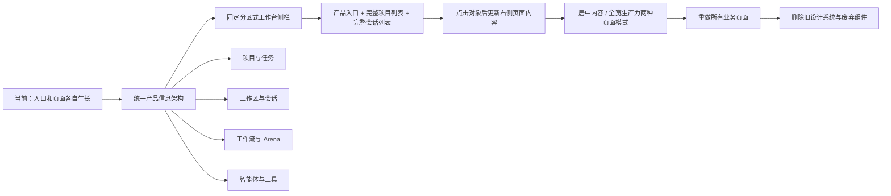

## 文档状态

| 项目       | 内容                                                                                            |
| ---------- | ----------------------------------------------------------------------------------------------- |
| 状态       | Phase 1–7 已完成，Phase 8 按四个有限 gate 收口，Phase 9 为下一实施阶段                          |
| 分支       | `refactor/frontend-redesign`                                                                    |
| 更新时间   | 2026-09-02                                                                                      |
| 已确认范围 | Local/Remote 全页面重做；同步重构 canonical Task、Workflow revision、Arena candidate 与查询投影 |
| 已确认布局 | 固定分区式工作台侧栏 + 单一右侧页面画布                                                         |
| 已确认定位 | 保留 `Vibe Kanban` 产品名，定位为“多智能体开发控制台”                                           |

Phase 0 仅保留一项脱敏 before-screenshot 证据债；它不代表 Phase 1–7 需要重做。
Phase 8 只剩页面状态、响应式、无障碍/本地化和实测性能四个退出 gate，全部通过后
直接进入 Phase 9 的旧实现删除与全量验证。

本轮重构不是给现有页面换主题，而是重新建立产品的信息架构、canonical Task 数据底座、应用外壳、页面模板和设计系统。已经稳定的 Agent Runtime、Session identity 和 Workflow run snapshot 继续作为事实来源；当前分裂的 Task/Workspace/Workflow/Arena 关系、缺失的 Workflow database revision 和名称推断 Arena purpose 一并重构。

## 一眼看懂目标

目标体验可以概括为：

> 用户打开 Vibe Kanban 后，左侧从上到下稳定呈现产品身份与环境、产品入口、完整项目列表、完整会话列表以及底部系统区。项目和会话按真实更新时间排列，点击任一对象后直接更新右侧页面内容。

## 文档导航

| 文档                                          | 解决的问题                                                          |
| --------------------------------------------- | ------------------------------------------------------------------- |
| [信息架构](./01-information-architecture.md)  | 产品以什么为中心，固定工作台入口如何划分，对象之间是什么关系        |
| [示例布局与线框图](./02-layout-wireframes.md) | 总览、看板、任务、Agent 工作台、工作流、Arena、设置和移动端长什么样 |
| [设计系统](./03-design-system.md)             | 色彩、字体、间距、组件、状态、动效和无障碍规则                      |
| [全页面覆盖矩阵](./04-page-matrix.md)         | “所有页面”具体包含哪些路由、弹窗和边界状态                          |
| [实施计划](./05-implementation-plan.md)       | 如何在一个分支内分阶段完成全量重构并验证质量                        |

## 已确认的重构基线

- 所有页面全部重做，不只改核心链路。
- 使用独立分支承载改造。
- 保留 `Vibe Kanban` 产品名称，产品定位从单一“看板工具”升级为“多智能体开发控制台”；项目、Agent、Workflow、Arena 和工具管理都作为核心能力，而不是看板附属功能。该定位用于信息架构和产品文案，不要求在每个页面重复展示完整口号。
- 桌面端使用约 256px 的固定分区式工作台侧栏，不设置横跨产品的全局顶部导航。
- 顶部固定产品身份与当前环境；工作台入口固定为 Dashboard、搜索、项目、工作流、智能体，其中搜索是弹框触发器而不是独立页面。
- 项目区和会话区完整展示当前环境中的所有对象，不设置数量上限，也不提供“查看更多”。
- 项目和会话都按真实 `updated_at DESC` 排序；点击、浏览和切换选中态不能修改 `updated_at` 或改变排序。
- 项目和会话保持扁平列表，不展开仓库、分支、任务或消息树；当前对象在左侧持续高亮。
- 设置、用户和版本固定在底部系统区；完整项目与会话列表共用中间滚动区域。
- 等待审批、等待输入和正在运行通过聚合徽标或会话状态点表达；Dashboard 展示优先处理摘要与直接动作，完整通知列表进入 `/notifications` 或对应模块。
- Dashboard 固定展示需要处理、活跃运行和智能体配置摘要，移除最近访问与环境健康，不在分区中提供“查看全部”。
- Dashboard 标题区不提供“新建工作区”或其他创建按钮；工作区从项目、Issue 或会话上下文创建。
- Dashboard 顶部按项目、Issue、智能体运行三个维度展示紧凑统计：项目为全部/活跃/需关注，Issue 为待办/进行中/今日完成，智能体运行为需处理/运行中。
- 智能体配置摘要展示连接状态、默认模型、API 地址和运行数量；未显式配置时显示“跟随客户端默认”，不展示密钥或 Token。
- 点击左侧“搜索”或按 `Ctrl/Cmd + K` 打开同一个 Global Search Palette；弹框保留当前页面，并将搜索框后的整个 App Shell 模糊、压暗，不产生独立路由、持久 active 状态或第二套搜索体验。
- 全局搜索覆盖功能入口、配置项、四个智能体、MCP、Skills、Commands、原生配置、项目、会话、Issue、工作流和运行记录；首版结果只负责打开 canonical 页面，不直接执行删除、停止运行等风险动作。
- 搜索结果按“智能体 / 配置 / 工具 / 功能与对象”弱化分组，每行展示名称和所在路径，并支持 `↑` / `↓`、`Enter` 与 `Escape` 完整键盘操作。
- 点击具体项目或会话后只更新右侧 Page Canvas，不增加第二列纵向导航。
- 同一对象内部的不同视图使用右侧横向 Page Tabs、页内分类或内容控件维护。
- 点击左侧具体项目直接进入项目看板；右侧不再增加“概览 / Issues / 工作区 / 设置”项目级 Page Tabs，也不重复项目导航。
- 项目看板顶部只保留一行：左侧是不可点击的项目图标与名称，右侧依次是当前项目 Issue 搜索、canonical Issue 数量和唯一主操作“新建 Issue”。看板是唯一视图，不提供列表、筛选或显示按钮；低频项目设置从左侧项目项的上下文菜单进入。
- 看板按项目配置中的可见状态及排序动态生成约 `300px` 等宽列；列头只展示状态色标、名称、可信数量和弱化的列内新增入口，不提供更多菜单。默认可见状态为 Todo、In Progress、In Review 和 Done，默认隐藏的 Cancelled 不生成列。
- 看板只使用一个共享滚动容器：整组列横向滚动，所有列共用同一纵向滚动位置，列头在该容器内吸顶；各列不建立独立纵向滚动条。长列可以让其他列下方留白，但不能用嵌套滚动换取表面紧凑。
- Issue 卡片使用自适应拖拽入口：桌面端按住卡片非交互区域并超过统一移动阈值后拖动，轻点仍打开 Issue；触屏端只从常驻专用把手开始拖动，把手保持小图标但至少提供 `44 × 44px` 命中区。Task 行、`+N 个任务`、标签和更多按钮等交互控件只执行自身动作，永不启动拖拽；键盘用户可通过同一 drag-and-drop 能力移动和取消。
- Issue 卡片默认展示弱化 ID、最多两行 Issue 标题、优先级和最多两个标签；存在 Task 时再展示任务总数、最多两个单行任务标题和 `+N 个任务`。Task 按待输入/待审批/失败、运行中、未开始的关注顺序排列；Agent、运行时长和其他执行细节由任务类型对应的 Agent 工作台、Workflow 运行页或 Arena 对比页展示。
- Issue 是执行入口，与 Task 是一对多关系。点击 Issue 卡片后在看板右侧打开留有外边距的非模态浮动框，不进入独立详情页、不挤压看板，也不使用背景模糊；点击其他 Issue 时直接替换同一浮动框内容，移动端使用全屏详情。浮动框固定按“标题 → 完整 Task 列表 → 单智能体 / Workflow / Arena 三个执行按钮 → Issue 信息”排列；Task 行只显示标题、执行方式、状态和打开箭头，不显示 Agent、模型、耗时或工作区。最后的 `IssueInformationSection` 是默认收起的单一折叠区，展开后直接查看和编辑描述、状态、标签、关系与评论，不使用内部 Tabs。每次确认都新增一条有标题、执行方式和独立状态的 Task，可重复发起并并行运行，不创建“尚未选择执行方式”的空任务。
- 业务语言统一为 `Workflow → Node → Task → Agent`：Workflow 画布中的所有业务单元都只叫 Node，Node Type 只是 Node 的属性；部分 Node 承载 Task，Agent 是 Task 的执行者。Issue 发起的 Task 与 Workflow Node 承载的 Task 使用同一种 Task 模型，不再创造 `Agent Node`、`Task Node`、`Agent Task`、`Workflow Task` 或 `Node Task` 等平行业务对象。
- Task 不只是统一的卡片外观，而是数据库中的 canonical 实体。它拥有稳定 ID、Project/Issue、可选父 Task、唯一标题、不可变执行方式和时间；状态与打开目标从 Session/AgentRun、WorkflowAttempt 或 ArenaGroup 的唯一 binding 派生，前端与 API 都不能再拼接三套执行对象或双写状态。
- Workflow Draft 中保存的是 TaskSpec，不提前创建执行 Task。确认单 Agent/Workflow/Arena 后才原子创建顶层 Task 与 binding；Workflow 运行时只把承载 Task 的 Agent/Arena Node 实例化为父 Workflow Task 的子 Task，Issue 只列顶层 Task。取消配置或创建失败不留下空 Task。
- 单 Agent Task 绑定 canonical Session，Workspace 通过 Session 获得；Arena 使用一个 Task 与多条显式 `attempt | synthesis` candidate 关系，候选 Workspace 改名不能改变 purpose。Workflow 保存同时使用客户端 Draft revision 和数据库 `expected_revision`，避免页面内旧响应与多页面并发覆盖。
- 项目未发布，因此本次允许一次性迁移现有测试数据库并删除旧 Issue-shaped `tasks`、`workspaces.task_id`、名称推断和兼容查询。迁移必须支持当前测试库顺序升级和全新数据库从零初始化，但迁移完成后不保留双读、双写或旧 UI 兼容层。
- Node Type 沿用 `Start`、`End`、`Agent`、`Condition`、`Human Gate`、`Transform` 和 `Arena` 七种值；例如界面表达为“Node / Type: Agent / Task / Agent”，不把类型和值组合成新的对象名称。
- `Arena` 类型的 Node 只承载一个 Task；该 Task 可以配置多个 Agent 候选并产生多路候选执行，但候选不会膨胀成多个同级 Task。
- Workflow Node 卡片最多三层：第一行以小号淡色文字显示 `Type: …`，仅在配置不完整时于右侧显示“待配置”；第二行是唯一主标题，承载 Task 时直接读取 `Task.title`，不再重复一行 Task 摘要；第三行只在承载 Task 时显示执行者摘要，单 Agent 显示 Agent 名称，Arena 只显示候选数量。模型、Skills、耗时、工作区路径等细节不进入卡片。
- 普通 Node 卡片桌面端固定宽约 `220–240px`，高度随两层或三层内容自然变化，不支持手动拉伸。主标题最多两行，超出后省略，并在 hover 或 keyboard focus 时提供完整标题；Start / End 使用更紧凑的系统卡片，不强行套用普通 Node 尺寸。
- 所有 Node Type 共用中性卡片表面，不用七种整卡底色区分类型；Type 只通过第一行的弱化文字或小图标表达。Hover 轻微增强边框，selected 使用清晰品牌色描边与轻阴影；待配置使用淡警示边框并保留“待配置”文字，不能只依赖颜色。
- Workflow 运行页在 Node 第一行右侧使用状态图标/状态点与文字显示 canonical 状态；Running 只允许小状态点轻微呼吸，Waiting、Failed、Completed、Cancelled 等保持静止。卡片边框可使用低强度状态色，但中性表面不变，selected 描边保持独立；编辑页不显示运行状态，只在必要时显示“待配置”。
- “添加 Node”先打开 Node Type Picker；在尚未选择 Type 时取消不会创建任何 Node。选择 Type 后立即以该类型的稳定默认值创建 Node，将其写入 Workflow Draft、显示在画布并自动选中，同时在靠右浮动的共享 Dialog 中显示 Node Form；Type 从创建起永久只读，不支持把现有 Node 隐式迁移成另一种 Type。
- Node Type Picker 是锚定在“添加 Node”按钮或 connection-drop 落点旁的轻量浮层，只纵向显示 Agent、Condition、Human Gate、Transform、Arena 五项。每项包含小图标、名称和一行说明；不提供搜索、分类、Tabs 或大 Modal，Start / End 不进入列表，并支持方向键、Enter 与 Escape。
- Workflow 以直接连线作为主建图交互：Node hover、选中或键盘聚焦时显示连接点，拖到已有 Node 立即创建 Edge；拖到空白处则在落点打开轻量 Node Type Picker，并用临时连线保持来源上下文，选定 Type 后原子创建新 Node 与 Edge，取消不修改 Draft。拖动 Edge 端点直接重连；把普通 Node 拖到高亮 Edge 上会原子拆成“来源 → Node → 原目标”两段。右键“插入 Agent Step / 插入 Node”不再存在。
- 输出连接点直接表达路由语义，不再先画一条无语义 Edge 再去表单选择类型：Start、Agent 和 Transform 使用一个 Default 连接点，Arena 使用 Winner，Human Gate 按 `required_action` 显示带标签的 Approve / Reject，Condition 的每条 branch 对应一个同名连接点并在末尾提供弱化的“新增分支”连接入口，End 不显示输出连接点。从哪个连接点拖出就确定 Edge 语义；已连接连接点仍可见并支持端点重连。
- 同一个语义连接点可以连接多个不同目标；该语义被激活后，全部目标 Node 并行进入后续执行。已存在 Edge 时再次从连接点拖动会新增独立 Edge，拖动某条 Edge 的 source / target 端点才只重连该 Edge。每条 Edge 保持独立 ID、选择、删除与 Undo / Redo，不为了并行分支新增 Fork 类型。
- Edge 默认使用带终点小箭头的自动平滑曲线表达执行方向，不使用生硬的直角折线。来自同一连接点的多条 Edge 从来源处自然散开，但仍是拥有独立命中区的完整曲线，不合并成公共主干；默认保持低强调，hover 或 selected 时只突出当前 Edge，并轻微弱化其他连线。Node 始终渲染在 Edge 上层；首版不提供手动路径编辑或路径重置，遮挡时直接移动 Node。
- Edge 标签按语义渐进展示：Default 不显示常驻标签；Approve、Reject、Winner 和 Condition branch 在靠近来源的位置显示小型淡色标签。标签不占据线条中部，hover 或 selected 时才增强并展示完整语义，避免普通 Workflow 被重复的 Default 和大块文字填满。
- Edge 在编辑状态完全静止；Workflow 运行时只有正在传递执行的 Edge 使用轻微方向流动，已经经过的路径保留低强调高亮，Condition 未命中的分支进一步弱化。Failed、Waiting 等状态继续由 Node 表达，不在线上重复堆叠状态；`prefers-reduced-motion` 下用静态高亮替代流动效果。
- 新建和编辑 Node 的字段变化都立即写入内存中的 Workflow Draft。配置不完整的新 Node 在画布和 Dialog 中显示“待配置”；关闭配置框或选择另一个 Node 不会删除 Node 或丢弃修改，只有显式删除才移除它。页面顶部“保存 Workflow”是持久化 Node、Edge 和整个 Workflow 的唯一入口，并在存在未完成或无效 Node 时阻止保存、定位错误。
- Workflow Draft 为 Dirty 时，切换 Node / Edge、关闭配置框等编辑器内部操作不提示；离开编辑器、切换到另一个 Workflow 或进入同一 Workflow 的非编辑页面时打开真正的离开确认 Dialog，提供“继续编辑 / 不保存 / 保存并离开”。保存校验或请求失败时留在原页面并定位错误；不保存时恢复到最后持久化版本后离开。浏览器刷新、关闭标签页或窗口只使用原生 `beforeunload` 提示，不依赖异步保存。
- 页面顶部保存使用 revision-aware 快照：点击时捕获不可变 Draft revision 并只提交该版本，保存期间画布和配置框继续可编辑且不重复发起同一请求。响应成功只更新对应持久化基线；若当前 Draft 已产生更新 revision，页面仍保持 Dirty，不能用旧响应覆盖新编辑或误显示“已保存”。没有后续修改时才变为 Clean。保存成功或失败都保持 viewport、selection、配置框和滚动位置，不重新加载整个 Workflow。
- Workflow 编辑器使用会话级统一 Undo / Redo command history，覆盖 Node / Edge 新增、删除、移动、连接、重连和配置修改；拖动或连续字段编辑按一次用户意图合并为一个 command。Toast 的撤销调用同一历史，不维护平行逆操作。文本输入保持原生 `Ctrl/Cmd + Z`，画布和非文本控件才使用 Workflow 撤销；顶部仅显示低强调的撤销/重做图标。历史不持久化，保存不清空历史，撤销到已保存基线之外时重新变为 Dirty。
- Workflow Canvas 支持 Node-only 多选：`Shift + 点击`切换单个 Node，`Shift + 空白拖动`框选 Node；普通空白拖动仍然平移。多选时关闭单对象配置框，在画布顶部显示仅含选中数量和删除的低强调临时操作条；拖动任一已选 Node 会整体移动，删除作为一个可撤销 command 原子移除全部选中 Node 及关联 Edge。Edge 仍然单选，不进入 Node 多选；第一版不提供批量配置、自动对齐或平均分布。
- 普通 Node 支持单对象复制：上下文菜单或画布焦点下的 `Ctrl/Cmd + D` 创建同 Type 副本，在右下方错开放置、自动选中新 Node 并打开 Node Form。副本保留 Task、Agent 和 Type 配置，清除 Session、运行身份与结果；Condition 保留路由模式但清空与 Edge 目标绑定的 branches。复制不包含任何入边或出边，Start / End 和 Node 多选均不提供复制。整个操作是一个可撤销 command。
- 桌面端共享 Workflow Canvas 配置 Dialog 宽约 `400–480px`，距 Page Canvas 顶部、右侧和底部 `16–24px`。它使用四边完整圆角和统一浮层阴影，覆盖在画布之上但不压缩画布，也不贴住视口边缘或复用常驻 Inspector / Drawer。打开后不显示 Scrim 或 Backdrop Blur、不锁定焦点，未被配置框遮挡的画布继续支持平移、缩放以及选择 Node / Edge。
- Node 与 Edge 复用同一个 `WorkflowCanvasConfigDialog` 外框，但分别使用独立配置表单。Node / Edge 之间切换时外框的位置、宽高、圆角和阴影保持稳定，只用 `120–160ms` Crossfade 替换 Header 与 Body；快速连续选择以最后一个对象为准并中断前一段动效，不排队播放。
- Edge Form 的 Header 只显示“来源 Node → 目标 Node”。来源和目标在 Body 中只读展示，不重复提供下拉框；重连通过画布端点完成，Edge 路径由画布自动生成，Edge ID、端口和路径数据不进入常规表单。路由类型由来源 Node 的语义连接点在连线时确定，Edge Form 始终只读展示 Default、Condition Branch、Winner、Approve 或 Reject，不再提供事后切换控件；需要改变语义时在画布从正确连接点重新连接。Condition 分支表达式继续由来源 Condition Node 维护，Edge Form 只显示摘要和“打开来源 Node”入口。删除 Edge 独立放在 Body 底部危险区；点击删除或按下 Delete 后立即从 Workflow Draft 移除、清除 selection 并关闭配置框，同时提供短时 Toast 撤销，页面级保存后才持久化。
- 连线拖动期间只高亮合法目标并扩大实际命中区域，不改变 Node 尺寸；非法目标说明具体原因，松手后预览线回弹且不写入 Draft。连接、空白落点创建、Edge 拆分和端点重连各自形成一个原子 Undo / Redo command；拆分保留原 Edge 的路由语义在“原来源 → 插入 Node”，第二段使用 Default，Condition branch 条件随目标迁移而不丢失。
- 每个 Node / Edge 在本次编辑会话中独立保留配置 Body 的滚动位置；新对象默认从顶部开始。点击画布对象不会强制把焦点移入配置框，异步内容超过 `300ms` 时也只在对应分区显示 Skeleton，不能让 Header、外框或整个表单闪烁。
- 空白画布的单击与平移使用画布已有的 canonical drag threshold 区分：手势未超过阈值且落在空白处时清除 selection 并关闭配置框；超过阈值的空白拖动视为画布平移，保留当前 Node / Edge selection 和配置框。配置层不能另造第二套阈值。
- Node 配置表单使用单列分区，不设置内部 Tabs；共享 Header 固定，Body 独立滚动，不设置操作 Footer。Node、Task、Agent 和 Type 专属配置按适用性显示，不适用的分区不保留空白；Draft 与校验状态在字段、Node 卡片和页面级状态中反馈。
- `Start` 和 `End` 是 Workflow 自动创建且各自唯一的系统 Node：不进入“添加 Node”、不允许删除或复制，也不显示配置内容；选择它们会关闭当前配置框。Start 禁止入边，End 禁止出边；删除当前可配置 Node / Edge 后同样关闭配置框。
- 删除普通 Node 与 Edge 使用相同的可恢复交互：配置框删除按钮和画布 Delete 键立即更新 Workflow Draft，不弹确认层，并清除 selection、关闭配置框、把焦点留在画布。Toast 显示 Node 标题和一并移除的关联 Edge 数量；撤销作为一个原子逆操作恢复同一 Node ID、完整 Node / Task 配置、画布位置、关联 Edge 及受影响的 Condition 分支，不覆盖删除后发生的其他无关 Draft 编辑。Start / End 永远不进入该命令。
- 承载 Task 的 Node 不维护独立 Node 名称，直接使用 `Task.title` 作为画布、Dialog、运行记录和会话中的唯一标题；不承载 Task 的 Node 才使用自身名称。
- `Type: Agent` 要求选择一个 Agent；模型、推理、权限和其他原生参数默认跟随智能体中心配置，只保存 Node 级覆盖。Node Form 不展示、选择或复制 Skills、MCP、Commands；Skills 由智能体中心提供，并可在具体会话中按底层能力使用或变化，不写入 Workflow Draft，也不会因为会话变化把 Workflow 标记为 Dirty。配置变化只影响下一次运行。
- `Type: Condition` 的 Node Form 只提供 Node 名称、单选/多选路由方式和自然语言分支列表。每条分支只编辑条件文本并只读显示当前连接目标；目标 Node 只能通过画布连线创建或重连，表单不提供目标下拉框，也不增加 `Else` 机制。表单“新增分支”可以先产生待连接分支，页面级保存会阻止未填写条件或未连接目标的分支持久化；从画布“新增分支”连接点发起时仍以 branch + Edge 原子创建，取消不留下空分支。
- `Type: Human Gate` 的 Node Form 只提供 Node 名称、给用户的提示，以及“仅批准继续 / 批准或拒绝”两种底层已支持的操作方式。Approve / Reject 的后续目标继续由对应 semantic handle 和画布连线维护，表单不放目标下拉框；首版不增加底层尚未建模的自由文本回答。从“批准或拒绝”切换为“仅批准继续”时，同一个可撤销 Draft command 原子移除全部 Reject Edge，并用一条包含移除数量的 Toast 提供撤销。
- `Type: Transform` 的 Node Form 只提供 Node 名称和 `template | regex_extract | truncate` 三种底层转换方式，并按当前模式只显示模板、正则或最大字符数字段。弱化“测试转换”按需展开临时样例输入与结果，可提前暴露模板、正则和匹配错误；测试数据与结果不进入 Workflow Draft、Undo / Redo 或持久化 Graph。
- `Type: Arena` 遵守一个 Node 只承载一个 Task、一个 Task 至少配置两个候选 Agent。Node Form 默认只显示 Task 标题和紧凑候选行；候选行展示 Agent 与继承配置摘要，配置覆盖和候选专属指令按候选展开，Skills 不进入表单。少于两个候选时允许 Draft 暂时无效但阻止页面级保存；获胜者不在编辑阶段预设，只在运行结果中由用户选择。
- Workflow 运行页使用“顶部运行摘要 + 单一只读画布”，不再保留“总览 / 画布 / 节点会话 / 事件”长期 Tabs，也不把 Dashboard 作为并列页面。顶部只承担 Workflow 名称、canonical 状态、完成进度和适用的取消动作；等待输入、等待审批或失败时才在画布右侧出现非模态关注卡，正常运行和完成时不保留空侧栏。Node 会话与运行详情从对应 Node 进入，全局事件日志降为运行详情能力而非一级导航。
- 点击运行页 Node 在画布右侧打开不贴边、无 Scrim 的非模态浮动详情框，画布不压缩且保留原 viewport。详情使用单列适用分区而非 Tabs，展示 canonical 状态、当前输出/等待/错误，并将技术事件默认折叠；Human Gate 在等待时直接显示提示和当前支持的“批准继续 / 拒绝”动作，Agent 的输入或权限请求仍通过“打开完整会话”处理，Arena 提供“查看候选结果”。关注卡与 Node 详情互斥，点击关注事项直接以对应详情替换关注卡，关闭后回到同一画布位置。
- Arena 对比页以候选结果而不是完整聊天为主轴：可用宽度内同时展示 2–3 个等权候选列，每列只保留 Agent、canonical 状态、结果摘要、Diff、测试、完整会话入口和获胜选择。候选超过 3 个或屏幕无法容纳时，使用可键盘切换的候选选择区与固定对比摘要，不产生无限横向滚动；完整对话始终进入对应 canonical Session。“综合结果”会启动新的 synthesis 工作区并作为一项新候选进入同一比较集合，不覆盖原候选，也不自动获胜；成功后可与原始候选一样被选为 winner。Workflow 的 winner projection 与应用契约必须同时接受 `attempt | synthesis`，不能出现能查看综合结果却无法采用的断路。
- Arena 顶部不再使用含糊的“结束 Arena”。操作区固定为“综合结果”、按需出现的“停止全部”和更多菜单：只有存在可取消的真实候选运行时才显示“停止全部”，并通过 canonical Agent cancel 真正取消全部可取消运行；更多菜单中的“关闭本轮”只关闭 Arena 生命周期并保留结果和工作区，“解散并归档”经二次确认后归档工作区并删除 Arena。关闭本轮、关闭页面或离开路由都不能暗中取消 Agent；单纯离开页面时 Arena 继续运行。
- “选择为获胜方案”不能点击后立即提交。原始候选和 synthesis 候选都先打开同一个紧凑确认 Dialog，只显示候选名称、变更文件数、将归档的其他候选数量，以及 Workflow 场景下“应用后继续执行”的影响；完整 Diff 仍从候选列查看。确认动作使用明确的“应用并继续”，提交期间锁定全部 winner 操作，失败留在 Dialog 内说明原因并允许重试，成功后才由 canonical winner 与 Workflow 状态关闭弹框并推进页面。
- 主区域区分“居中限宽内容页”和“全宽生产力页”，不强迫所有页面使用同一种宽度。
- Dashboard、项目目录、智能体中心和设置等普通信息或管理页面，在 Product Sidebar 右侧的 Page Canvas 内使用最大 `1120px` 的内容画幅。内容只做水平居中，仍从页面顶部开始；标题、工具栏和主体共用同一条内容轴，大屏两侧保留自然留白。
- 看板、Agent 工作台、Workflow 和 Arena 等确实依赖横向空间的生产力页面才使用全宽。
- Agent 工作台只有两个并列工作区：中间主区始终显示 canonical 对话时间线和固定输入框，右侧 Inspector 统一承载变更、文件、Git、终端和预览。Inspector 可以向右完全收起且不保留空白栏，对话区使用释放空间，边缘把手负责恢复上次标签和宽度；主区不再重复提供同名 Page Tabs，左侧会话和 Issue 中的单 Agent Task 进入同一个工作台。
- Agent 工作台顶部只表达上下文：第一行是任务名称，第二行依次展示可选 Issue、工作空间路径和分支。Agent、模型、运行状态、持续时间和停止操作不进入标题区，运行反馈与控制由输入区域附近承载。
- 对话时间线先采用可演进的三层基础标准：用户与 Agent 正文保持最高阅读权重，工具和日志默认摘要并可展开，审批、输入请求与失败就地处理。两个及以上相邻工具调用组成可整体收起的工具组，任何非工具事件都会截断分组；组内仍保留每条真实调用及原始输入输出。首版不冻结其他事件卡片和最终视觉，后续根据真实会话持续优化。
- 用户消息首版靠右使用淡色容器，Agent 回复靠左采用文档式 Markdown；两者共享约 `760px` 的居中阅读列，代码和宽内容按需扩展。
- 固定输入区与阅读列对齐，使用一个约 `10px` 轻圆角的单层矩形外框；顶部偶现区只在存在会话产物、待提交上下文、权限配置或 Agent UI 时出现，主输入区与底部工具区永久存在，Agent、模型、运行控制、Commands 和 Skills 严格读取底层能力。
- 中央输入保持原生纯文本，默认约 3–4 行并只限制界面高度，不限制或裁剪内容；支持会话级草稿恢复和原样粘贴。Composer 外部使用左侧分类、右侧结果的级联资源选择器，`＋` 打开全部分类，`@`、`/`、`$` 分别直达文件与上下文、Command、Skill；移动端改为单面板逐层选择。
- 发送、追加、canonical 排队和停止严格读取底层动作语义；前端不自建发送队列、不使用运行或取消假超时，提交回执只清理对应快照并保留后续草稿。
- 项目目录保持简单：标题、项目搜索、新建项目按钮和三列封面式项目卡片；卡片只显示项目名称、更新时间与更多菜单，不增加统计、筛选器或视图切换。
- 本地端和远程端都必须落在同一套共享设计语言中。
- 已经建立的 Agent Runtime、会话不换智能体、工作区模式和工具管理语义不能被 UI 重构破坏。
- 视觉设计以 Dark-first 的专业开发者工具风格为基线，但产品首次启动默认使用 `System` 跟随操作系统；外观设置完整提供 `System / Light / Dark`，不能把 Dark-first 实现成强制默认深色。Light 与 Dark 都必须独立校验文字、边框、交互状态以及 Diff、终端、代码等复杂内容。
- 保留橙色作为稀疏的品牌与主操作强调，只用于产品身份、页面唯一主操作和明确的选中/焦点反馈；Running、Waiting、Success、Error、Cancelled 等运行状态继续使用独立语义色与文字/图标，不能被品牌橙替代。具体橙色色值在高保真阶段按 Light/Dark 对比度微调，不因本次确认提前冻结。
- 最终交付不能长期保留两套并行产品界面。

## 不变的底层契约

前端可以彻底重做，但不能重新发明底层语义：

- Agent 生命周期、审批、输入、取消、重试和恢复只读取 canonical `AgentRun`、`RunState` 与 canonical events。
- 普通 Agent UI 不从 Native Audit、ProviderEvent、旧日志或 `ExecutionProcess` 猜测状态。
- Setup、Cleanup、Archive、Dev Server 等脚本进程继续使用独立的 `ExecutionProcess` 产品模型。
- 一个已创建的会话绑定一个智能体，不能在会话中途更换 provider。
- 外部智能体历史会话采用“从接管点开始记录增量”的方式，不伪造或重写 provider 的完整历史。
- Worktree 和 Direct Folder 都是一等工作区模式，共享目录协作不能被强制改为 Worktree。
- Codex、Claude Code、Gemini 和 Oh My Pi 的原生差异由 adapter 负责，UI 只呈现能力和不可用原因。

## 完成标准

只有同时满足以下条件，才能称为“全量前端重构完成”：

- 页面矩阵中的所有产品页面已经迁移。
- 所有页面共享同一 App Shell、Token 和基础组件。
- 空状态、加载、失败、离线、等待输入、等待审批和权限不足状态都有设计。
- Local Web、Remote Web、桌面尺寸和移动尺寸均完成验证。
- 键盘导航、焦点、对比度和 `prefers-reduced-motion` 达标。
- 旧主题作用域、旧页面组件和无调用样式已删除。
- 核心链路具有自动化测试和视觉回归基线。
